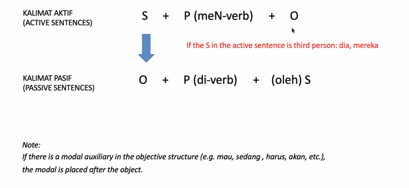
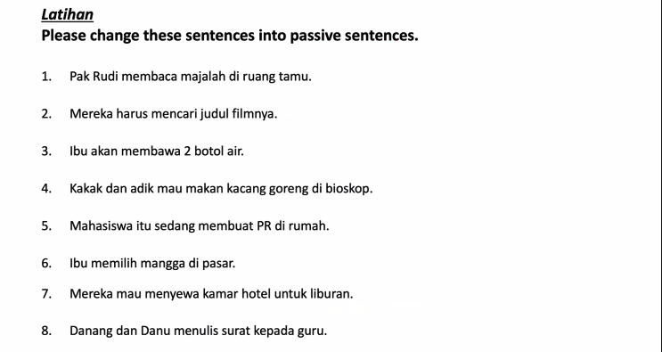

bangsa = nation / people 

**“Lulus dari sekolah itu”** means **“to graduate from that school”** or **“to have passed from that school.”**

- **lulus** → to pass / graduate
    
- **dari** → from

|Word|English meaning|Function|Typical position|
|---|---|---|---|
|**ada**|_there is / there are / exist(s)_|expresses **existence or presence**|before the object (like “there is a book”)|
|**adalah**|_is / are / am_|used to **define or describe** something formally|between subject and complement (like “X is Y”)|

pesan = order
SD (Sekolah Dasar) 6 tahun  (SD kelas satu, dua, ..., enam)
SMP (Sekolah Menengah Pertama) 3 tahun  (SMP kelas satu, dua, )
SMA 3 tahun (SMA kelas satu, dua, tiga)
Universitas (S1, Sarjana 1, S1 Kuliah tingkat 1 --- S1 is bachelor, s2 is master, S1 kuliah tingkat 1 is bachelor year 1)

Pembantu = helper (maid)

1. belajar
2. mencari
3. berangkat
4. ikut
5. mengobrol
6. mengantar
7. menjemput
8. berbelanja
9. menonton
10. menyapu

**Sambil** = “while / at the same time (doing two actions simultaneously).”

olahraga lari. 

lari marathon.

Subject + Predicate + Object

**Jadi** can mean:

1. **To become** (verb) → _Dia jadi guru_ = “He became a teacher.”
    
2. **So / therefore** (connector) → _Hujan deras, jadi saya tidak pergi_ = “It rained heavily, so I didn’t go.”
    
3. **Done / finished** (adjective/verb result) → _Kue ini sudah jadi_ = “This cake is ready/done.”
    
4. **Agreed / settled** (decision) → _Jadi berangkat besok?_ = “So, we’re going tomorrow (then)?”

Third person in the passage: Andre, Doni, Mereka

S: Andre dan Doni
P: memakai
O: Baju kaos dan celana pendek

S: Mereka
P: membeli
O: Buku di toko buku

S: Andre
P: mencari
O: buku "Laskar Pelangi"

S: Andre
P: memesan
O: buku itu

This is only for the third person.

tamu = guest
**majalah** = magazine. (borrowed from Arabic _majallah_ = journal, record).
Judul = title

Dijawab oleh Jek:
1. Di ruang tamu majalah dibaca oleh Pak Rudi
2. Judul filmnya harus dicari oleh mereka
3. 2 botol air akan dibawa oleh ibu
4. Di bioskop mau dimakan kacang goreng oleh kakak dan adik
5. PR di rumah sedang dibuat oleh mahasiswa itu.
6. Mangga dari pasar dipilih oleh ibu
7. kamar hotel untuk liburan mau disewa oleh mereka
8. Surat kepada guru ditulis oleh Danang dan Danu

---

1. Majalah dibaca oleh Pak Rudi di ruang tamu.
2. Judul filmnya harus dicari oleh mereka
3. Dua botol air kan dibawa oleh ibu
4. Kacang goren mau dimakan oleh kakak dan adik di bioskop
5. PR sedang dibuat oleh mahasiswa itu di rumah.
6. Mangga dipilih oleh ibu di pasar
7. Kamar. hotel mau disewa oleh mereka untuk liburan / kamar hotel untuk liburan mau disewa oleh mereka
8. Surat ditulis oleh Dang dan Danu kepada guru /  Surat kepada guru ditulis oleh Danang dan Danu

