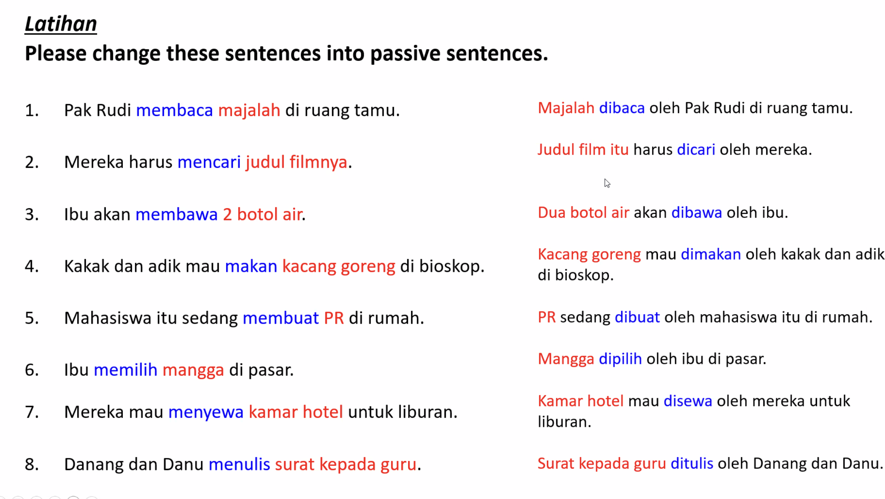

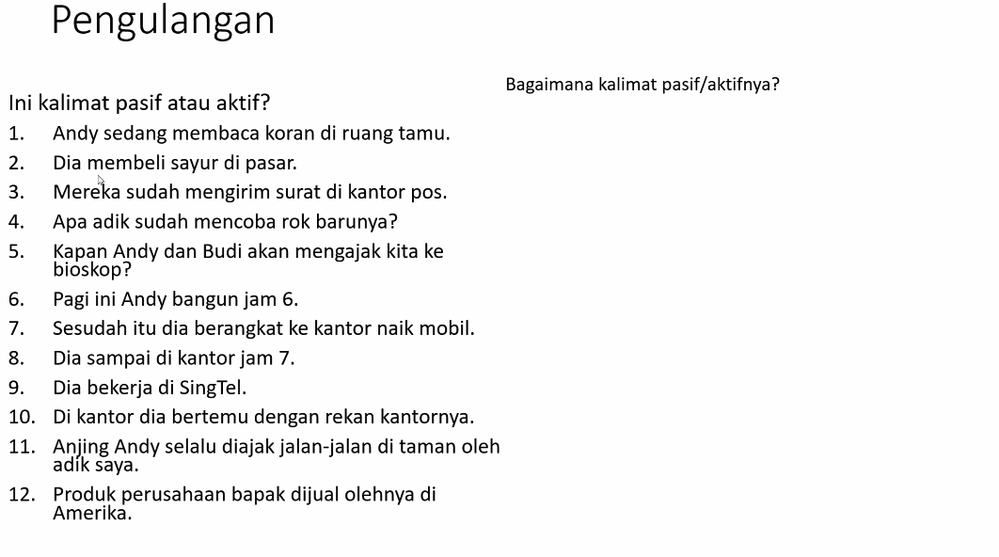

**“Rekan”** means **“colleague,” “associate,” “partner,”** or **“fellow.”**

1. Koran sedang dibaca oleh Andy di ruang tamu
2. Sayur dibeli oleh dia di pasar
3. surat sudah dikirim oleh mereka di kantor pos
4. PALING --> Apa rok baru adik sudah dicoba olehnya? 
5. Kapan kita akan diajak oleh Andy dan Budi ke bioskop?
6. -
7. -
8. -
9. -
10. -
11. Sudah pasif  --> Aktif --> Adik saya selalu mengajak Anjing Andy jalan-jalan di taman. 
12. Sudah pasif --> Aktif --> Bapak menjual produk perusahaannya di Amerika

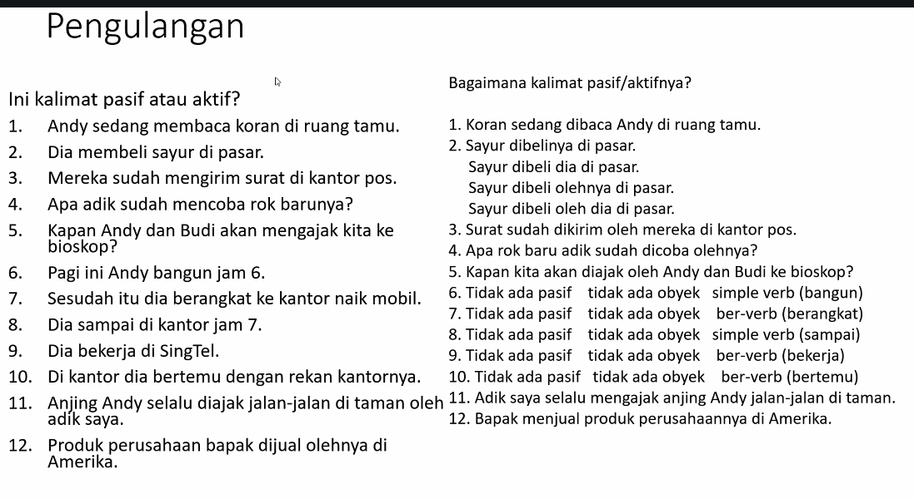

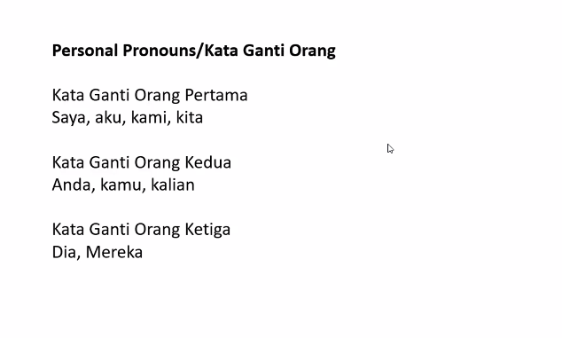

The above is 1st person, 2nd person, and 3rd person

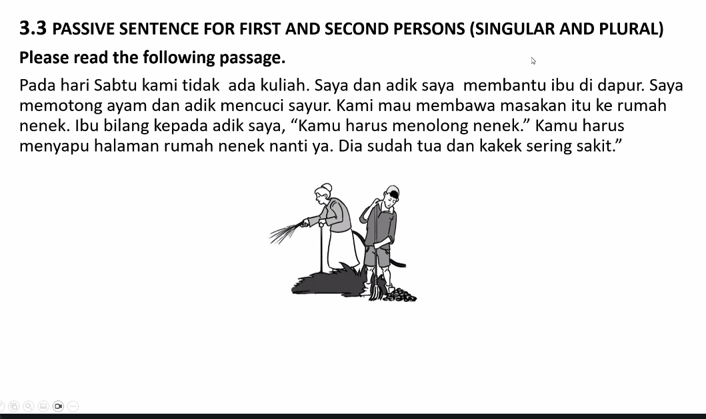

#### **halaman**

- **Root word:** _laman_ (old form, meaning “yard” or “open area”)
    
- **Prefix/suffix:** _ha-...-an_ — a **noun-forming circumfix**  
    → _halaman_ literally means “a space or area (of something)”

**“Sering”** means **“often”** or **“frequently.”**  
It describes how often something happens — an **adverb of frequency**.

**Example:**

- _Saya sering minum kopi pagi-pagi._  
    → “I often drink coffee in the morning.”

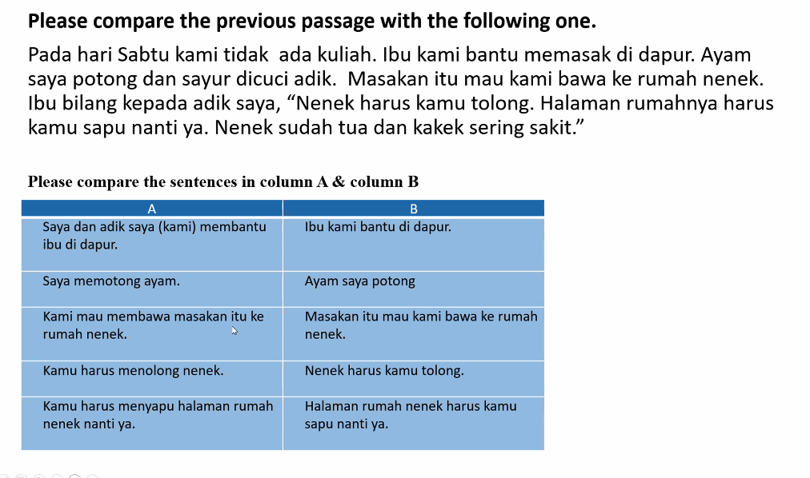

Objek + Subject + Predicate untuk kata ganti orang pertama.

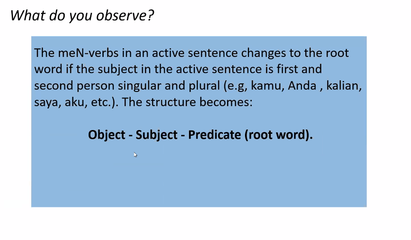

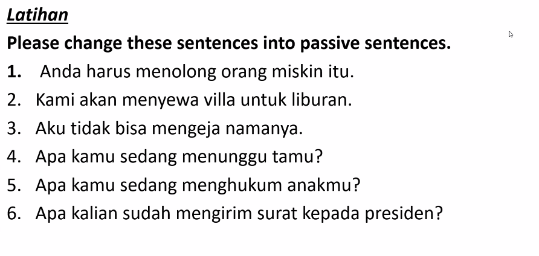

**miskin** = _poor_ (financially or materially)

_eja_ = spell

**“Kalian”** means **“you all”** or **“you (plural)”**

Menghukum
- **hukum** → law, rule
    
- **hukuman** → punishment, penalty
    
- **dihukum** → to be punished (passive)

1. Orang miskin itu harus Anda tolong.
2. Villa untuk liburan akan kami sewa.
3. Namanya tidak bisa aku eja. / Nama dia tidak bisa aku eja.
	1. Andy tidak bisa mengeja nama temannya.
	2. Nama teman Andy tidak bisa dieja oleh Andy.
4. Apa tamu sedang kamu tunggu?
5. Apa anakmu sedang kamu hukum?
6. Apa anakmu sedang kamu hukum?

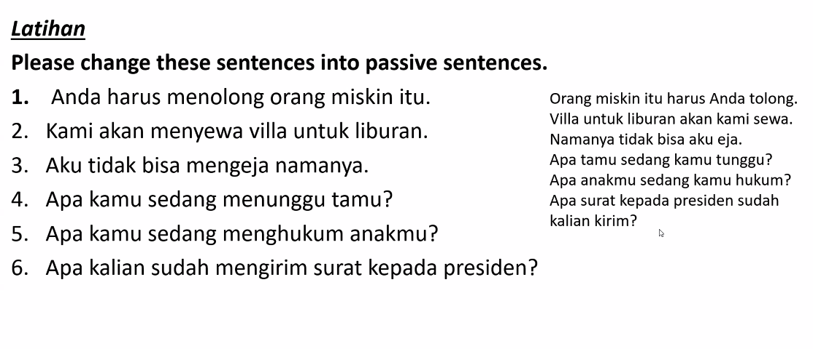

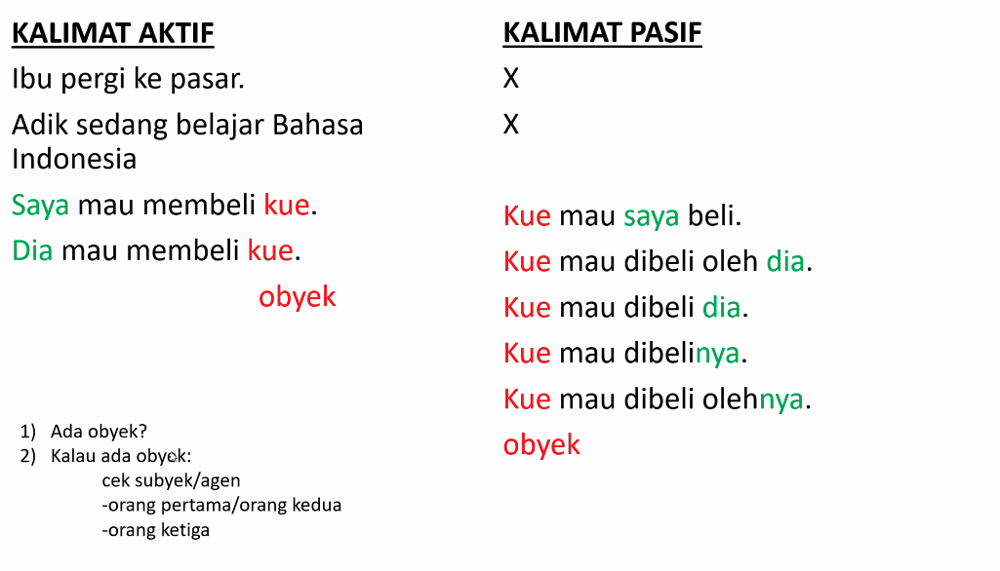

Normally speaking it is using pasif form. 

Report and writing are in pasif form. Pasif form is more polite.

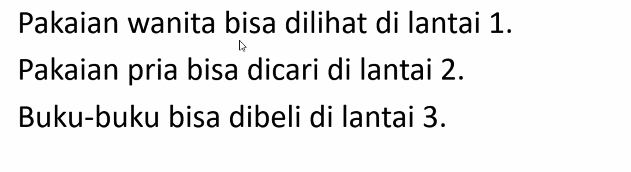

**“Pria”** means **“man”** or **“male (adult man)”** in English.  
It is a **formal and polite** way to refer to a man, especially in writing or formal conversation.
On **official forms** (e.g. “Jenis kelamin: Pria / Wanita” → “Gender: Male / Female”).

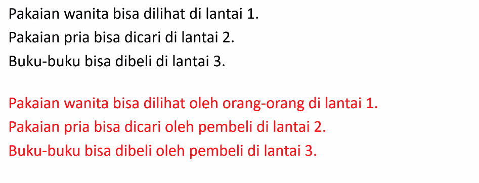

**“Gelap”** means **“dark”** — it refers to a lack of light or brightness.

|Word|Root|Affixes|Meaning|
|---|---|---|---|
|**terbitlah**|_terbit_|suffix _-lah_|“rise” (as in the sun rising), with _-lah_ to make it emphatic or expressive (e.g., “Let it rise”)|
|**terang**|_terang_|none|“bright,” “light,” “clear”|

This phrase is very **famous in Indonesian history** because of **R.A. Kartini**, a national heroine who fought for women’s education and equality.  
Her collection of letters was published under the title **_“Habis Gelap Terbitlah Terang”_**, meaning **“Out of Darkness Comes Light.”**

In Indonesian culture, this phrase symbolizes:

- Enlightenment
    
- Education and progress
    
- Hope after hardship

**“Merdeka”** means **“independent,” “free,”** or **“freedom.”**

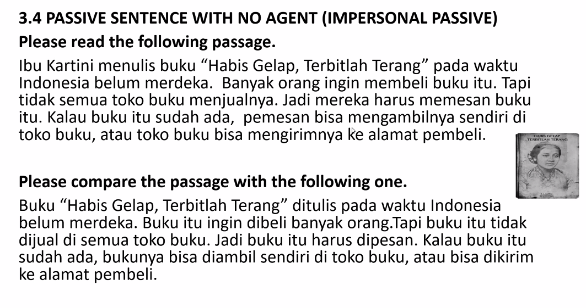

Pemesan with pe is the person. The person order. 

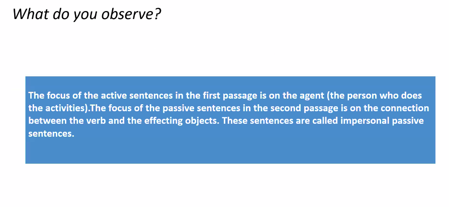

Impersonal passive sentences is the key to the above.

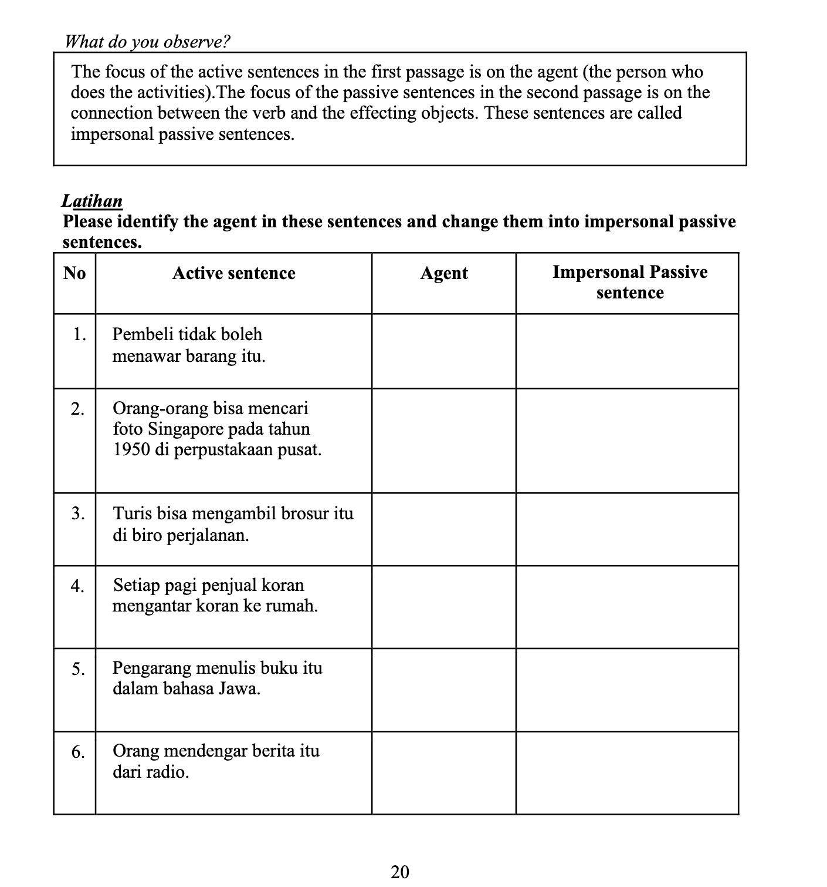

| Word          | Root    | Prefix/Suffix              | Meaning                         |
| ------------- | ------- | -------------------------- | ------------------------------- |
| **pengarang** | _arang_ | prefix _pe-_, infix _-ng-_ | someone who creates or composes |

|Phrase|Meaning|Example|
|---|---|---|
|**Pusat kota**|city center|_Hotel ini dekat pusat kota._ → “This hotel is near the city center.”|
|**Pusat perbelanjaan**|shopping center / mall|_Kita pergi ke pusat perbelanjaan._|
|**Kantor pusat**|head office|_Kantor pusatnya di Jakarta._|
|**Pusat perhatian**|center of attention|_Dia jadi pusat perhatian._|
|**Pusat data**|data center|_Kami menyimpan informasi di pusat data._|

“Biro” has no prefix or suffix; it’s a **loanword from Dutch** _bureau_, which itself comes from French _bureau_ (desk or office).

|Word|Root|Affixes|Meaning|
|---|---|---|---|
|**biro**|_biro_|none|office, bureau, agency|

|Word|Root|Prefix/Suffix|Meaning|
|---|---|---|---|
|**berita**|from _ber- + cerita_ (old form)|prefix _ber-_|story / report / news|

Historically, _berita_ came from **Malay “bercerita”** (to tell a story).  
So literally, _berita_ = “something that is told.”

Pasif sentence there is no agent.

1. Agent: Pembeli
	1. Impersonal pasif: Barang itu tidak boleh pembeli ditawar
2. Agent: Orang-orang
	1. Impersonal pasif: Di perpustakaan pusat, foto Singapore pada tahun 1950 bisa orang-orang dicari
3. Agent: Turis
	1. Impersonal pasif: Di biro perjalanan, brosur itu bisa turis diambil.
4. Agent: Penjual
	1. Impersonal pasif: Koran diantar ke rumah setiap pagi
5. Agent: Pengarang
	1. Impersonal pasif: Buku itu ditulis dalam bahasa Jawa
6. Agent: Orang
	1. Impersonal pasif: Berita itu didengar dari radio

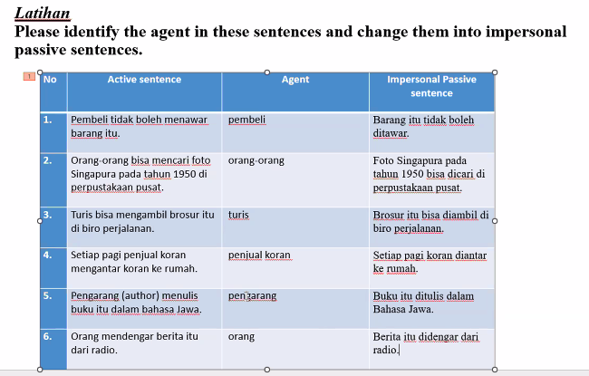

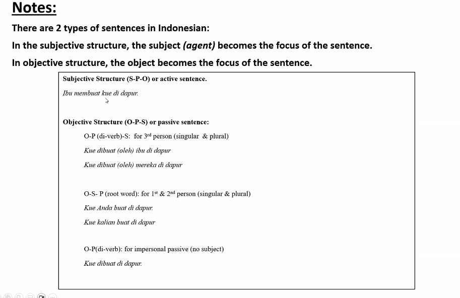

Mereka is an exception that can use as 3rd person, 1st person and 2nd person.

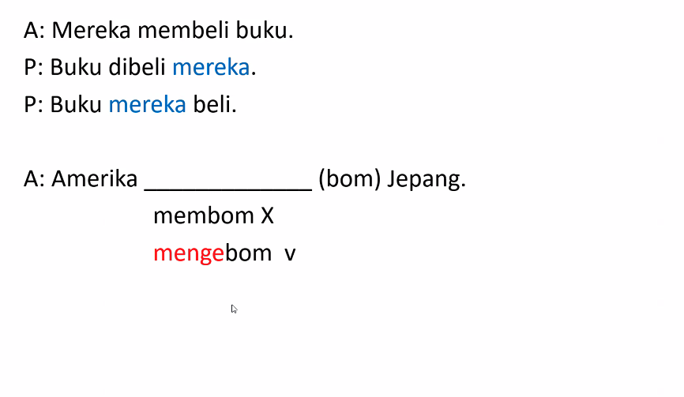

A single syllabus is mengebom... instead of membom is wrong.

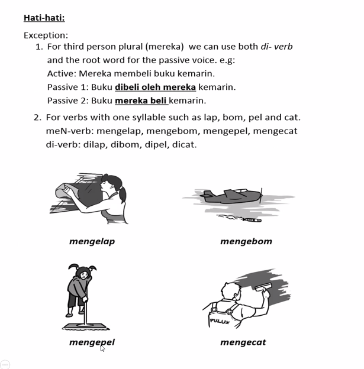

The root word is lap, bom, pel and cat

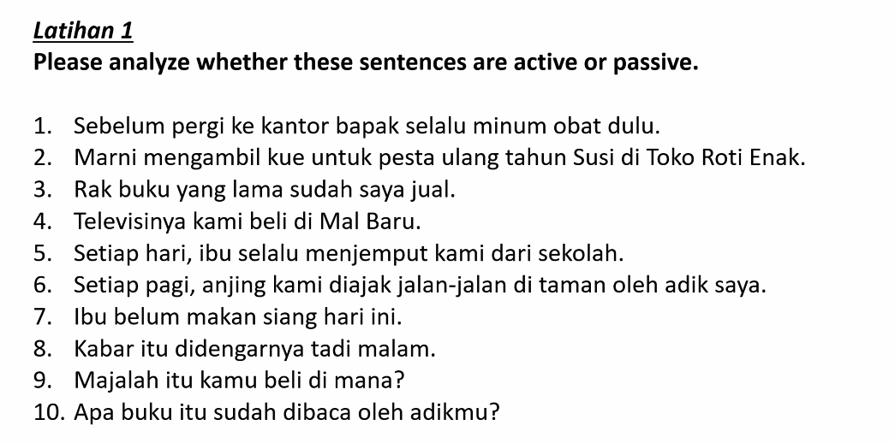

Jawab Jek:
1. Pasif
2. Active
3. Pasif
4. Pasif
5. Actif
6. Pasif
7. Actif
8. Pasif
9. Pasif
10. Pasif

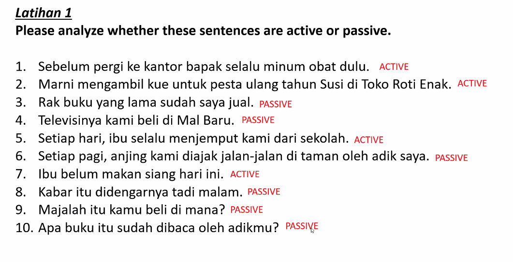

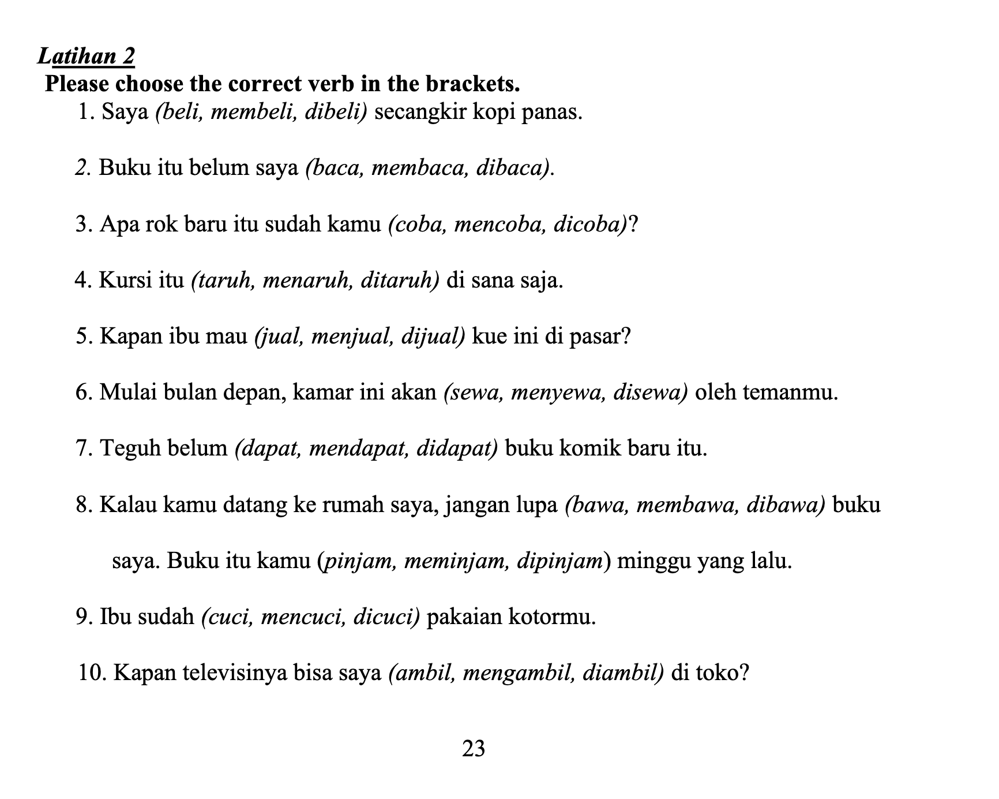

1. membeli
2. baca
3. coba
4. taruh XXXX because no agent. It is like the third person because someone must put the chair there. e.g. Pakaian perempuan bisa dilihat di lantai 1.  Pasif: Kursi itu ditaruh (oleh orang itu) di sana.
	1. The answer is ditaruh
5. menjual
6. disewa
7. mendapat
8. membawa
	1. pinjam
9. mencuci
10. ambil