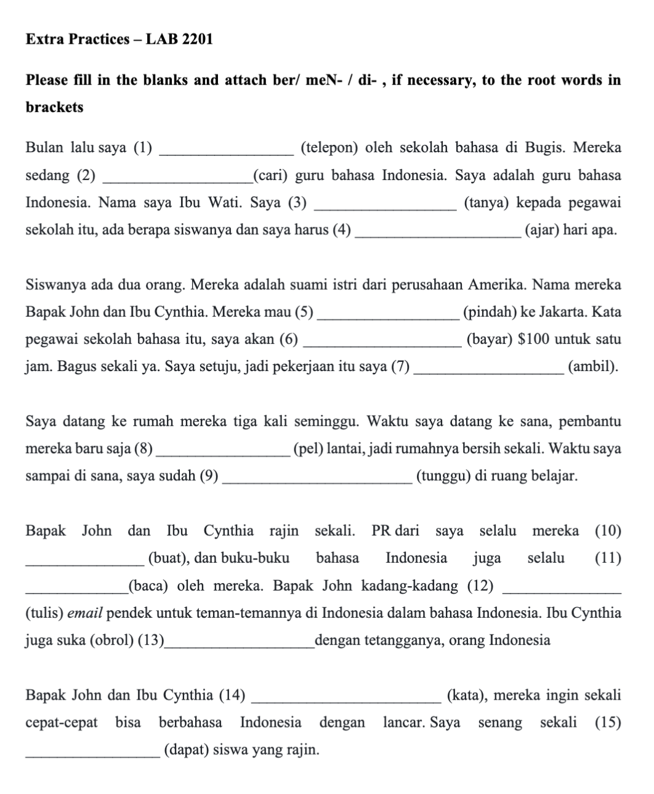
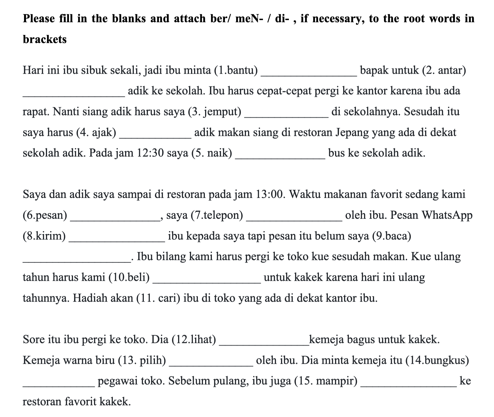
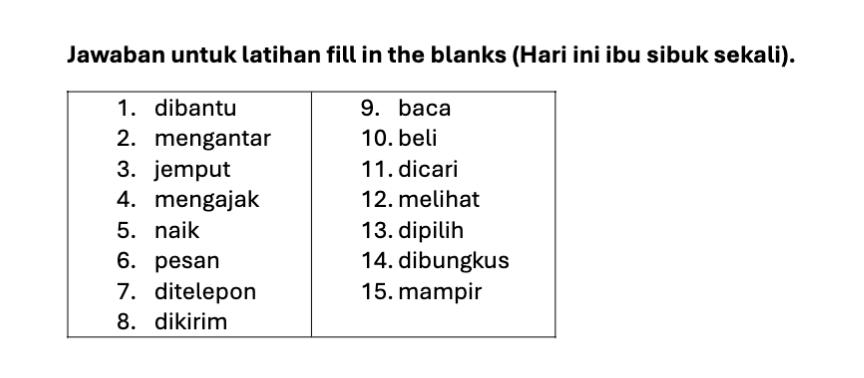
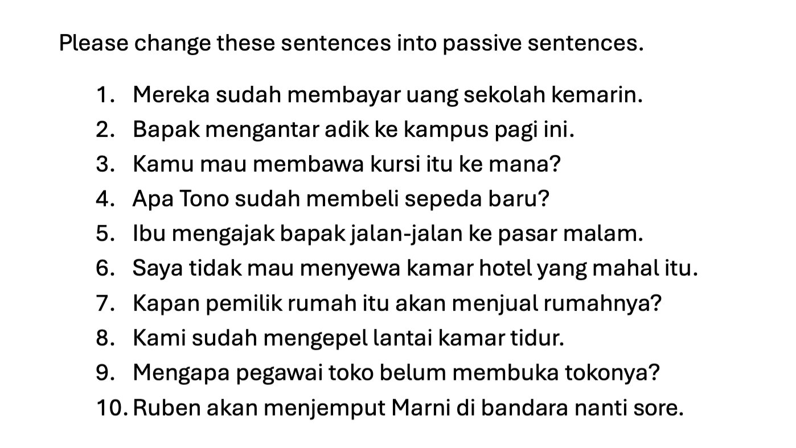
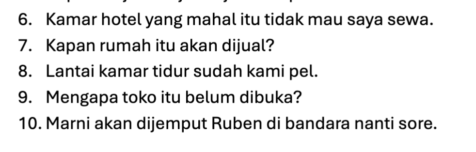
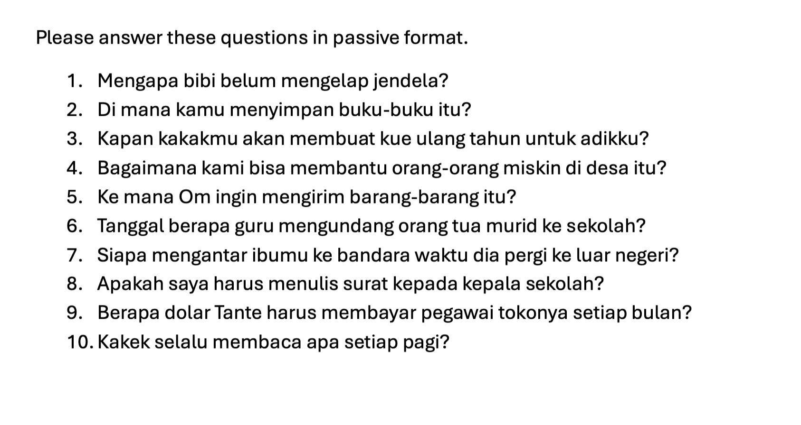
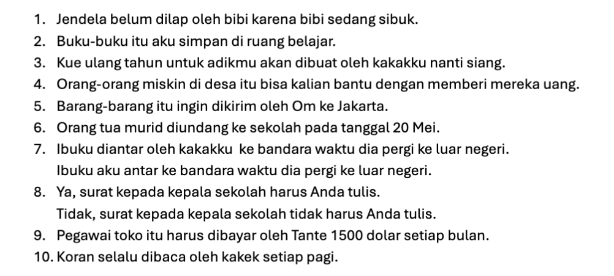

|Part|Meaning|Notes|
|---|---|---|
|**siswa**|student|root noun|
|**-nya**|his / her / their / the|possessive or definite suffix|

So:  
**siswa + nya → siswanya** → “the student” or “his/her student(s)”

1. ditelepon 
2. mencari
3. bertanya
4. mengajar
5. meminda XXXX --> betul: pindah 
6. membayar XXXX --> betul: dibayar
7. mengambil XXXX --> ambil
8. mengepel
9. menunggu XXXX --> ditunggu
10. membuat XXXX --> buat 
11. dibaca
12. menulis 
13. mengobrol
14. kata XXXX --> berkata
15. mendapat

In Indonesian, after **mau** (“want to”), we usually use the **base form (root)** of the verb — **not** the me-/di- form.

		✅ **mau pindah**  
		❌ **mau memindah**  
		❌ **mau dipindah** (unless they’re _being relocated by someone else_)

After **“ingin”**, you also use the **base (root) form** of the verb — **no prefix** like _me-_ or _di-_.

|Indonesian word|Meaning|Example sentence|Translation|
|---|---|---|---|
|**mau**|want (casual)|Saya **mau makan.**|I want to eat.|
|**ingin**|want / wish (formal)|Saya **ingin belajar.**|I wish to study.|
|**hendak**|intend to (formal/literary)|Saya **hendak pergi.**|I intend to go.|
|**akan**|will / going to (future)|Saya **akan datang.**|I will come.|
|**sudah**|already (perfect aspect)|Saya **sudah tidur.**|I have already slept.|
|**belum**|not yet|Saya **belum makan.**|I haven’t eaten yet.|
|**boleh**|may / allowed to|Kamu **boleh duduk.**|You may sit.|
|**bisa**|can (ability)|Saya **bisa berenang.**|I can swim.|
|**dapat**|can / able to (formal for _bisa_)|Dia **dapat menulis dengan baik.**|He can write well.|
|**harus**|must / have to|Kamu **harus belajar.**|You must study.|
|**perlu**|need to|Kita **perlu bicara.**|We need to talk.|
|**tidak usah / tak usah**|don’t need to|Kamu **tidak usah datang.**|You don’t need to come.|
|**jangan**|don’t (imperative)|**Jangan tidur!**|Don’t sleep!|
|**masih**|still / continue to|Dia **masih tidur.**|He is still sleeping.|

**bungkus** means **“to wrap”** or **“package.”**

When you eat at a restaurant in Indonesia, if you can’t finish your meal, you say:

> **“Bungkus, ya.”**  
> → “Please wrap it (to take away).”  
> This is short, polite, and very common — like saying _“Take away, please”_ or _“Can I have this to go?”_

**pegawai** = **employee**, **worker**, or **staff member**.

|Part|Meaning|Type|
|---|---|---|
|**pe- … -i**|prefix + suffix that form nouns referring to a person performing an action|derivational affix|
|**gawai**|root meaning “task,” “work,” or “job” (from Malay origin)|noun root|
|**pegawai**|_pe- + gawai + -i_ → _someone who works_|noun|

1. membantu XXX --> dibantu
2. diantar XXX --> mengantar
3. jemput
4. ajak  XXXX --> mengajak
5. naik 
6. pesan
7. ditelepon
8. dikirim
9. baca
10. beli
11. dicari
12. melihat
13. dipilih
14. dibungkus
15. mampir

1. Uang sekolah sudah dibayar oleh mereka kemarin.
2. Pagi ini adik diantar oleh bapak ke kampus
3. Kursi itu mau kamu bawa ke mana?
4. Apa sepeda baru sudah dibeli oleh Tono?
5. Bapak diajak oleh ibu jalan-jalan ke pasar malam

6. Kamar hotel yang mahal itu tidak mau saya sewa.
7. Kapan rumah itu akan dijual oleh pemilik rumah itu? **XXXXXXX**
8. Lantai kamar tidur sudah kami pel.
9. Mengapa toko itu belum dibuka oleh pegawai toko?
10. Marni akan dijemput oleh Ruben di bandara  nanti sore.

---

**“Desa”** means **village** or **rural area** in English.  
It refers to a **small community area**, usually outside the city (_kota_).

**“Miskin”** means **poor** — someone who has **little or no money or resources**.  
It’s the opposite of **kaya** (rich).

**“Selalu”** means **“always”** in English.

Murid = **“Student” or “pupil.”**  
Usually refers to a **student in school** (elementary to high school).  
For university students, Indonesians usually use **“mahasiswa.”**

In Indonesian schools, it’s **common for teachers to invite parents** (_orang tua murid_) for meetings — often to discuss students’ progress, report cards (_rapor_), or school events.

1. Bibi belum mengelap jendela karena dia sibuk sekali.
	1. Jendela belum dilap oleh Bibi karena dia sibuk sekali.
2. Saya menyimpan buku-buku itu di lemari sana
	1. Buku-buku itu saya simpan di lemari sana.
3. Besok kakak saya akan membuat kue ulang tahun untuk adik saya.
	1. kue ulang tahun akan dibuat oleh kakak saya untuk adik saya.
4. Ya, saya setuju. Kami bisa membantu orang-orang miskin di desa itu.
	1. Ya, saya setuju. Orang-orang miskin bisa kami bantu di desa itu. 
		1. **XXXX** --> Orang-orang miskin di desa itu bisa kalian bantu denga memberi mereka uang.
5. Om ingin mengirim barang-barang itu ke Jakarta.
	1. Barang-barang itu ingin dikirim oleh Om ke Jakarta.
6. Pada tanggal 25 Desember, guru mengundang orang tua murid ke sekolah
	1. Orang tua murid diundang oleh guru ke sekolah pada tanggal 25 Desember.
7. Saya mengantar ibu saya ke bandara waktu dia pergi ke luar negeri
	1. Ibuku saya antar ke bandara waktu dia pergi ke luar negeri
8. Ya, saya harus menulis surat kepada kepala sekolah
	1. Surat kepada kepala sekolah harus saya tulis .
9. Tante harus membayar $100 untuk pegawai tokonya setiap bulan.
	1. $100 harus dibayar oleh Tante untuk pegawai tokonya setiap bulan. 
		1. **XXXXXXXX** --> Pegawai toko itu harus dibayar oleh Tante 1500 dolar setiap bulan.
10. Kakek selalu membaca surat kabar setiap pagi.
	1. Surat kabar selalu dibaca oleh Kakek setiap pagi.

---

