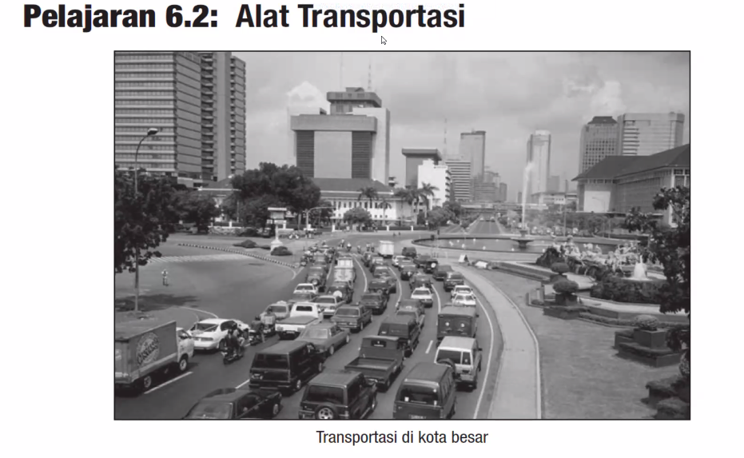

Alat = Mode
Mode of Transportation

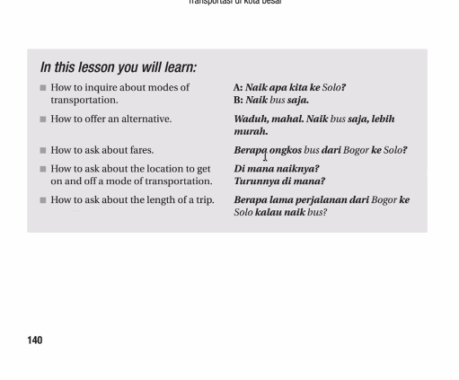

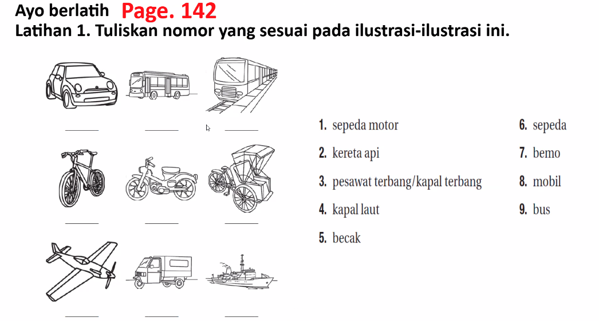

**Bemo** (sometimes spelled _beca motor_ or _bemo_) means **a small public transportation vehicle**, usually a **three-wheeled or small minivan-like** vehicle used for **short-distance travel** in cities or towns in Indonesia.

It’s similar to:

- A **tuk-tuk** in Thailand

|Part|Explanation|
|---|---|
|**bemo**|Comes from **BE** (Becak, “pedicab”) + **MO** (Motor, “motorized”) — a **motorized becak**.|
|**Root meaning**|Literally, a small 3-wheeled vehicle for public transport.|
|**No prefix/suffix**|It’s a loan/compound term, not a verb or affixed form.|

**Becak** means a **pedicab** or **cycle rickshaw** — a **three-wheeled vehicle** used to carry passengers, powered by a person pedaling.

It’s similar to:

- A **rickshaw** in India,
    
- A **trishaw** in Malaysia or Singapore.
    

|Part|Explanation|
|---|---|
|**becak**|A root noun, no prefix/suffix.|
|**Root meaning**|A human-powered three-wheeled vehicle for transporting people or goods.|
|**Etymology**|Likely from Hokkien Chinese _bé-tsia̍h_ (馬車 / “horse cart”), adapted into Malay-Indonesian pronunciation.|

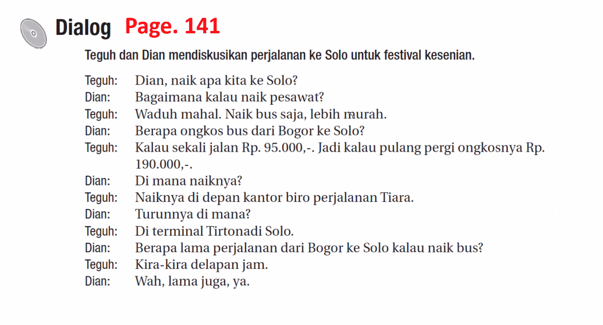

| Part         | Explanation                                                                         |
| ------------ | ----------------------------------------------------------------------------------- |
| **turun**    | root verb = _to go down, to descend, to get off._                                   |
| **-nya**     | suffix, can mean _his/her/its_ or _the (noun form of action)._                      |
| **turunnya** | literally “the act of going down,” “his/her descent,” or “the time of getting off.” |
- **“Turunnya hujan deras.”** → _The rain fell heavily._
    
- **“Turunnya harga minyak.”** → _The fall of oil prices._
    
- **“Waktu turunnya dari bus, hati-hati ya.”** → _Be careful when getting off the bus._

pulang pergi= pp

Berapa ongkos bus pp?

Naik --> Turun
Board --> Alight

Turun dari bus

Turun dari kereta api

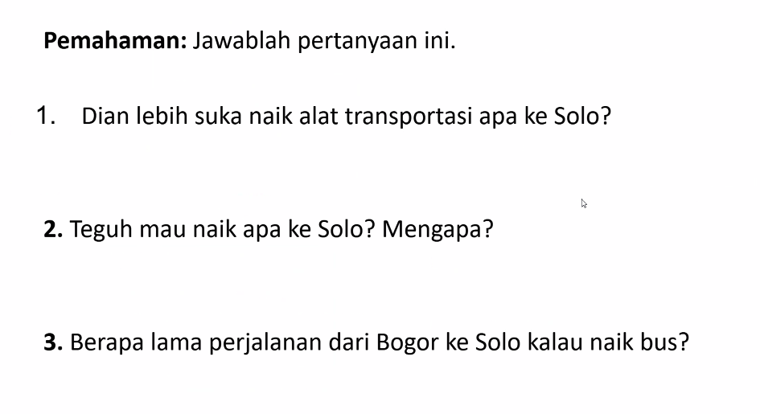

1. Pesawat terbang
2. Bus
3. Kira-kira delapan jam

kereta listrik

In Indonesia, **listrik** is an essential part of daily life.  
People often talk about **“token listrik”** (electricity credit) because most homes use prepaid meters.  
Example of common use:

- “Listriknya habis!” → “The electricity ran out!”
    
- “Token listrik sudah dibeli?” → “Have you bought the electricity token?”

Mulai dari sini -->

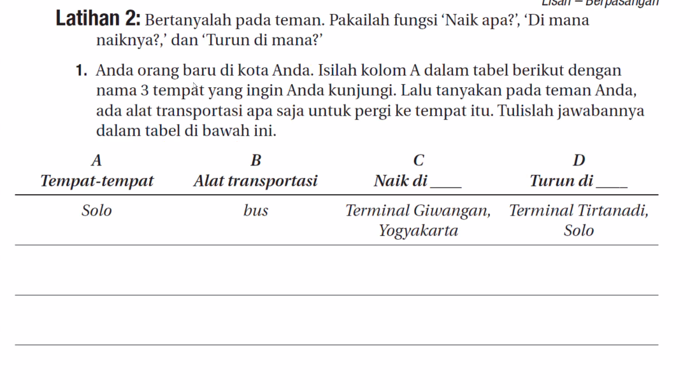

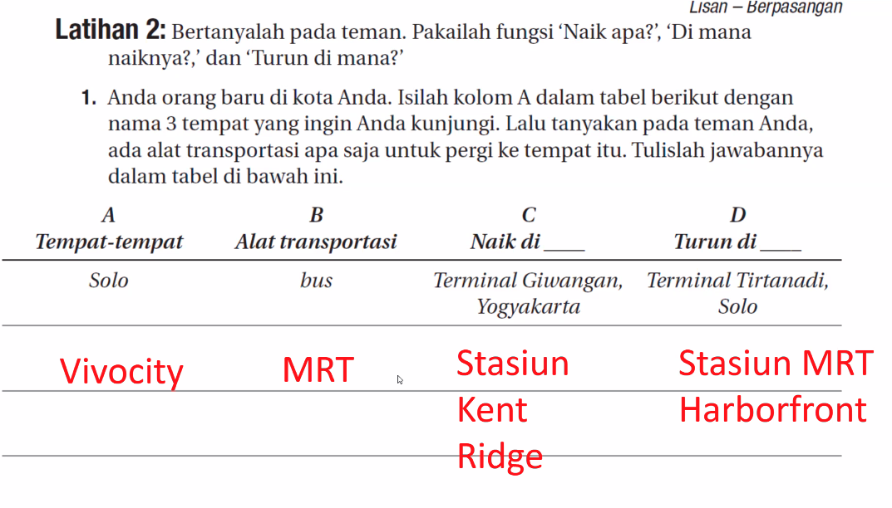

uang saya habis.

Ada bus langsung dari __ ke ___

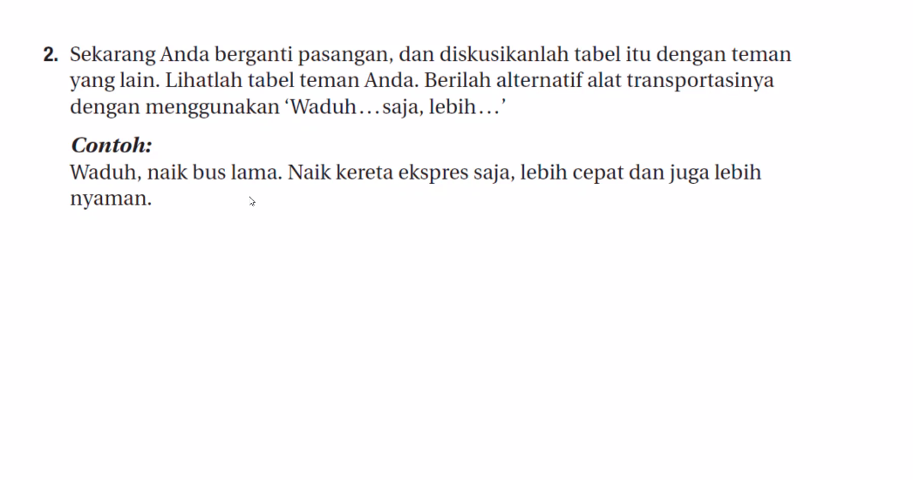

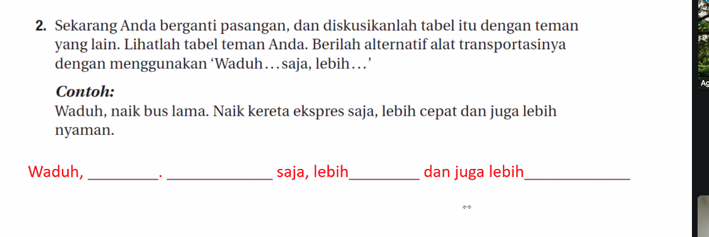

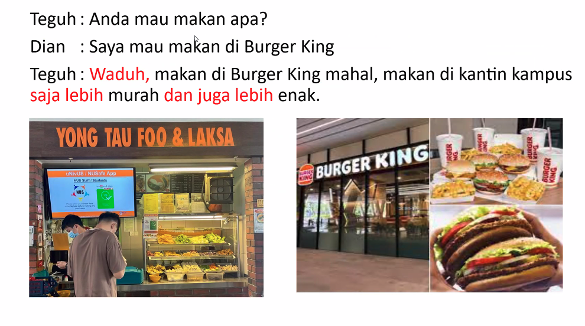

Saya mau bertanya.

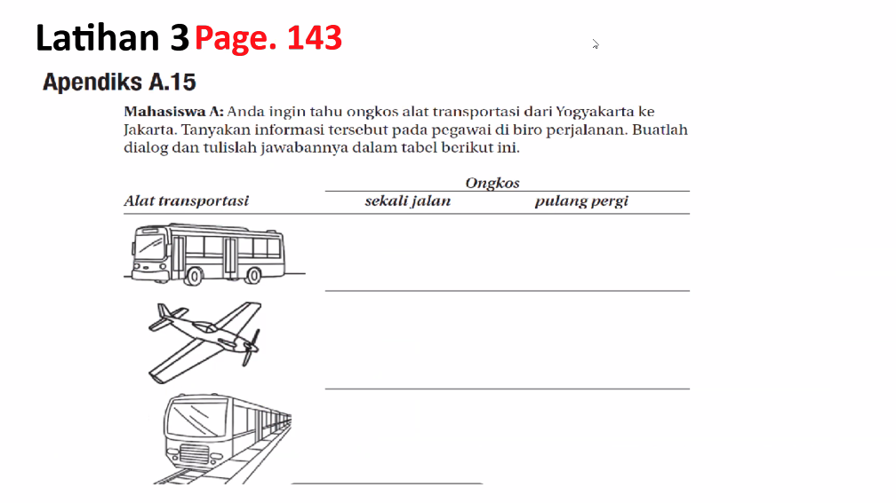

pegawai = staff

pp = pulang pergi

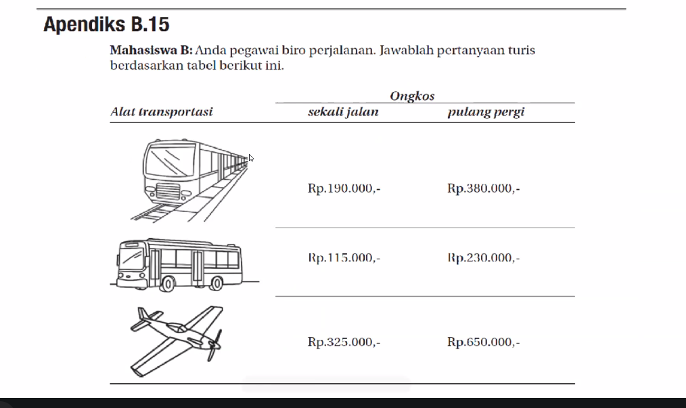

Jangan lama-lama berpikir

banyak orang mau beli tiket pesawat

nanti cepat habis

tidak apa-apa

tunggu tunggu

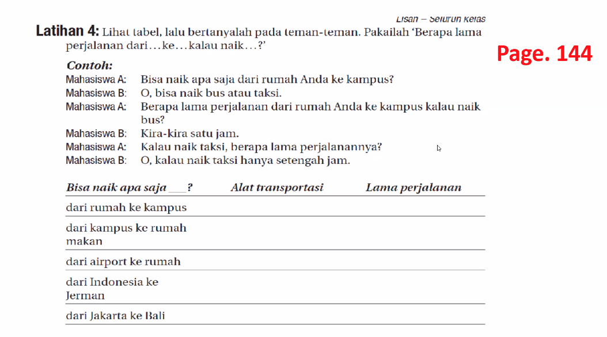

Naik mobil. 

satu jam lima belas menit

satu seperempat jam

satu tiga perempat jam

satu jam empat puluh lima menit

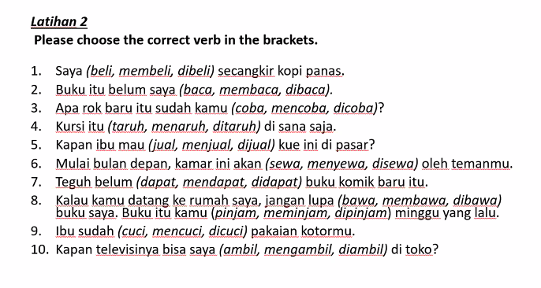

Taruh = **“To put,” “to place,” or “to set (something down).”**  
It means to **put something somewhere**, usually a physical object.

Pinjam = **“To borrow.”**

1. membeli
2. baca
3. coba
4. taruh XXXX because no agent. It is like the third person because someone must put the chair there. e.g. Pakaian perempuan bisa dilihat di lantai 1.  Pasif: Kursi itu ditaruh (oleh orang itu) di sana.
	1. The answer is ditaruh
5. menjual
6. disewa
7. mendapat
8. membawa
	1. pinjam
9. mencuci
10. ambil
