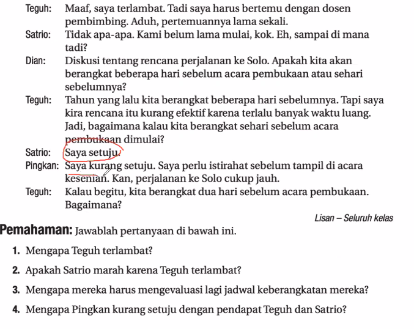
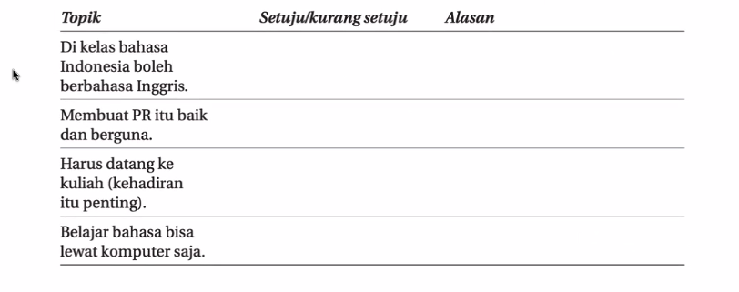
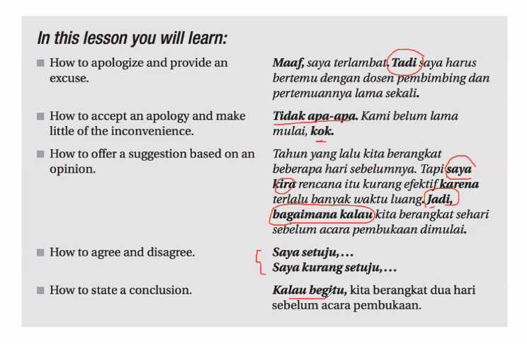
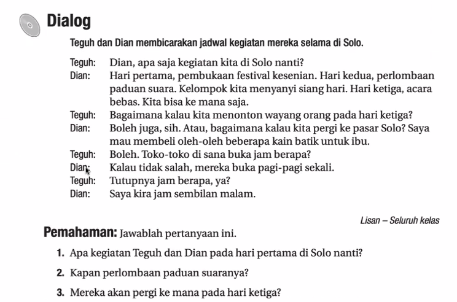
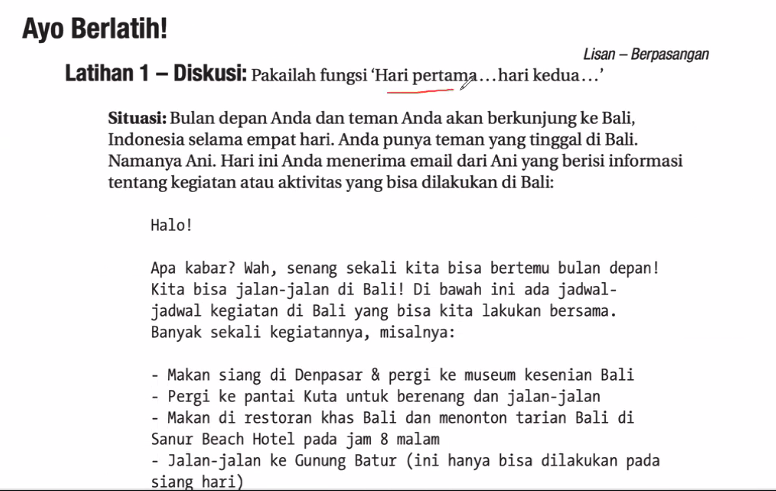
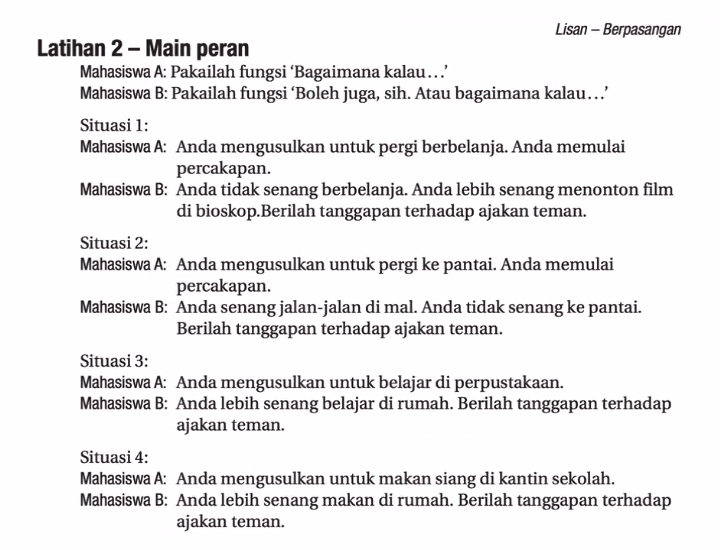
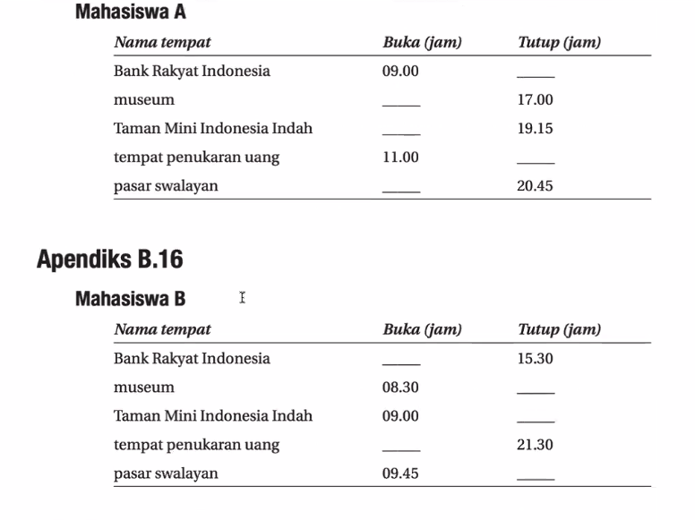

**“Kehadiran itu penting”** means **“That presence is important”** or more naturally,

Belajar bahasa bisa lewat komputer saja
👉 **“Learning a language can be done just through the computer.”**  
or more naturally,  
👉 **“You can learn a language just using a computer.”**

Ke satu = pertama
Ke dua 
Ke tiga 
Anak ke satu
Anak ke dua

Singaura berulang-tahun ke-60 pada tahun 2025.

tiga hari berlibur di Singapura.

usul = idea

|Part|Function|Meaning|
|---|---|---|
|**beri**|root verb|to give|
|**-lah**|suffix (particle)|softens the command, polite emphasis|

|Part|Function|Meaning|
|---|---|---|
|**tanggap**|root word|to respond, to be aware, to react|
|**-an**|suffix|turns a verb/adjective into a noun → “the act/result of responding”|

|Part|Function|Meaning|
|---|---|---|
|**ter-**|prefix|indicates state, relation, or passive quality|
|**hadap**|root word|to face, to look toward, direction|

| Part     | Function  | Meaning                                                 |
| -------- | --------- | ------------------------------------------------------- |
| **ajak** | root word | to invite, to ask someone to join                       |
| **-an**  | suffix    | turns a verb into a noun — “the act/result of inviting” |

penukaran = exchange

pasar swalayan = supermarket

swalayan = do it yourself

