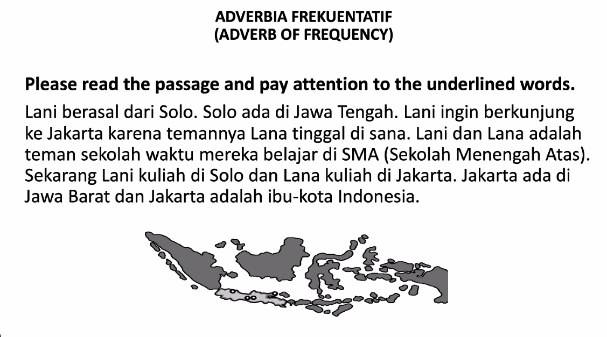

waktu = when (when used as conjunction)

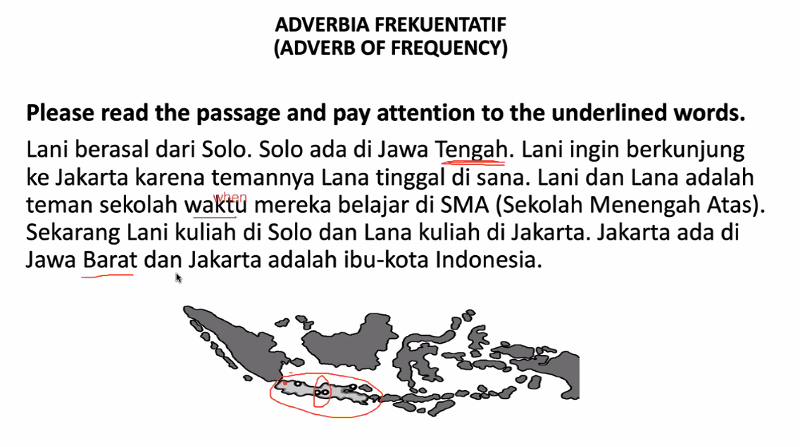

Utara = North
Selatan = South
Barat = West
Timur = East

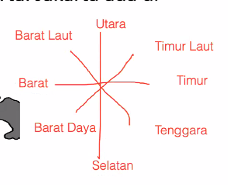

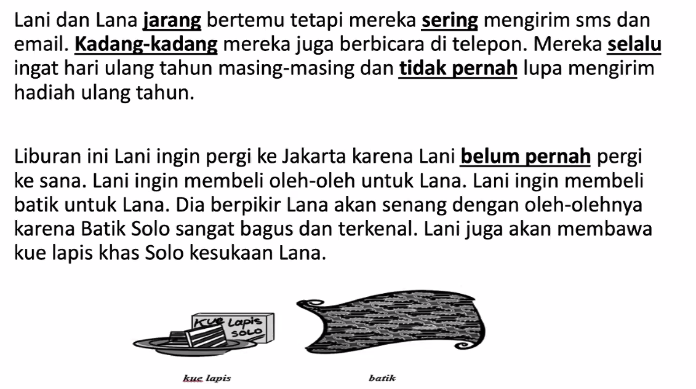

jarang = seldom
sering = often
kadang-kadang = sometimes
selalu = always
tidak pernah = never
masing-masing = each

belum pernah = not yet

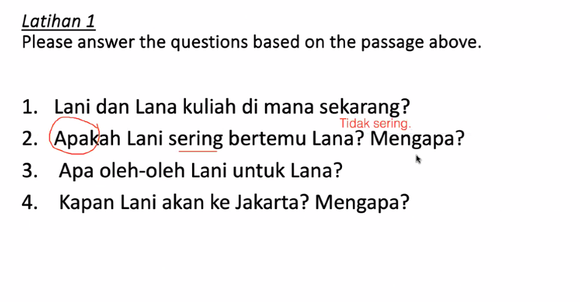

1. ...
2. Tidak sering. Karena Jakarta dan Solo jauh sekali. 
3. Batik dan kue lapis Solo.
4. 

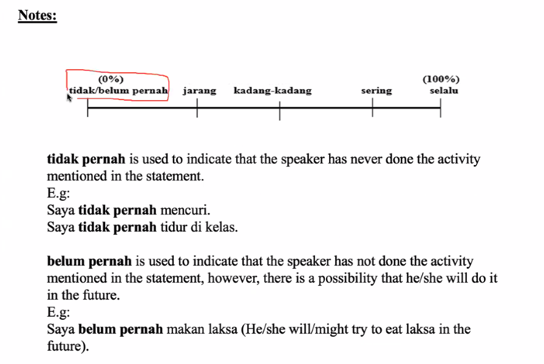

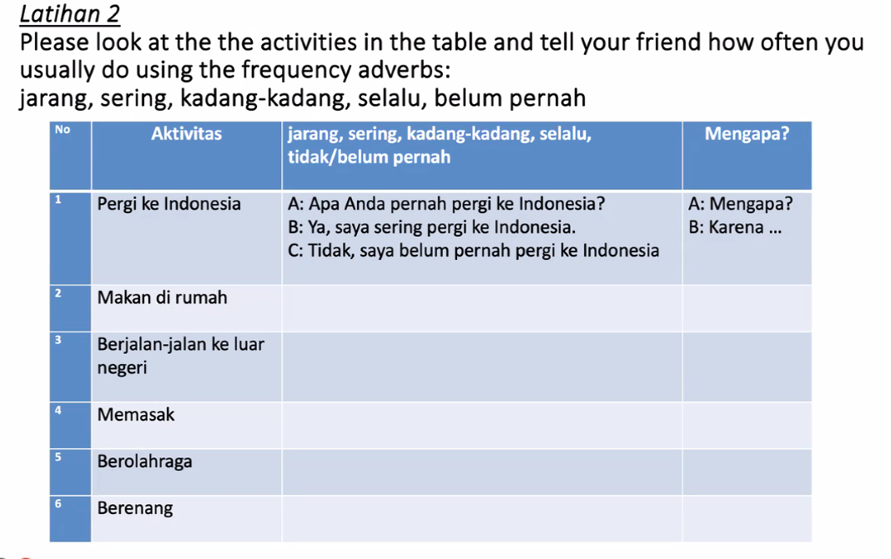

2. Saya kadang-kadang makan di rumah.
	1. Atau kadang-kadang saya makan di kanteen.

Dulu suka = last time like

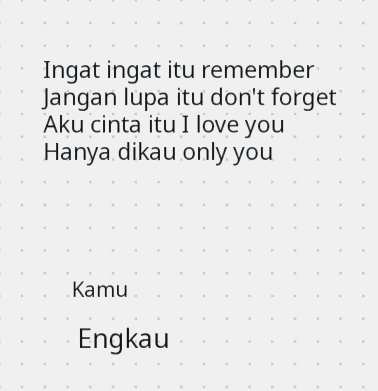

Kamu = you
Engkau = you but we don't use it in conversation. But use it mostly songs or literature.

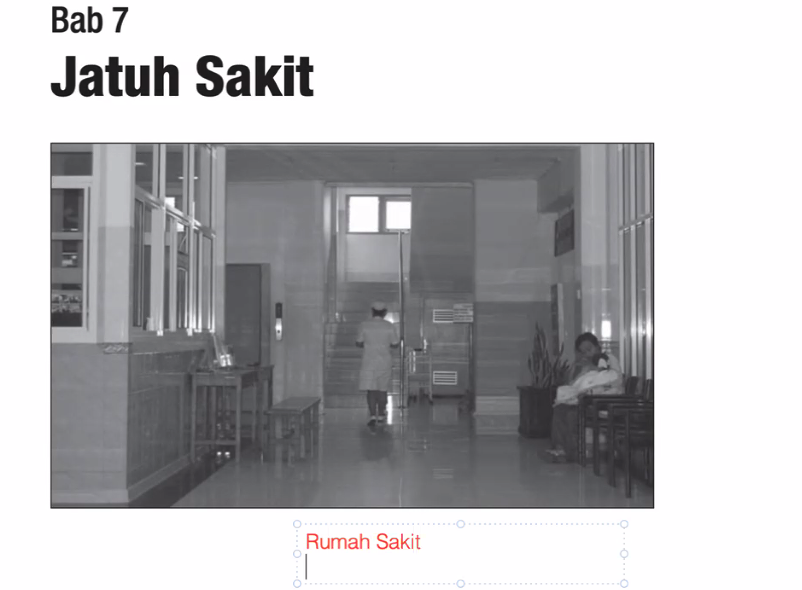

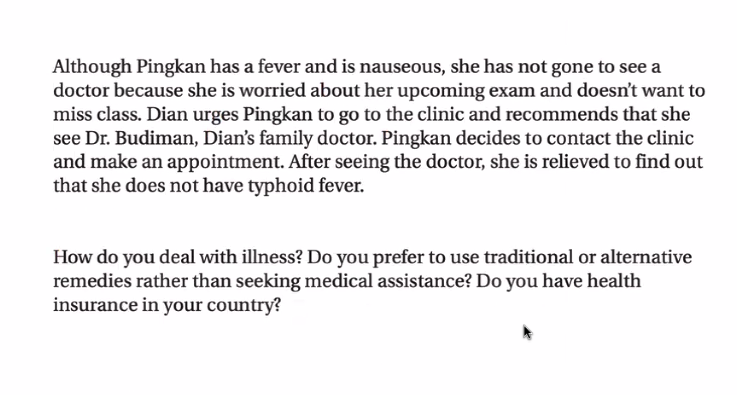

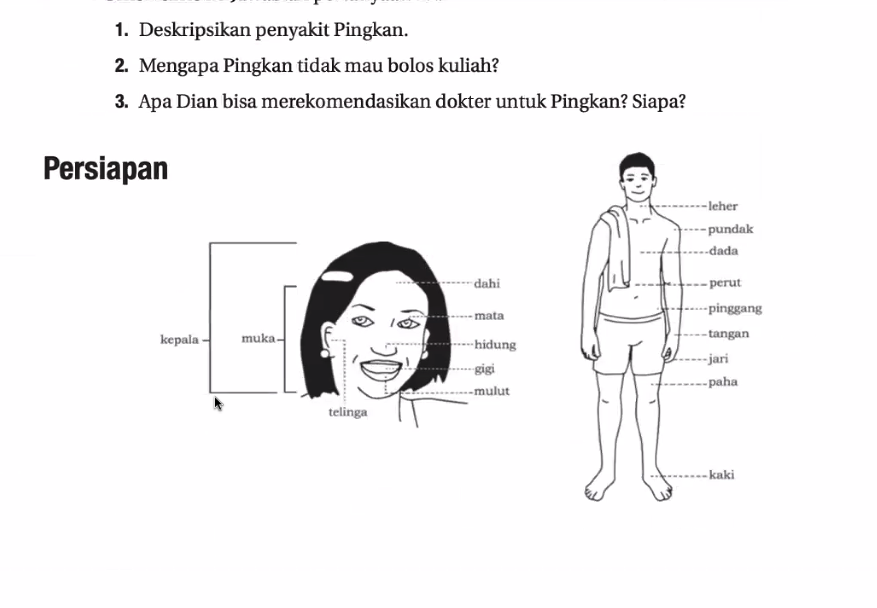

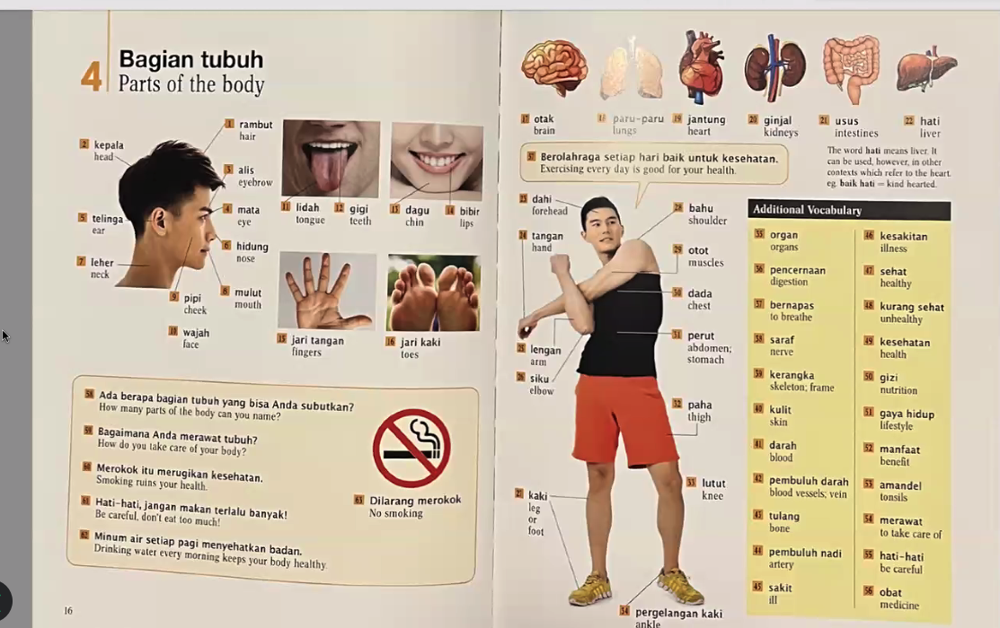

Bagian = parts
tubuh = body

Saya berkerja di bagian penjualan
bagian penjualan = sales department

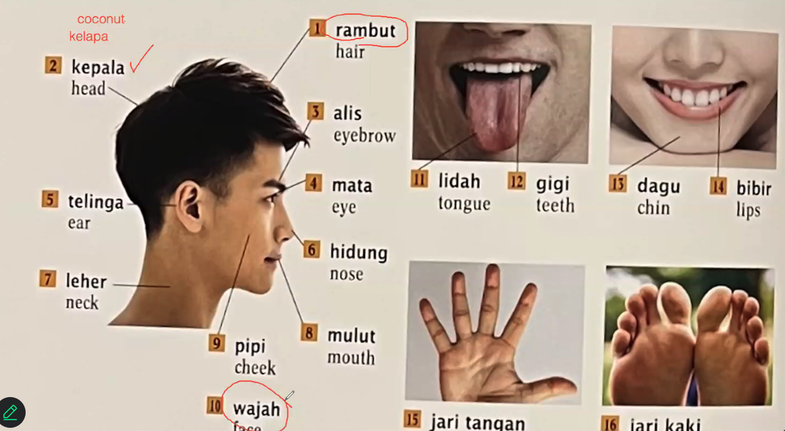

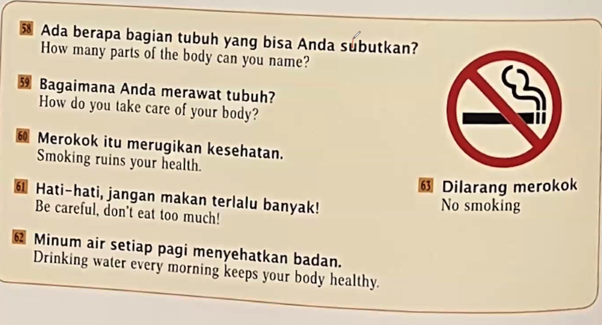

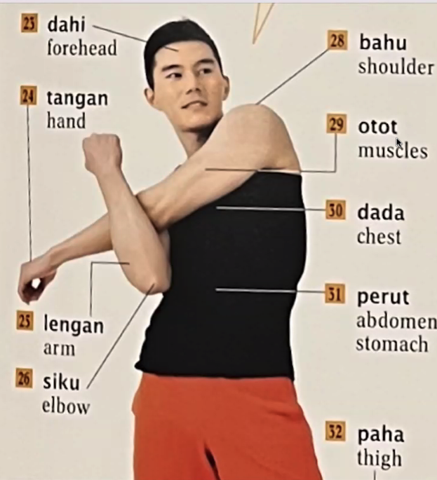

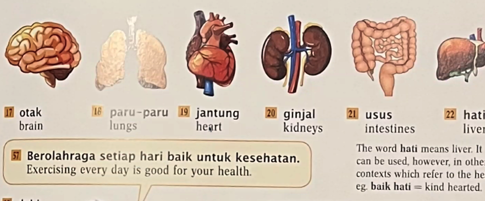

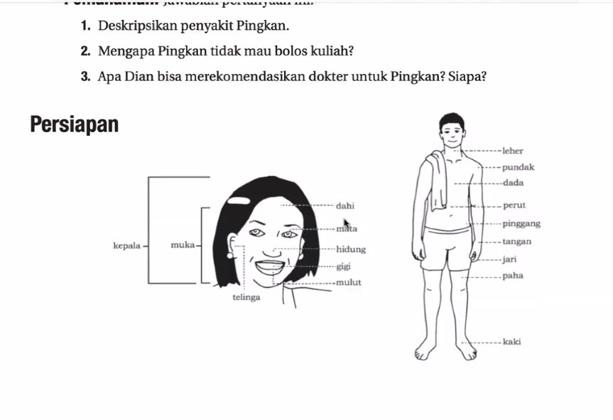

Perlu ingat "Persiapan".

wajah = muka = face

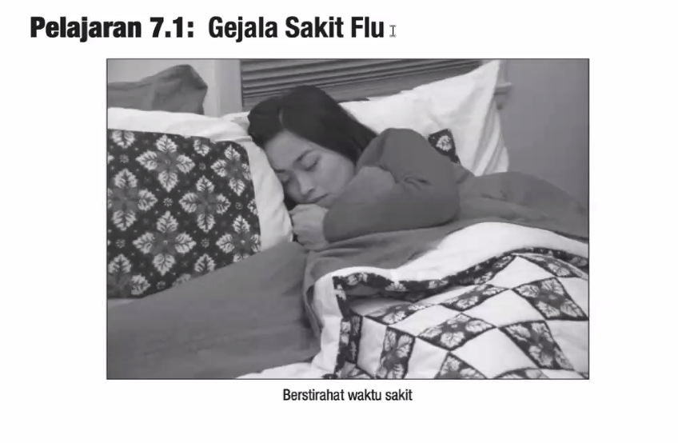

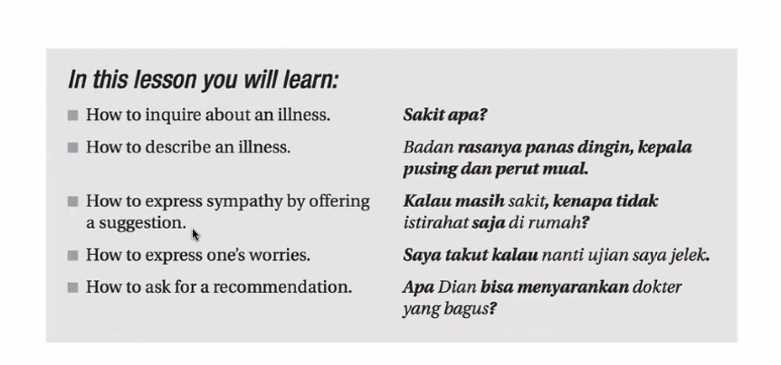

--- 

