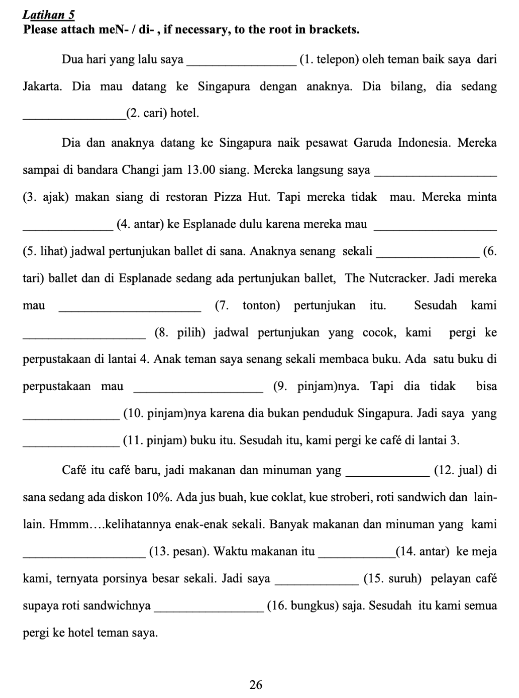
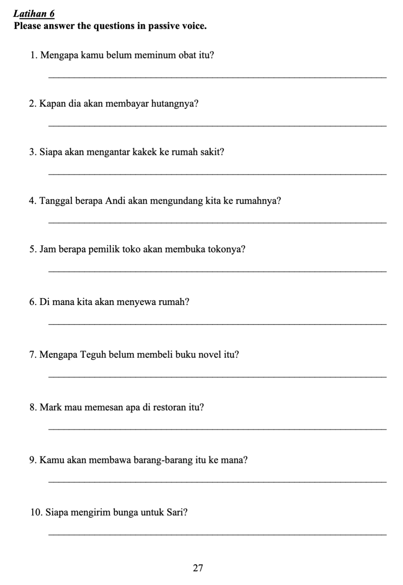
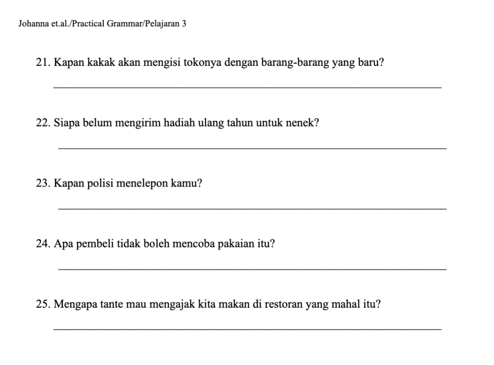

waktu = when (when used as conjunction)

Utara = North
Selatan = South
Barat = West
Timur = East

jarang = seldom
sering = often
kadang-kadang = sometimes
selalu = always
tidak pernah = never
masing-masing = each

belum pernah = not yet

1. ...
2. Tidak sering. Karena Jakarta dan Solo jauh sekali. 
3. Batik dan kue lapis Solo.
4. 

2. Saya kadang-kadang makan di rumah.
	1. Atau kadang-kadang saya makan di kanteen.

Dulu suka = last time like

Kamu = you
Engkau = you but we don't use it in conversation. But use it mostly songs or literature.

Bagian = parts
tubuh = body

Saya berkerja di bagian penjualan
bagian penjualan = sales department

Perlu ingat "Persiapan".

wajah = muka = face

--- 

PR:

|Part|Type|Meaning|
|---|---|---|
|**te- … -angga**|circumfix|indicates relation or position|
|**angga**|root (Old Javanese)|meaning “side” or “part”|

So, **tetangga** literally means “someone at the side,” i.e., **someone living beside you** → _neighbor._

**Pilih** means **“to choose”** or **“to select.”**  
It’s a **verb** (kata kerja).

|Part|Type|Meaning|
|---|---|---|
|**alat**|root word|tool, instrument|
|**per- … -an**|circumfix|forms a noun meaning “a collection or set of” the root|

So,  
**alat** → “tool”  
**peralatan** → “a set of tools” or “equipment.”

**Atur** means **“to arrange,” “to organize,”** or **“to regulate.”**  
It’s a **verb** (kata kerja).

| Form           | Prefix/Suffix                   | Meaning                                 |
| -------------- | ------------------------------- | --------------------------------------- |
| **atur**       | root                            | arrange, regulate                       |
| **mengatur**   | prefix **me-**                  | to arrange/manage (active)              |
| **diatur**     | prefix **di-**                  | to be arranged/managed (passive)        |
| **pengatur**   | prefix **pe-**                  | arranger/manager                        |
| **aturan**     | suffix **-an**                  | rule/regulation                         |
| **pengaturan** | prefix **pe-** + suffix **-an** | arrangement / organization / regulation |

**Halaman** has two main meanings depending on context:

1. **Yard / Courtyard / Garden area** (space outside a house or building)
    
    > **Anak-anak bermain di halaman.**  
    > “The children are playing in the yard.”
    
2. **Page (of a book or document)**

**Pel** in Indonesian can mean two things, depending on how it’s used:

1. **As a noun:** _mop_ — the tool used to clean floors.
    
    > **Pel-nya di dapur.**  
    > “The mop is in the kitchen.”
    
2. **As a verb:** _to mop_ — the act of cleaning the floor using a mop.
    
    > **Tolong pel lantainya.**  
    > “Please mop the floor.”

| Form         | Prefix/Suffix                      | Meaning                          |
| ------------ | ---------------------------------- | -------------------------------- |
| **pel**      | root (loanword from English “mop”) | mop / to mop                     |
| **mengepel** | prefix **meN-**                    | to mop (active)                  |
| **dipel**    | prefix **di-**                     | to be mopped (passive)           |
| **pelan**    | suffix **-an** (rare)              | the act of mopping (less common) |

Latihan 3
Dijawab oleh Jek (yang jawab Jek.)
1. diundang (pasif)
2. beli (pasif)
3. pilih (pasif)
4. bawa (pasif)
5. dibeli (impersonal pasif)
6. dimasak (pasif)
7. dibuat (pasif)
8. dicuci (pasif)
9. diatur (pasif)
10. dilap (pasif)
11. disapu (pasif)
12. dipel (pasif)

---

| Word       | Root           | Meaning                      |
| ---------- | -------------- | ---------------------------- |
| **tiup**   | root word      | to blow (air from the mouth) |
| **meniup** | prefix **me-** | to blow (active form)        |
| **ditiup** | prefix **di-** | to be blown (passive form)   |
| **lilin**  | root noun      | candle                       |

Latihan 4
Dijawab oleh Jek (yang jawab Jek)
1. mengundang (actif)
2. mengobrol (actif)
3. mengantar (actif)
4. pakai (pasif)
5. memakai (actif)
6. memasak (actif)
7. dibuat (pasif)
8. membuat (actif)
9. meniup (actif)
10. dipotong (pasif)
11. dijemput (pasif)
12. menunggu (actif)

---

**Pinjam** means **“to borrow”** or **“to lend.”**  
It’s usually used to mean **borrow**, but with different prefixes it can also mean **lend**.

**Suruh** means **“to tell (someone) to do something”** or **“to order/ask someone to do something.”**  
It’s a **verb** (kata kerja) used when one person gives instructions to another.

**Bungkus** means **“to wrap”** or **“to pack.”**  
It can be used as both a **verb** (_to wrap something_) and a **noun** (_a package_). In Indonesian daily life, **bungkus** is very common, especially in **food culture**.

Latihan 5
Dijawab oleh Jek

1. ditelepon (pasif)
2. mencari (actif)
3. ajak (pertama pasif)
4. mengantar (actif)
5. melihat (actif)
6. menari (actif)
7. menonton (actif)
8. memilih (actif)
9. dipinjam (pasif)
10. meminjam (actif)
11. meminjam (actif)
12. dijual (pasif)
13. pesan (pasif)
14. mengantar (actif)
15. menyuruh (actif)
16. bungkus

---

Latihan 6

Dijawab oleh Jek:
1. Mengapa obat itu kamu belum diminum?
2. ...

