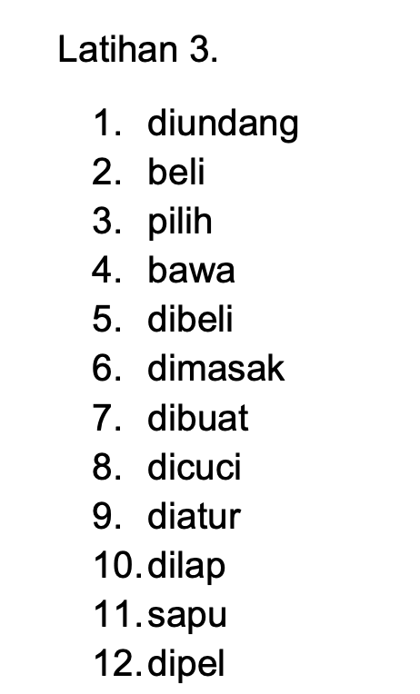
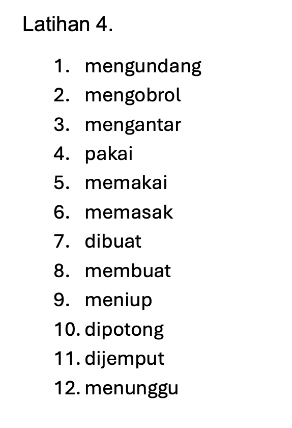
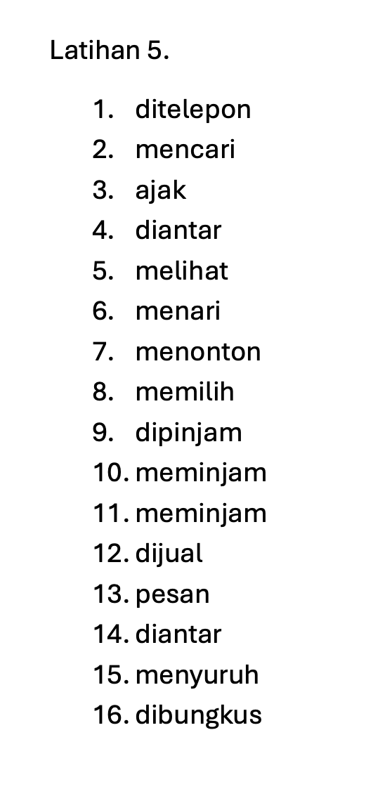

PR:

|Part|Type|Meaning|
|---|---|---|
|**te- … -angga**|circumfix|indicates relation or position|
|**angga**|root (Old Javanese)|meaning “side” or “part”|

So, **tetangga** literally means “someone at the side,” i.e., **someone living beside you** → _neighbor._

**Pilih** means **“to choose”** or **“to select.”**  
It’s a **verb** (kata kerja).

|Part|Type|Meaning|
|---|---|---|
|**alat**|root word|tool, instrument|
|**per- … -an**|circumfix|forms a noun meaning “a collection or set of” the root|

So,  
**alat** → “tool”  
**peralatan** → “a set of tools” or “equipment.”

**Atur** means **“to arrange,” “to organize,”** or **“to regulate.”**  
It’s a **verb** (kata kerja).

| Form           | Prefix/Suffix                   | Meaning                                 |
| -------------- | ------------------------------- | --------------------------------------- |
| **atur**       | root                            | arrange, regulate                       |
| **mengatur**   | prefix **me-**                  | to arrange/manage (active)              |
| **diatur**     | prefix **di-**                  | to be arranged/managed (passive)        |
| **pengatur**   | prefix **pe-**                  | arranger/manager                        |
| **aturan**     | suffix **-an**                  | rule/regulation                         |
| **pengaturan** | prefix **pe-** + suffix **-an** | arrangement / organization / regulation |

**Halaman** has two main meanings depending on context:

1. **Yard / Courtyard / Garden area** (space outside a house or building)
    
    > **Anak-anak bermain di halaman.**  
    > “The children are playing in the yard.”
    
2. **Page (of a book or document)**

**Pel** in Indonesian can mean two things, depending on how it’s used:

1. **As a noun:** _mop_ — the tool used to clean floors.
    
    > **Pel-nya di dapur.**  
    > “The mop is in the kitchen.”
    
2. **As a verb:** _to mop_ — the act of cleaning the floor using a mop.
    
    > **Tolong pel lantainya.**  
    > “Please mop the floor.”

| Form         | Prefix/Suffix                      | Meaning                          |
| ------------ | ---------------------------------- | -------------------------------- |
| **pel**      | root (loanword from English “mop”) | mop / to mop                     |
| **mengepel** | prefix **meN-**                    | to mop (active)                  |
| **dipel**    | prefix **di-**                     | to be mopped (passive)           |
| **pelan**    | suffix **-an** (rare)              | the act of mopping (less common) |

Latihan 3
Dijawab oleh Jek (yang jawab Jek.)
1. diundang (pasif)
2. beli (pasif)
3. pilih (pasif)
4. bawa (pasif)
5. dibeli (impersonal pasif)
6. dimasak (pasif)
7. dibuat (pasif)
8. dicuci (pasif)
9. diatur (pasif)
10. dilap (pasif)
11. disapu (pasif) XXX --> betul: sapu
12. dipel (pasif)

---

| Word       | Root           | Meaning                      |
| ---------- | -------------- | ---------------------------- |
| **tiup**   | root word      | to blow (air from the mouth) |
| **meniup** | prefix **me-** | to blow (active form)        |
| **ditiup** | prefix **di-** | to be blown (passive form)   |
| **lilin**  | root noun      | candle                       |

Latihan 4
Dijawab oleh Jek (yang jawab Jek)
1. mengundang (actif)
2. mengobrol (actif)
3. mengantar (actif)
4. pakai (pasif)
5. memakai (actif)
6. memasak (actif)
7. dibuat (pasif)
8. membuat (actif)
9. meniup (actif)
10. dipotong (pasif)
11. dijemput (pasif)
12. menunggu (actif)

---

**Pinjam** means **“to borrow”** or **“to lend.”**  
It’s usually used to mean **borrow**, but with different prefixes it can also mean **lend**.

**Suruh** means **“to tell (someone) to do something”** or **“to order/ask someone to do something.”**  
It’s a **verb** (kata kerja) used when one person gives instructions to another.

**Bungkus** means **“to wrap”** or **“to pack.”**  
It can be used as both a **verb** (_to wrap something_) and a **noun** (_a package_). In Indonesian daily life, **bungkus** is very common, especially in **food culture**.

Latihan 5
Dijawab oleh Jek

1. ditelepon (pasif)
2. mencari (actif)
3. ajak (pertama pasif)
4. mengantar (actif) XXX --> betul: diantar
5. melihat (actif)
6. menari (actif)
7. menonton (actif)
8. memilih (actif)
9. dipinjam (pasif)
10. meminjam (actif)
11. meminjam (actif)
12. dijual (pasif)
13. pesan (pasif)
14. mengantar (actif) XXX --> betul: diantar 
15. menyuruh (actif)
16. bungkus XXX --> betul: dibungkus

---

Latihan 6

bayar = pay

Hutang = debt, money owed

“Tanggal berapa?” → “What date is it?” or “When (exactly)?”

|Part|Meaning|Notes|
|---|---|---|
|**pe-**|prefix meaning “the person who…”|forms nouns indicating an agent or doer|
|**miliki** / **memiliki**|to own / to possess|derived from _milik_|
|**milik**|possession / ownership|root noun|

So:

- **milik** → possession
    
- **memiliki** → to own
    
- **pemilik** → the owner

Dijawab oleh Jek:
1. Saya belum minimum obat karena saya belum makan.
	1. Obat itu belum saya minimum karena saya belum makan siang.
2. Besok dia akan membayar hutangnya.
	1. Hutangnya akan dibayar oleh dia besok.
3. Saya mau antar kakek ke rumah sakit.
	1. kakek mau diantar oleh saya ke rumah sakit.
4. Besok Andi akan mengundang kita ke rumahnya.
	1.  Kita akan diundang oleh Andi ke rumahnya tanggal 5 November.
5. Setiap hari jam sembilan pemilik toko akan membuka tokonya.
	1. Tokonya akan dibuka oleh pemilik toko setiap hari jam sembilan
6. Kita akan menyewa rumah di Singapura
	1. Rumah akan kita sewa di Singapura
7. Teguh belum membeli buku novel itu karena mahal sekali
	1. Buku novel itu belum dibeli oleh Teguh karena mahal sekali.
8. Mark mau memesan ayam nasi goreng di restoran itu.
	1. ayam nasi goreng mau dipesan oleh Mark di restoran itu. 
9. Saya akan membawa barang-barang itu ke toko buku.
	1. Barang-barang itu akan saya bawa ke toko buku.
10. Pacar Sari mengirim bunga untuk Sari
	1. Bunga untuk Sari dikirim oleh pacarnya

---

|Word|Meaning|Usage|English Equivalent|
|---|---|---|---|
|**nonton**|to watch|informal / spoken|watch (casual)|
|**menonton**|to watch|formal / written|to watch (formal)|
|**tonton**|watch (root form / command)|base or imperative|watch (as a command)|

Dijawab oleh Jek:
11. Saya akan menonton film itu di jam sembilan
	1. film itu akan saya tonton jam sembilan
12. Bulan depan kita akan menjual rumah itu.
	1. rumah itu akan kita jual bulan depan.
13. 

Dijawab oleh Jek:

21. ...
22. ...

Kenapa jerapah-jerapah berkelahi?

Ada gedung-gedung di Singapura

Tidak cukup meja-meja untuk  belajar.

Saya tidak suka minuman -minuman kaleng karena manis sekali.

Rumah sakit itu kurang dokter-dokter.

