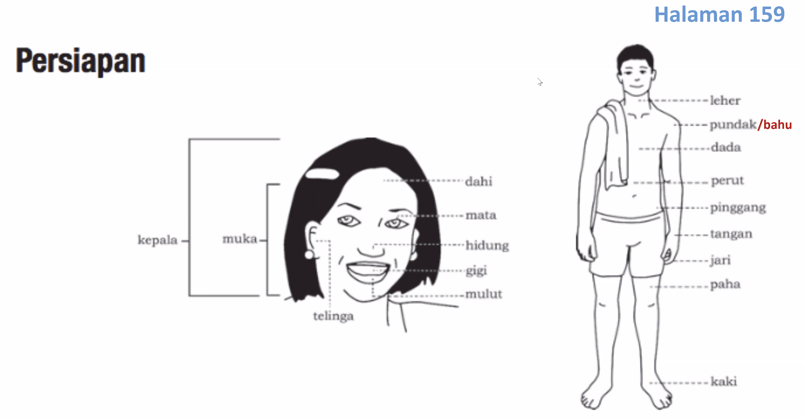

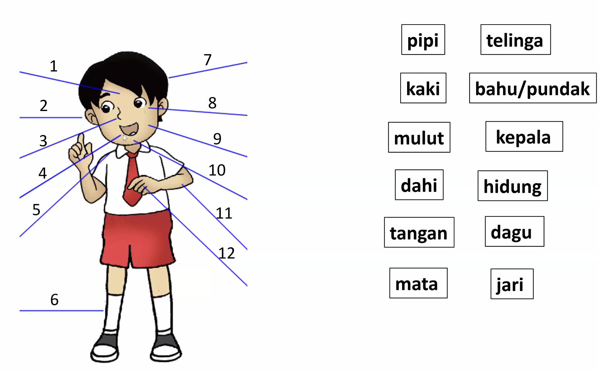

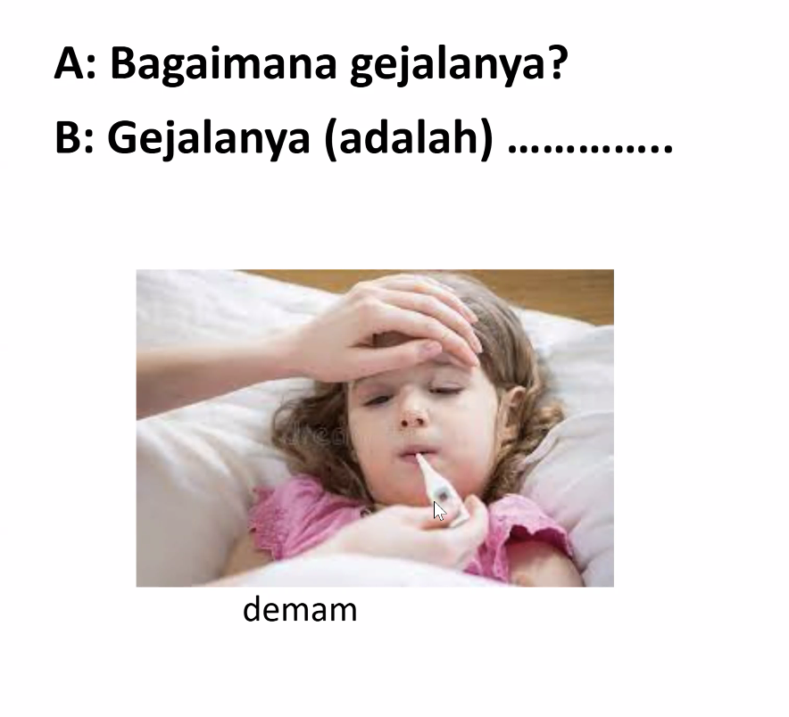

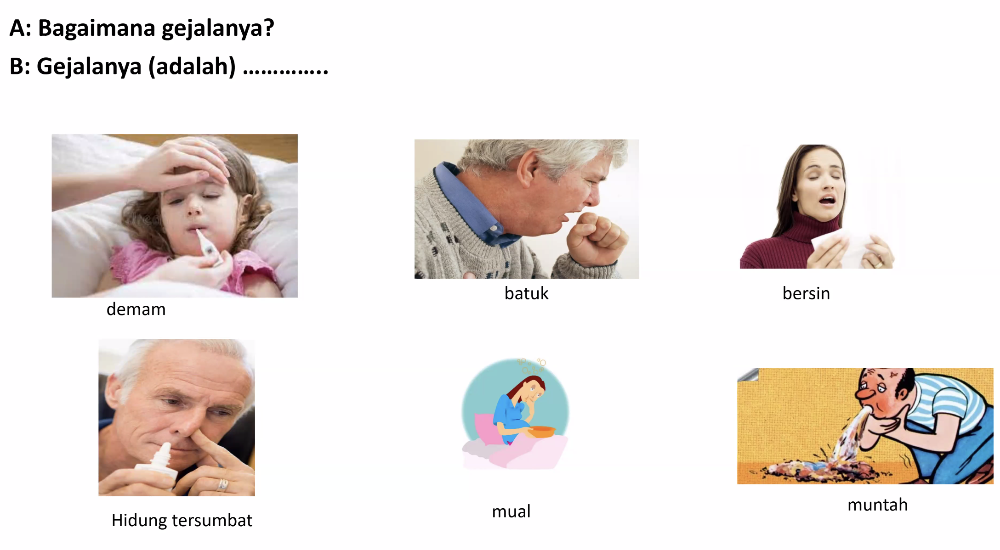

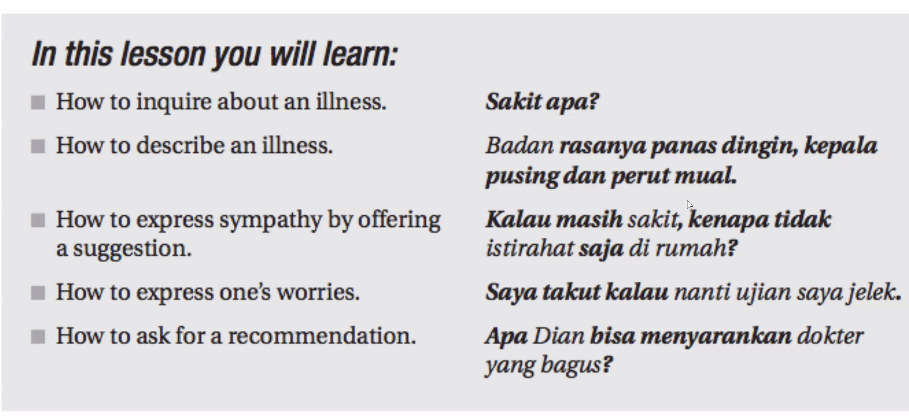

**“Ujian”** means **“exam,” “test,” or “trial.”**

**“Jelek”** means **“bad,” “ugly,” “poor quality,”** or **“unpleasant.”**

| Part       | Function  | Meaning              |
| ---------- | --------- | -------------------- |
| **sembuh** | root verb | to recover / to heal |

|Part|Function|Meaning|
|---|---|---|
|**sehat**|root adjective|healthy|
|**ke-...-an**|circumfix|forms a **noun** meaning “the state or condition of being …”|

So:  
**sehat (healthy)** → **kesehatan (health, the state of being healthy)**

**“Penting”** means **“important”** or **“significant.”**

**“Mahir”** means **“skilled,” “proficient,” “expert,” or “adept.”**  
It describes someone who does something **very well** because of **experience or talent.**

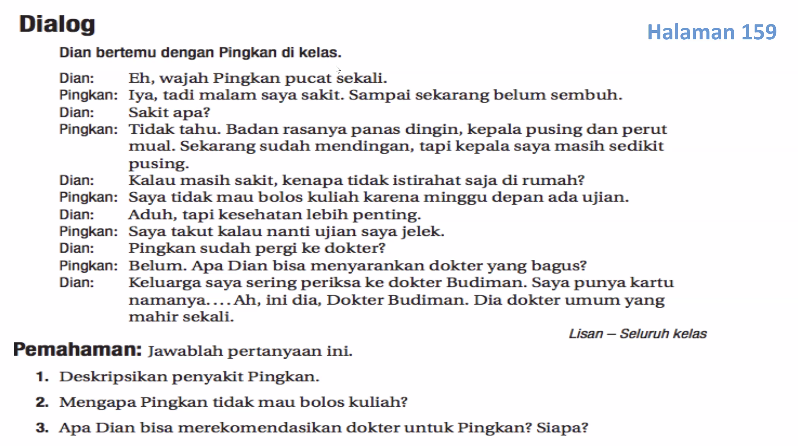

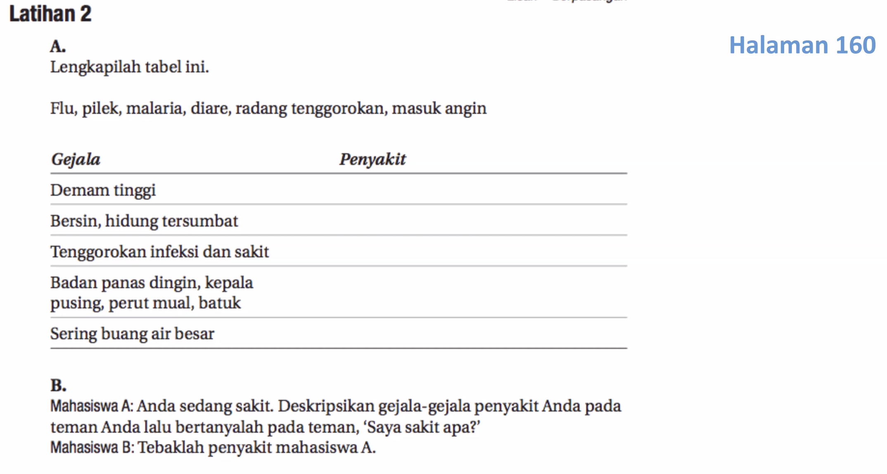

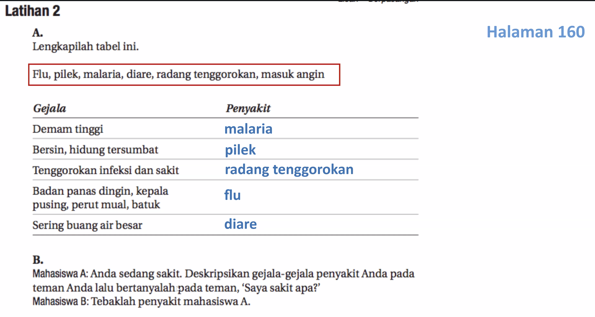

Kamu ada gejala apa?

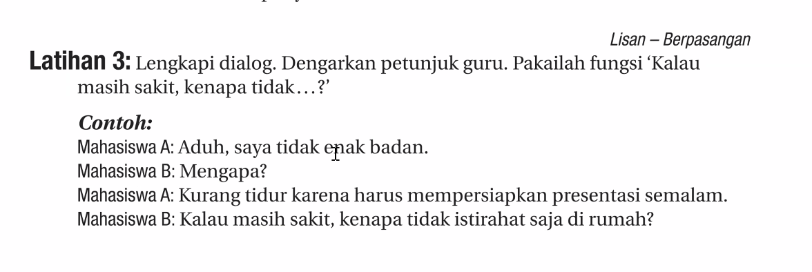

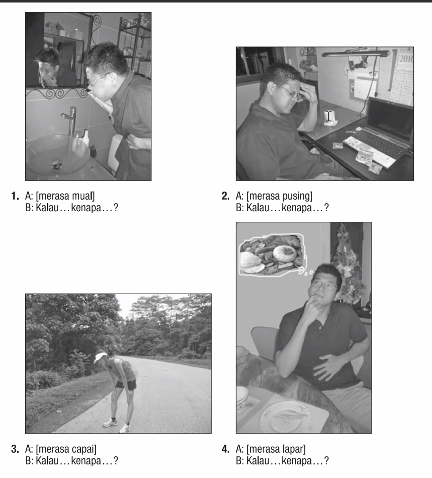

sakit

Saya sakit

penyakit

Penyakit saya flu.
penyakit paru

paru-paru

tenggorokan infeksi, batuk karena sering merokok

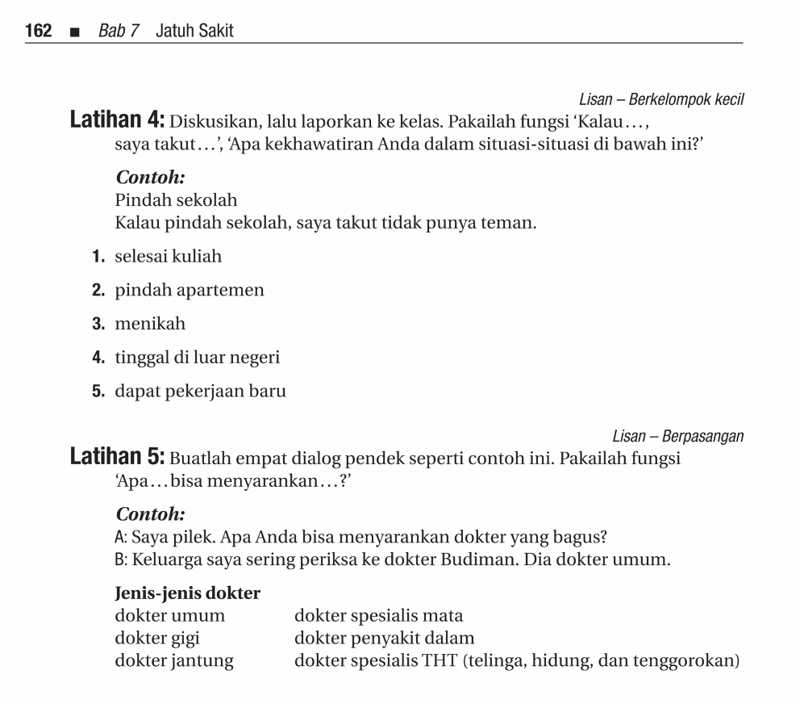

lulus kuliah

lingkungan baru

Jangan takut....

melihat vs bertemu

orang tua saya akan sering melihat anak saya. (weird because melihat is just seeing, not meet)

orang tua saya akan sering bertemu dengan anak saya

Saya melihat pertunjukan tarian.

Saya menyanyi Majulah Singapura. (cannot be pasif)

Saya menari Lion Dance (cannot be pasif)
