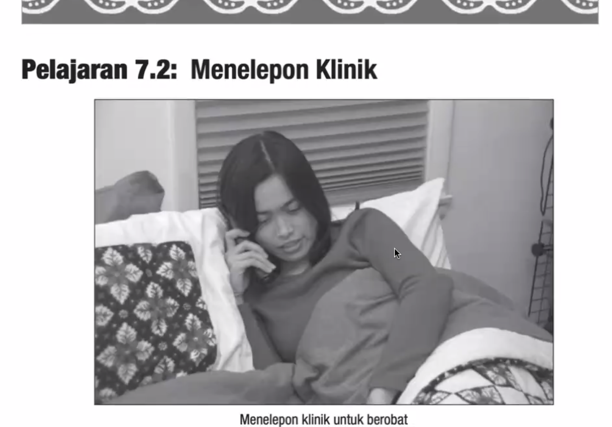

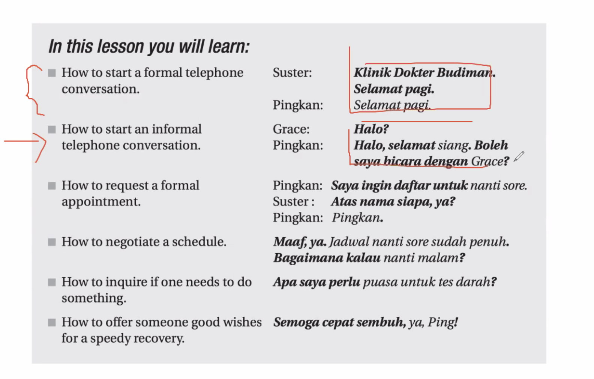

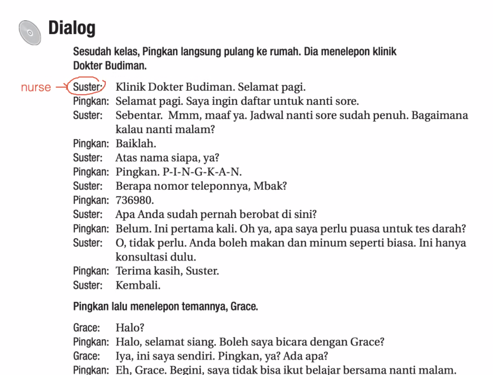

daftar = register

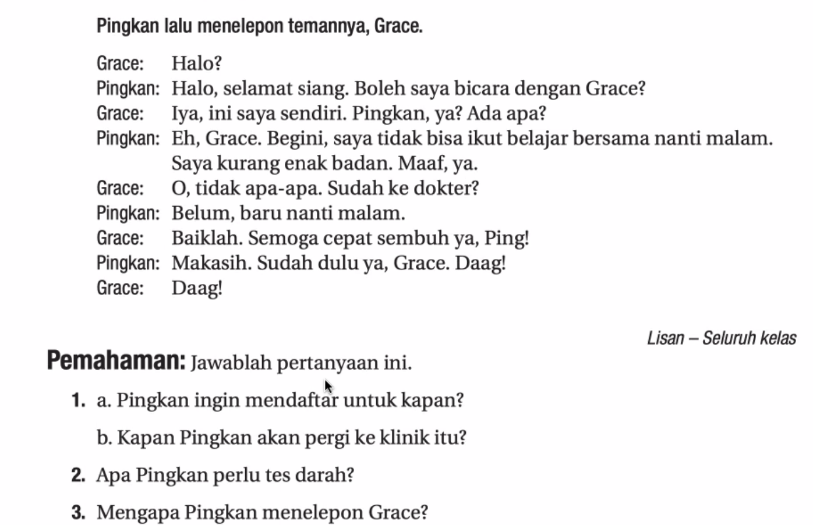

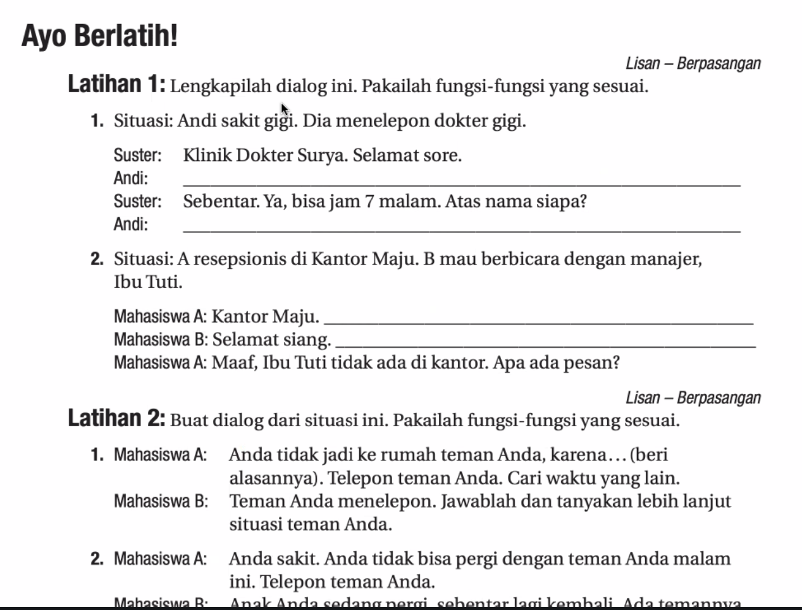

Latihan 1
1. Andi: Selamat sore. Saya mau daftar untuk nanti malam (atau malam hari) jam 7.
	1. Andi: Nama saya Andi A-N-D-I
2. Mahasiswa A: Selamat Siang.
	1. Mahasiswa B: Boleh saya mengobrol dengan manajer Ibu Tuti. <-- it is informal to use mengobrol, use bicara.

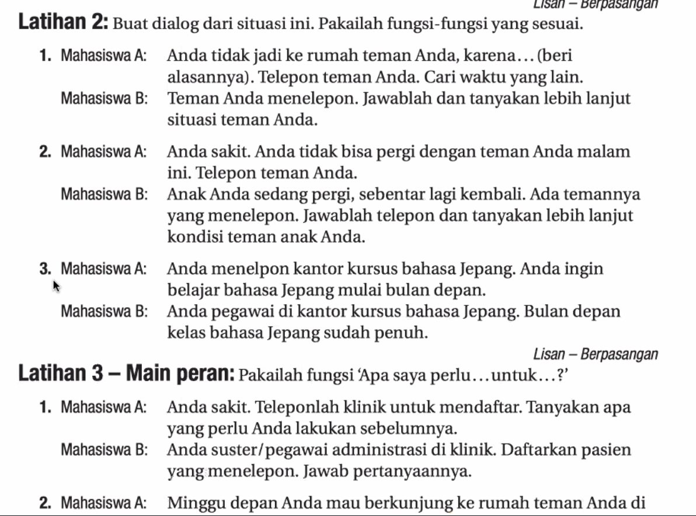

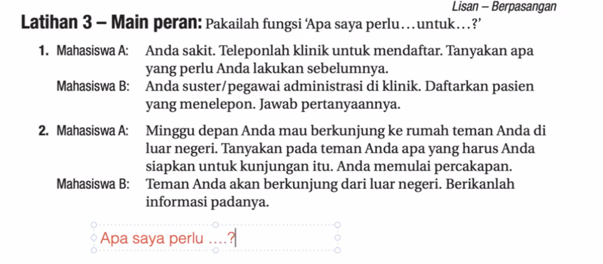

Apa saya perlu membawa uang untuk berobat? Berapa banyak?

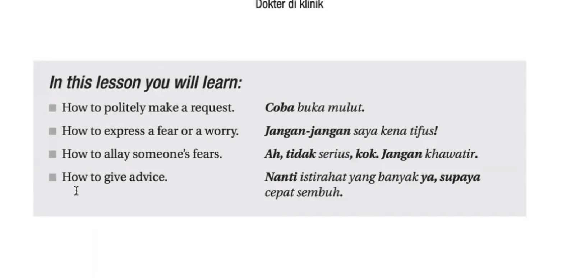

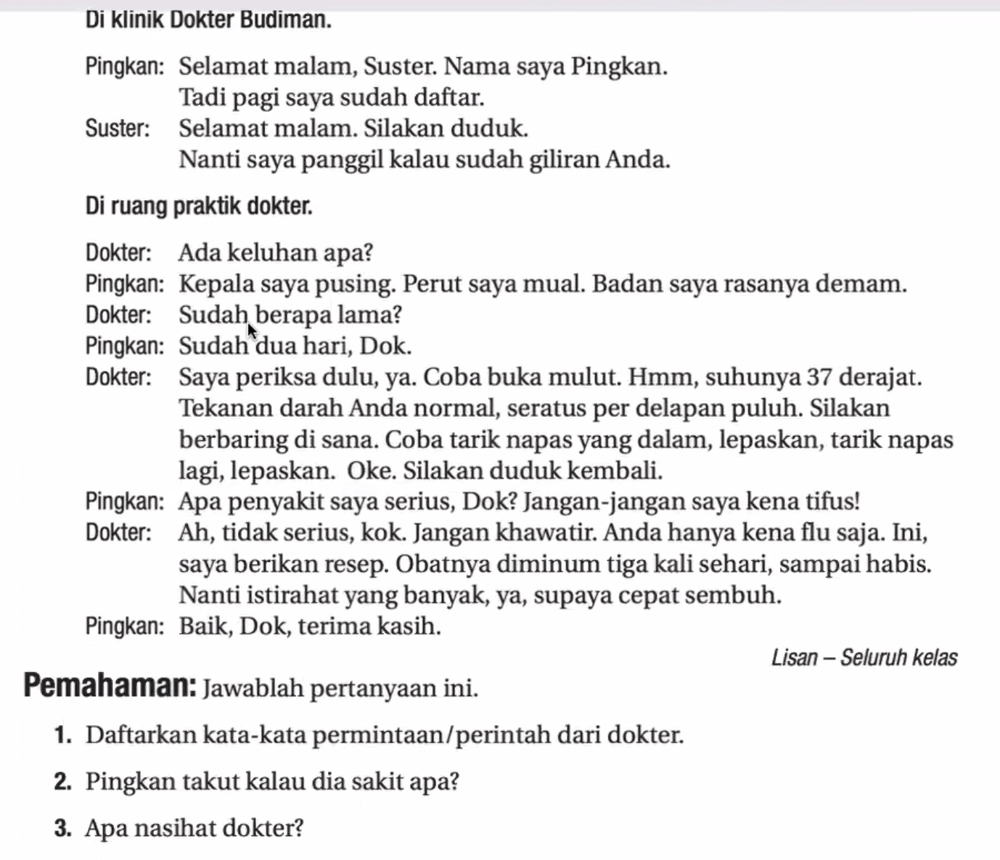

ruang praktek 

periksa = check

supaya = in order to <-- must remember this.

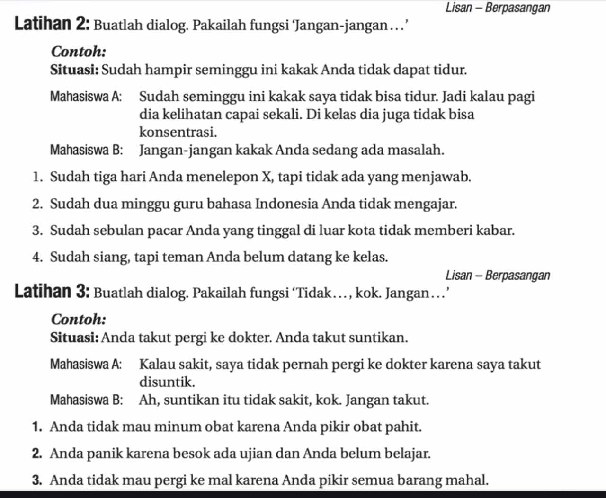

| Word          | Root          | Meaning                    | Notes                                                                   |
| ------------- | ------------- | -------------------------- | ----------------------------------------------------------------------- |
| jangan        | —             | don’t / a prohibitive word | used to tell someone **not to do** something                            |
| jangan-jangan | reduplication | “what if…”, “maybe…”       | the repetition changes it from prohibition to **suspicion/possibility** |

PR --> 

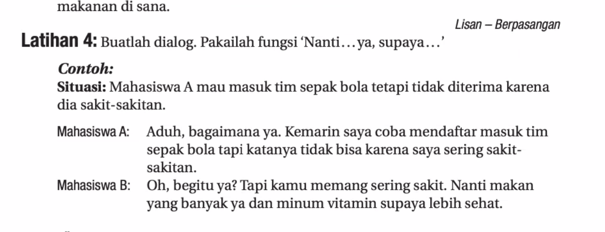

capai = tired but in dictionary but people say "capek" 

Tuesday Test --> Listening, actif pasif, and creating dialog.

Thursday Test --> Writing test