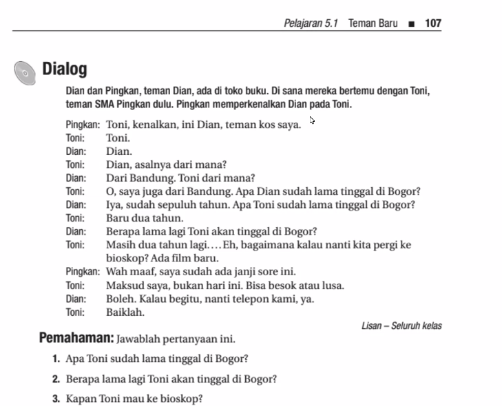

1. Belum, baru dua tahun
2. Toni akan tinggal di Bogor masih dua tahun lagi
3. Toni mau ke bioskop besok atau lusa

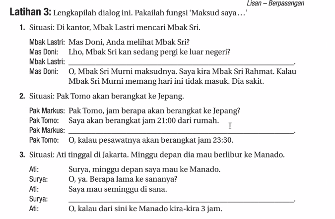

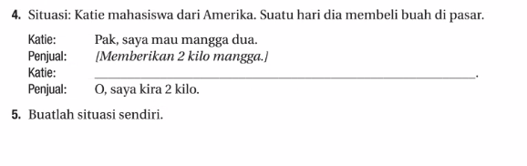

1. Mbak Lastri: Maksud saya, saya mencari Mbak Sri Murni, bukan Mbak Sri Rahmat.
2. Maksud saya, jam berapa pesawatnya akan berangkat? 
3. Maksud saya, berapa lama dari Jakarta ke Manado?
4. Maksud saya, saya mau 2 buah mangga.

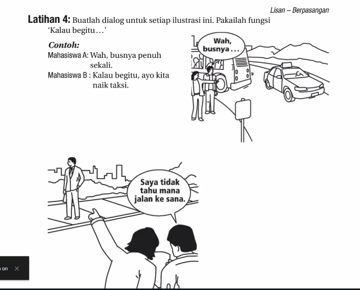
Kalau begitu, Kita bisa tanya orang itu aja.
Kalau begitu, ayo kita bertanya kepada orang itu.

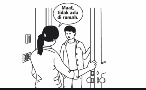
Kalau begitu...
kurang bagus --> Nanti saya balik lagi ya.
Bagus --> Saya akan kembali nanti.
Bagus --> Saya datang lagi nanti.
Bisa --> Saya akan telephon nanti.

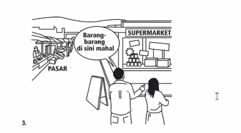

Kalau begitu, kita pergi ke pasar.
Kalau begitu, Anda cek harga di Shopee, saya pergi ke pasar cek harga.
Kalau begitu, ayo kita pergi ke pasar di sana.
Kalau begitu, ayo kita pergi ke pasar. Barang-barang di sana lebih murah.

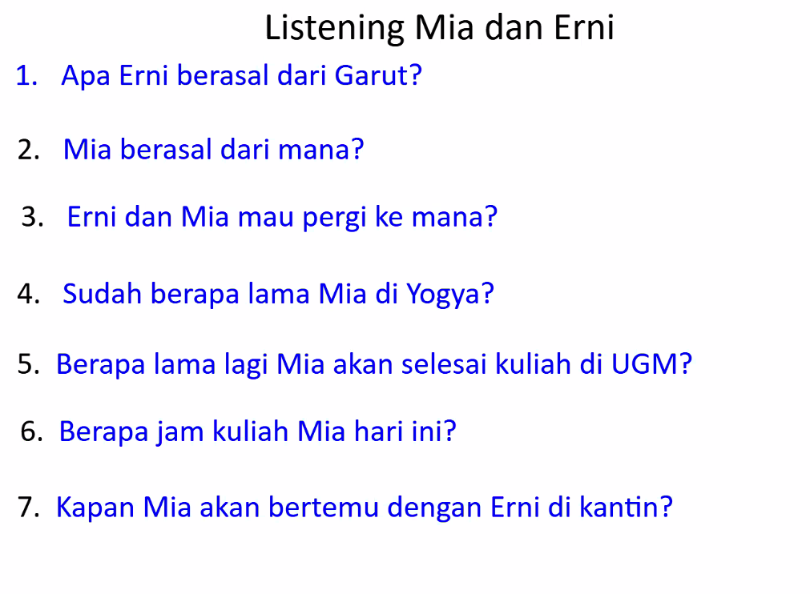

UGM = Universitas

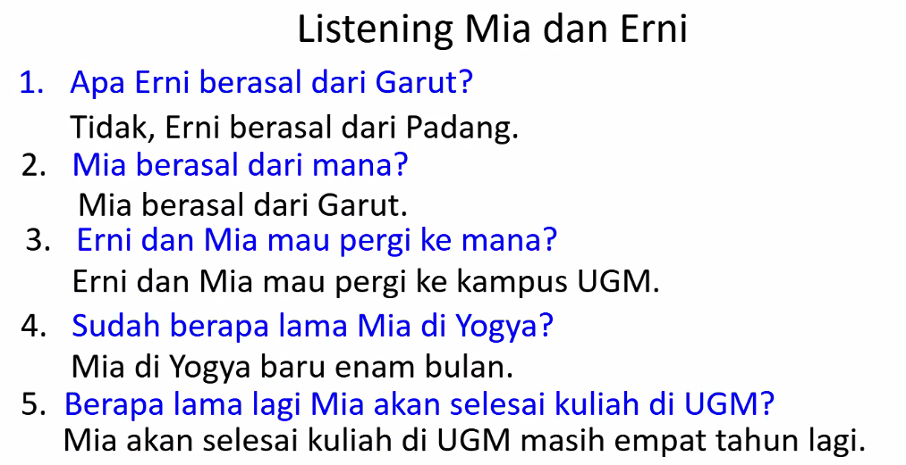

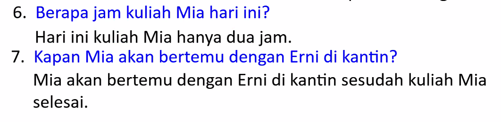

 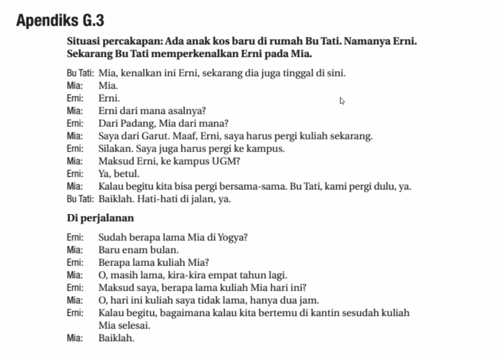

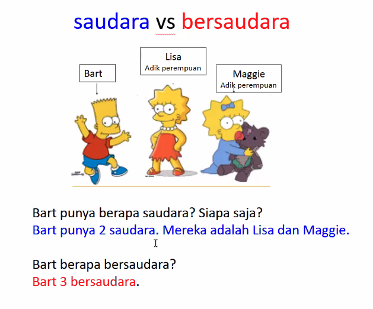

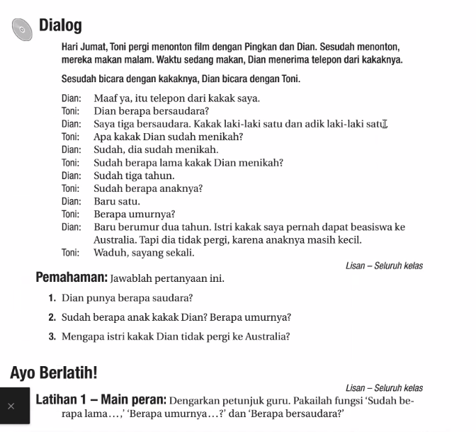

beasiswa = scholarshiop.

Waduh = (expression)

- **baru** → root word, meaning “new” / “recently.”
    
- **ber-umur**
    
    - **ber-** = prefix meaning “to have” or “to possess.”
        
    - **umur** = root word, “age.”
        
    - Together: **berumur** = “to have age” / “aged.”

1. Dian punya dua saudara.
2. Anak kaka Dian baru satu (this implies that wants more). Dia berumur dua tahun.
3. Karena anaknya masih kecil.

- **“Ada 2 saudara”** = _“There are 2 siblings”_ (existence).
    
- **“Punya 2 saudara”** = _“(I/He/She) has 2 siblings”_ (possession).

- Use **punya** when talking about your own siblings.
    
- Use **ada** when pointing out existence (e.g., in the family there are two siblings).

- Question: _“Berapa saudara kamu?”_ (How many siblings do you have?)
    
- Answer: _“Saya punya dua saudara.”_ (I have two siblings.)

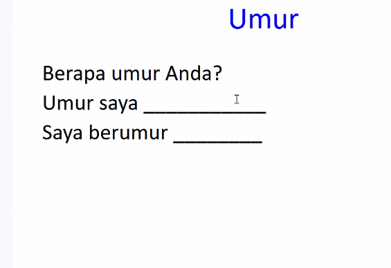

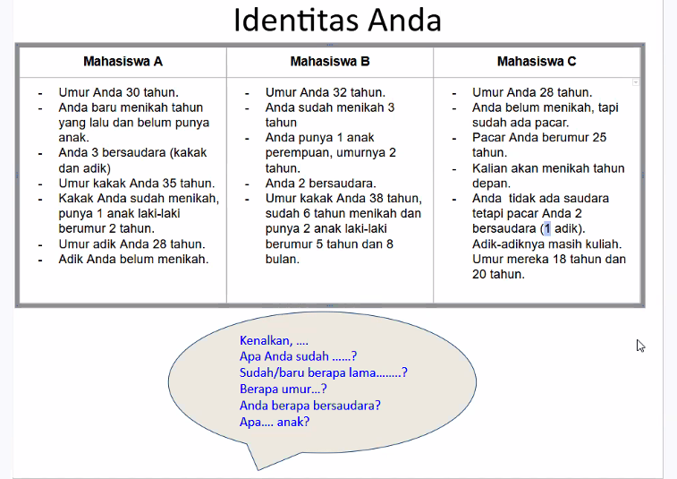

30 September (hari selasa) - mock test. Ada listening. Grammar tentang verb. Lalu untuk dialog boku ini sampai Pelajaran 5.3 (samapi verb).

