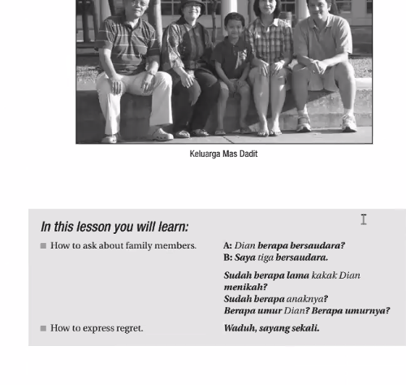

Memorise technique:

- Wednesday = Rabu
    
- Thursday = Kamis
    
- Friday = Jumat

While eating **Ra**men cooked by I**bu**, I saw a **Ka**yak **mis**placed by a **Ju**venile who says it's a small **mat**ter.

- **Pingkan memperkenalkan Dian kepada Toni** ✅ → Correct, standard, formal Indonesian.  
    → “Pingkan introduced Dian to Toni.”
    
- **Pingkan memperkenalkan Dian pada Toni** ⚠️ → Possible, but feels **less standard**. In formal Indonesian, _kepada_ is preferred when the object is a **person**. _Pada_ here sounds off in writing, though some speakers might use it casually.

**kos** (short for _kos-kosan_) = rented room / boarding house (common among students or young workers).

1. Belum lama, baru dua tahun
2. Toni akan tinggal di Bogor masih dua tahun lagi
3. Toni mau ke bioskop besok atau lusa
- **besok** = tomorrow.
    
- **atau** = or.
    
- **lusa** = the day after tomorrow.

1. Mbak Lastri: Maksud saya, saya mencari Mbak Sri Murni, bukan Mbak Sri Rahmat.
2. Maksud saya, jam berapa pesawatnya akan berangkat? 
3. Maksud saya, berapa lama dari Jakarta ke Manado?
4. Maksud saya, saya mau 2 buah mangga.

Kalau begitu, Kita bisa tanya orang itu.
Kalau begitu, ayo kita bertanya kepada orang itu.

**ayo** = let’s (encouragement).
- Teachers often use it with students: _“Ayo belajar!”_ → “Come on, let’s study!”
    
- Parents to kids: _“Ayo makan!”_ → “Let’s eat!”
    
- Friends: _“Ayo pergi sekarang.”_ → “Let’s go now.”

Kalau begitu...
kurang bagus --> Nanti saya balik lagi ya.
Bagus --> Saya akan kembali nanti.
Bagus --> Saya datang lagi nanti.
Bisa --> Saya akan telephon nanti.

Kalau begitu, kita pergi ke pasar.
Kalau begitu, Anda cek harga di Shopee, saya pergi ke pasar cek harga.
Kalau begitu, ayo kita pergi ke pasar di sana.
Kalau begitu, ayo kita pergi ke pasar. Barang-barang di sana lebih murah.

- **Apa** = “Does/Is” → A question marker in Indonesian. Used to start yes/no questions.
    
- **Erni** = a person’s name.
    
- **berasal** = “to come from / originate from.”
    
- **dari** = “from.” A preposition.
    
- **Garut** = a regency (kabupaten) in West Java, Indonesia.

“Does Erni come from Garut?” or more naturally:  
“Is Erni from Garut?”

**selesai** = _finished, completed, done._

Kalau tugas sudah selesai, kamu kerjakan yang lain. = “If the assignment is finished, you do the other one.”

- **Berapa** = “How many / how much.” Used to ask about numbers or amounts.
    
- **jam** = “hour / o’clock.” Here it means “hours (of duration).”
    
- **kuliah** = “lecture / class (at university).” Also used as a verb “to study at university.”
    
- **Mia** = person’s name.
    
- **hari ini** = “today.” (_hari_ = day, _ini_ = this).
“How many hours of classes does Mia have today?”

UGM = Universitas

 

**“Sudah berapa lama _kakak_ Dian menikah?”**  
= “How long has Dian’s older sibling been married?”

**kakak laki-laki** = _older brother_.

- **kakak** = older sibling (gender-neutral, could be brother or sister).
    
- **laki-laki** = man / male.

In Indonesian families, people usually call their older siblings _kakak_ (or _kak_ in short). To clarify gender, you can say _kakak laki-laki_ (older brother) or _kakak perempuan_ (older sister).

In Indonesian families, _adik_ is used for anyone younger than you (biological sibling, or sometimes even cousins/close relatives). To clarify gender, Indonesians say:

- _adik laki-laki_ = younger brother.
    
- _adik perempuan_ = younger sister.

In Indonesian family culture, family relations are often described clearly. Instead of using a single English-style word like _sister-in-law_, Indonesians usually explain it relationally:

- _istri kakak saya_ = my older brother’s wife.
    
- _suami kakak saya_ = my older sister’s husband.

**pernah dapat** = _have ever received / have ever got_.

- **pernah** = ever (indicates an experience in the past, at least once).
    
- **dapat** = got / received (synonym: _mendapat_).

Indonesians often use _pernah_ when talking about life experiences, similar to how English uses "ever."  
Example contexts:

- _Saya pernah dapat beasiswa._ → "I once received a scholarship."

- **dapat** = _to get / obtain / be able to._
    
- **terima** = _to receive / accept._
    

At first they sound similar, but their nuance is different.

---

### **dapat**

- Focus: the _result of getting something_, not necessarily from another person.
    
- Can mean "get," "obtain," or even "can/be able to."
    
- More casual in everyday conversation.
    
- Example:
    
    - _Saya dapat nilai bagus._ → "I got a good grade."
        
    - _Dia dapat beasiswa._ → "He got a scholarship."
        
    - _Bisa dapat tiketnya?_ → "Can you get the ticket?"
        

### **terima**

- Focus: the _act of receiving_ something, usually from someone else.
    
- Often used in formal or polite contexts.
    
- Common in official settings (letters, business, ceremonies).
    
- Example:
    
    - _Saya menerima hadiah dari guru._ → "I received a gift from the teacher."
        
    - _Dia menerima tamu._ → "He/She welcomed guests."
        
    - _Terima kasih._ → "Thank you." (_literally: accept my thanks_)

- **waktu** = "time" or "when." Here it means _when/while_. Common in storytelling.
    
- **sedang** = indicates an action in progress (_currently doing_). Daily speech often uses it when emphasizing ongoing action.
    
- **makan** = "to eat." Simple verb used everywhere in daily life.
    
- **Dian** = person’s name.
    
- **menerima** = "to receive" (from root _terima_ = receive, with prefix _me-_ to make it an active verb).
    
- **telepon** = "telephone/call." In modern Indonesian, people often just say _telpon_ (shortened).
    
- **dari** = "from."
    
- **kakaknya** = "his/her older sibling." From _kakak_ = older sibling, + _-nya_ (possessive, "his/her").

beasiswa = scholarship.

- **bea** = fee / expense / cost (old Malay, also used in modern Indonesian like _bea cukai_ = customs duty).
    
- **siswa** = student / pupil.  
    Together: _bea + siswa_ → "student’s expenses" → financial support for students.

Waduh = (expression)

- **baru** → root word, meaning “new” / “recently.”
    
- **ber-umur**
    
    - **ber-** = prefix meaning “to have” or “to possess.”
        
    - **umur** = root word, “age.”
        
    - Together: **berumur** = “to have age” / “aged.”

1. Dian punya dua saudara.
2. Anak kaka Dian baru satu (this implies that wants more). Dia berumur dua tahun.
3. Karena anaknya masih kecil.

- **“Ada 2 saudara”** = _“There are 2 siblings”_ (existence).
    
- **“Punya 2 saudara”** = _“(I/He/She) has 2 siblings”_ (possession).

- Use **punya** when talking about your own siblings.
    
- Use **ada** when pointing out existence (e.g., in the family there are two siblings).

- Question: _“Berapa saudara kamu?”_ (How many siblings do you have?)
    
- Answer: _“Saya punya dua saudara.”_ (I have two siblings.)

30 September (hari selasa) - mock test. Ada listening. Grammar tentang verb. Lalu untuk dialog boku ini sampai Pelajaran 5.3 (samapi verb).

