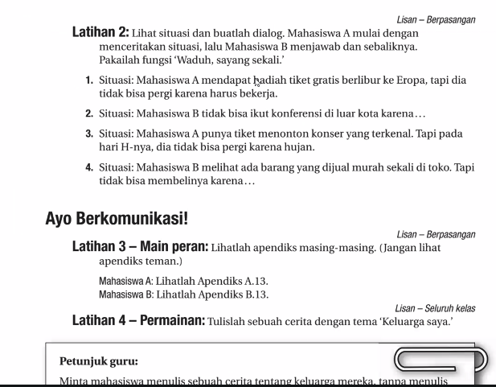

- **Waduh** → an interjection, similar to “oh dear” / “oops,” used when something unfortunate happens.
    
- **Sayang sekali** → literally “so unfortunate,” used to express regret or pity.
    
- **Situasi** → “situation.”
    
- **Mahasiswa** → “university student.”
    
- **Hadiah tiket gratis** → “free ticket gift.”
    
- **Berlibur** → “to go on holiday.” (root: _libur_ = holiday; prefix _ber-_ = to do/perform the state)
    
- **Tidak bisa** → “cannot.”
    
- **Karena** → “because.”
    
- **Konferensi** → “conference.”
    
- **Konser** → “concert.”
    
- **Barang** → “item/thing.”
    
- **Murah sekali** → “very cheap.”

hari H-nya = D day.

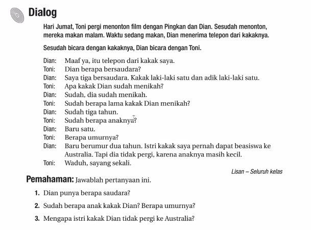

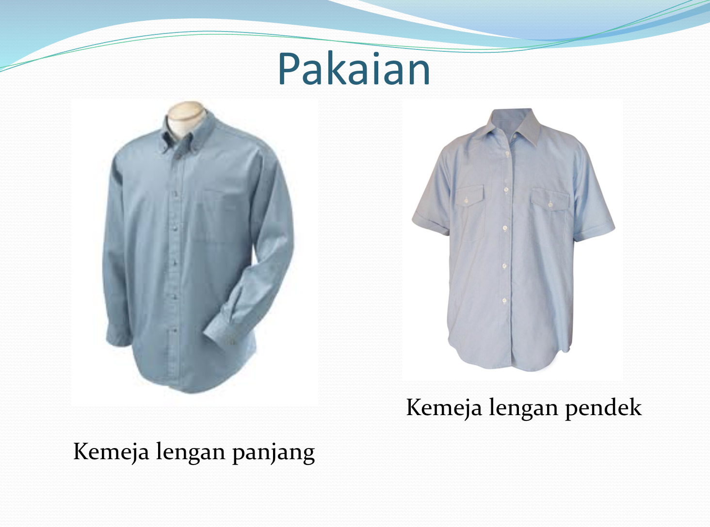

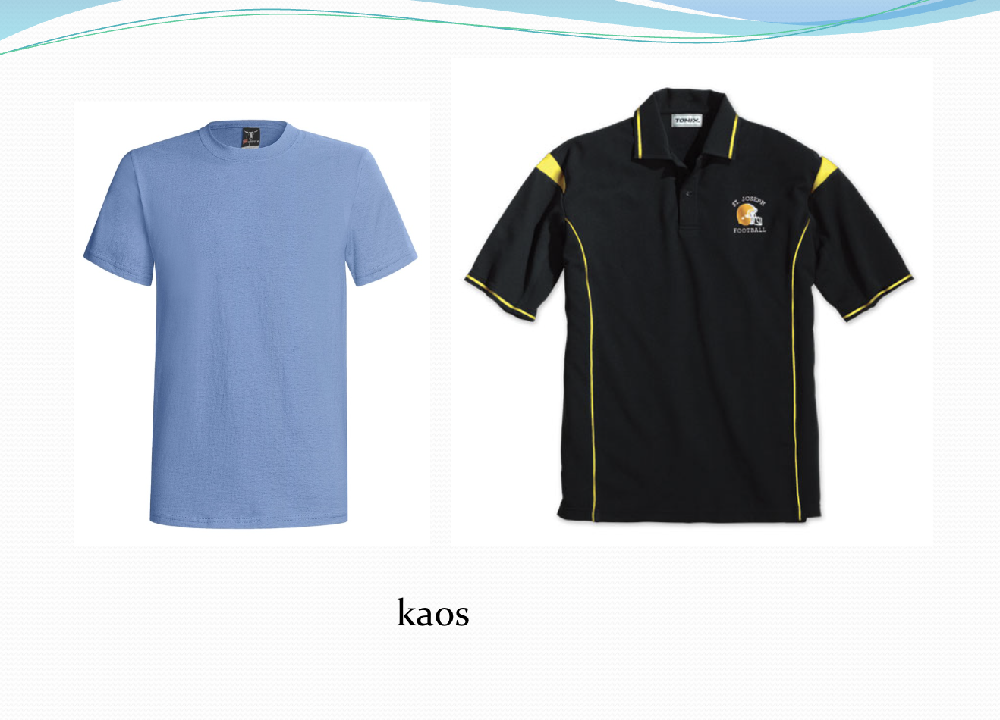

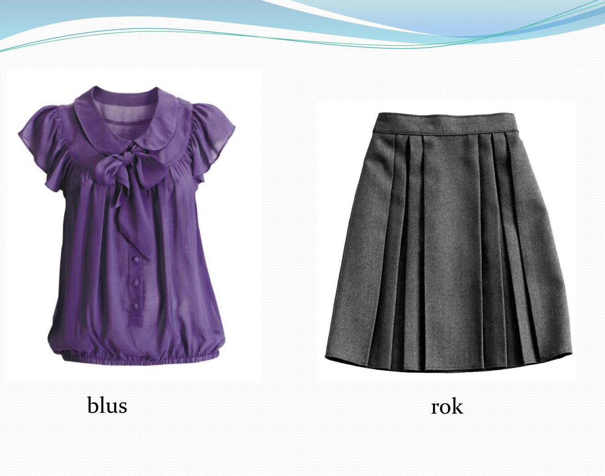

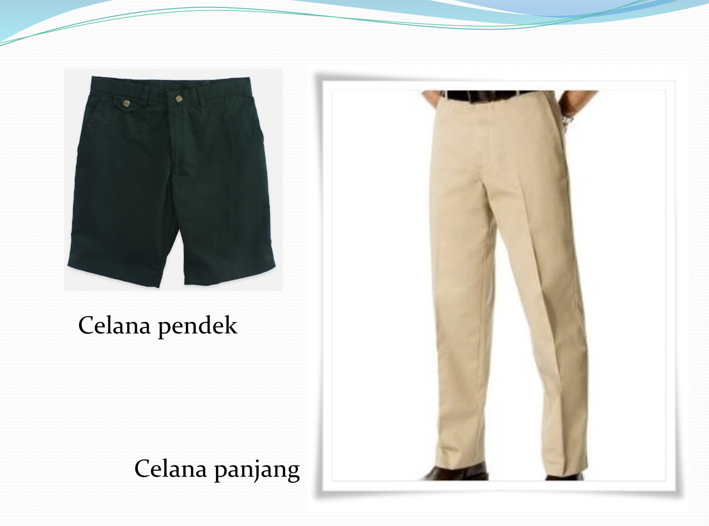

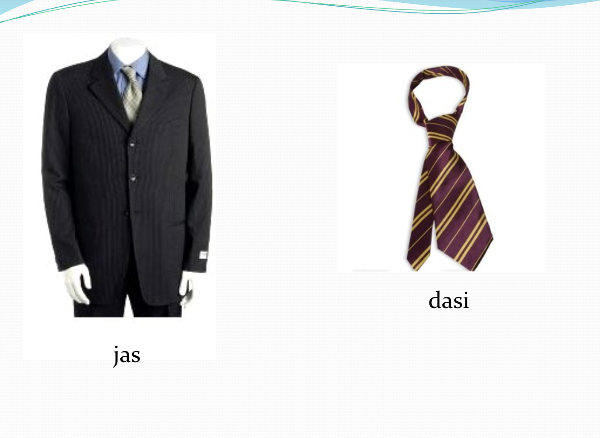

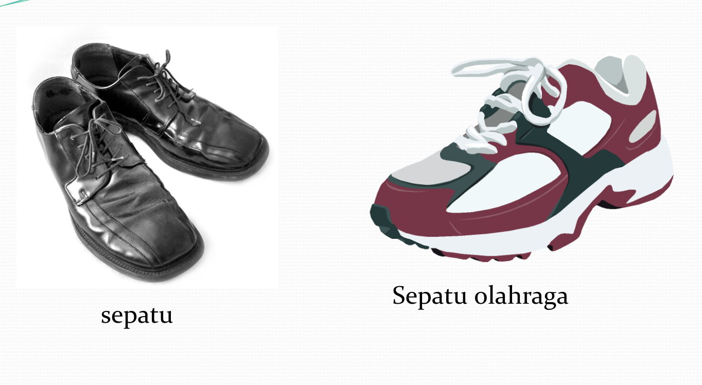

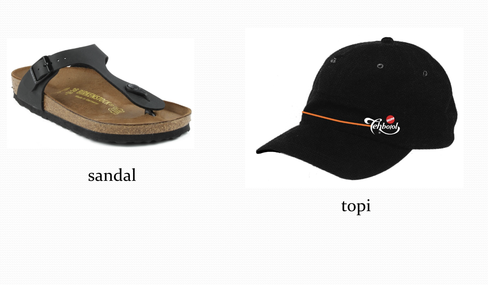

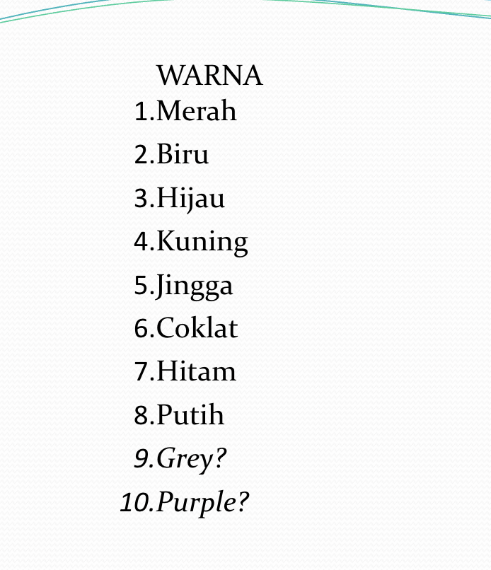

Biru tua = dark blue
biru muda = light blue
Jingga / oranye = orange
Coklat tua 
coklat mudah
Abu-abu = grey
ungu = purple

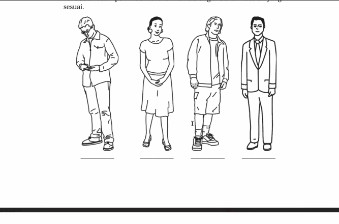

Tulis nama nama merika. 

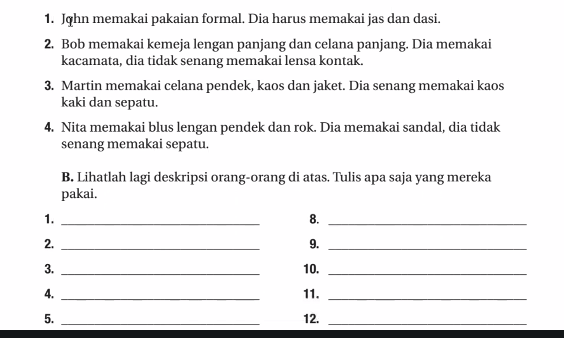

1. Bob
2. Nita
3. Martin
4. John

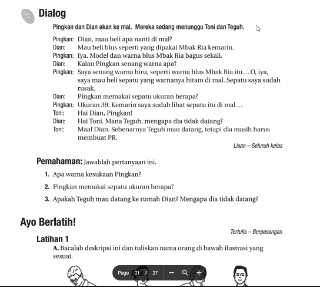

pakai-memakai

dipakai

Ibu memakai blus.

Blus dipakai ibu

1. Warna kesukaan Pingkan biru. / Warna favorit Pingkan biru.
2. Pingkan memakai sepatu ukuran 39.
3. Karena dia masih harus membuat PR.

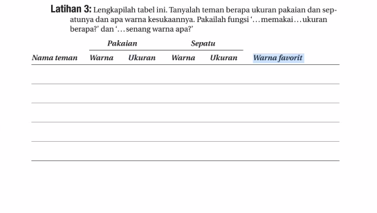

Anda memakai kaos warna apa?

Saya memakai kaos ukuran 42...

Anda memakai kaos ukuran berapa?

Saya memakai kaos ukuran M.

Anda memakai sepatu warna apa?

Apa warna favorit Anda?

saya bilang ___ = i say___
- Pak Jia Le bilang

Kata saya,___ = My word is___ 

- Kata Pak Jia Le, dia lebih senang memakai sandal.

Saya berkata ___ ( too formal)

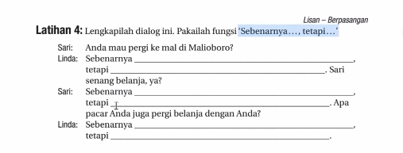

**Dialog Lengkap:**

**Sari:**  
Anda mau pergi ke mal di Malioboro?

**Linda:**  
Sebenarnya saya ingin pergi, tetapi saya sedang banyak tugas kuliah. Sari senang belanja, ya?

**Sari:**  
Sebenarnya saya juga suka belanja, tetapi saya sedang hemat uang sekarang. Apa pacar Anda juga pergi belanja dengan Anda?

**Linda:**  
Sebenarnya dia suka belanja juga, tetapi dia sibuk kerja akhir-akhir ini.

--- 

**Sari:**  
Kamu mau ke mal di Malioboro?

**Linda:**  
Sebenernya aku pengin sih, tapi lagi banyak tugas kuliah. Kamu kan doyan belanja ya?

**Sari:**  
Sebenernya aku juga suka belanja, tapi lagi harus hemat duit. Pacarmu biasanya ikut belanja juga nggak?

**Linda:**  
Sebenernya dia suka juga, tapi lagi sibuk kerja belakangan ini.

---

### 📖 English Explanation

- **Kamu mau ke mal di Malioboro?**  
    = "Do you want to go to the mall in Malioboro?"  
    _(Casual version of “Anda mau pergi…” — “kamu” is friendlier and more common.)_
    
- **Sebenernya aku pengin sih, tapi lagi banyak tugas kuliah.**  
    = "Actually I do want to, but I have a lot of college assignments right now."  
    _(“Sebenernya” = casual form of “sebenarnya”; “pengin” = casual Javanese-influenced word for “want to.”)_
    
- **Kamu kan doyan belanja ya?**  
    = "You like shopping, don’t you?"  
    _(“kan” adds a friendly confirmation tone, very common in daily conversation.)_
    
- **Sebenernya aku juga suka belanja, tapi lagi harus hemat duit.**  
    = "Actually I also like shopping, but I have to save money right now."  
    _(“duit” is the casual word for “money.”)_
    
- **Pacarmu biasanya ikut belanja juga nggak?**  
    = "Does your boyfriend usually go shopping with you?"  
    _(“nggak” = casual form of “tidak.”)_
    
- **Sebenernya dia suka juga, tapi lagi sibuk kerja belakangan ini.**  
    = "Actually he likes it too, but he’s been busy with work lately."

Pacar saya mencari barang-barang lain.

traktir

Pacar saya menraktir saya

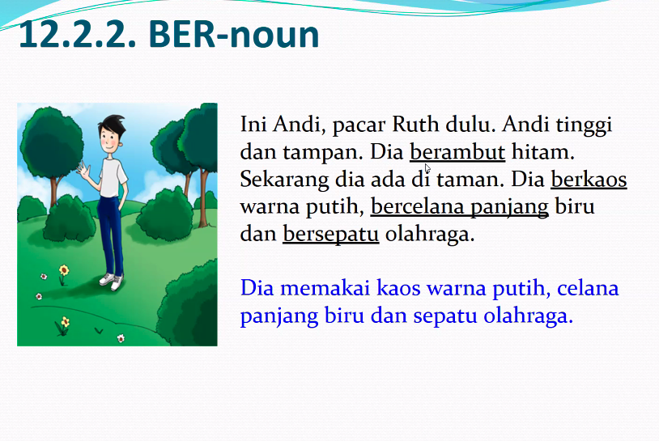

memakai kaos = berkaos

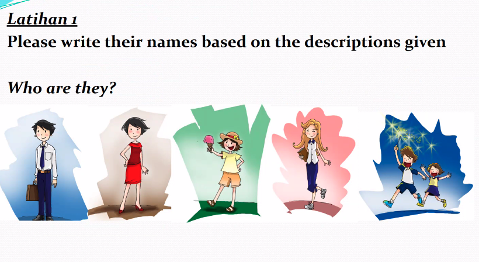

