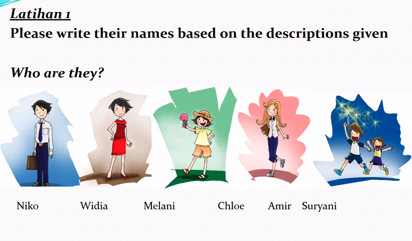

Menceritakan

- **Root:** _cerita_ = story.
    
- **Prefix:** _me-_ → makes the word into an active verb (to do something).
    
- **Suffix:** _-kan_ → indicates the action is being done _for or to someone else_.
    
- **Full form:** _menceritakan_ = “to tell/narrate something (to someone).”
    

	Compare:
	
	- **bercerita** = to tell a story (in general, not necessarily to someone).
	    
	- **menceritakan** = to tell/narrate _something to someone_.

Sebaliknya

- **balik** = turn, return, reverse.
    
- **se-** = prefix meaning “the” or “one” (makes it a noun-like form).
    
- **-nya** = possessive/definite marker (“its”).
    
- **sebaliknya** = literally “the reverse/its opposite.”

mendapat

- **Root:** _dapat_ = can, able, to get.
    
- **Prefix:** _men-_ (from _me-_) → active verb, makes it “to do the action of getting.”
    
- **Full form:** _mendapat_ = to get/receive something.

## 1. General Meanings

- **dapat** → _can / to get / to obtain_.
    
- **bisa** → _can / able to (ability)_.
    
- **boleh** → _may / allowed to (permission)_.
    

---

## 2. Cultural & Daily Usage

- **dapat** is a bit more formal, often used in writing, reports, or polite speech. In everyday talk, Indonesians prefer **bisa** instead.
    
- **bisa** is the most common way to say _can_ (ability).
    
- **boleh** is usually about _permission_. In Indonesian culture, asking with **boleh** is more polite than using **bisa** when requesting something.
    

---

## 3. Word Meaning in Conversation

- **dapat**
    
    1. _to get / obtain_ → _Saya dapat hadiah_ = I got a gift.
        
    2. _can (formal)_ → _Anda dapat menghubungi kami_ = You can contact us.
        
- **bisa**  
    = ability → _Saya bisa berenang_ = I can swim.
    
- **boleh**  
    = permission → _Boleh saya duduk di sini?_ = May I sit here?

--- 

- **hadiah** = gift / present / prize.  
    In conversation:
    
- _Dia kasih saya hadiah._ = He/She gave me a gift.
    
- _Apa hadiahnya kalau menang?_ = What’s the prize if you win?

- **Root:** _hadiah_ (Arabic origin: هدية _hadiyyah_ = gift, offering).
    
- No prefix/suffix here; it’s a base noun.

---

- **Waduh** → an interjection, similar to “oh dear” / “oops,” used when something unfortunate happens.
    
- **Sayang sekali** → literally “so unfortunate,” used to express regret or pity.
    
- **Situasi** → “situation.”
    
- **Mahasiswa** → “university student.”
    
- **Hadiah tiket gratis** → “free ticket gift.”
    
- **Berlibur** → “to go on holiday.” (root: _libur_ = holiday; prefix _ber-_ = to do/perform the state)
    
- **Tidak bisa** → “cannot.”
    
- **Karena** → “because.”
    
- **Konferensi** → “conference.”
    
- **Konser** → “concert.”
    
- **Barang** → “item/thing.”
    
- **Murah sekali** → “very cheap.”

- **kota** = city, town.  
    Examples:
    
- _Dia tinggal di kota._ = He/She lives in the city.
    
- _Besok saya mau pergi ke kota._ = Tomorrow I want to go to town.

Mahasiswa B tidak bisa ikut konferensi di luar kota karena dia harus menjaga orang tuanya. 

Mahasiswa A punya tiket menonton konser yang terkenal. Tapi pada hari H-nya, dia tidak bisa pergi karena hujan. Kalau begitu, dia bisa menonton itu di televisi. 

Mahasiswa B melihat ada barang yang dijual murah sekali di toko. Tapi tidak bisa membelinya karena dia kurang uang dan mau hemat uang untuk membeli rumah.

Alternative: Mahasiswa B melihat ada barang yang dijual sangat murah di toko. Tetapi dia tidak bisa membelinya karena kekurangan uang dan ingin menghemat untuk membeli rumah.
	- - **ke- ... -an** → circumfix that turns a verb/adjective/noun into a noun, often abstract.
    
	- **kurang** → root word meaning _less, lacking, not enough_.
	    
	- So **“kekurangan”** literally means _the state of being lacking_.

---
**peran** → noun, meaning _role / character / function_. Comes from Javanese origin but widely used.

**“Masing-masing”** means **each, respectively, one by one**.

--- 

hari H-nya = D day.

___
Keluarga saya

Keluarga saya terdiri dari empat bersaudara. Saya sudah punya anak-anak, dan sekarang tinggal di Singapura. Saya suka makanan Asia, tetapi kurang suka makanan yang terlalu asin, manis, berlemak, atau digoreng. Sebaliknya, anak-anak saya senang dengan makanan asin dan manis.

	terdiri
	- **Root word:** _diri_ = “self” or “oneself”.
    
	- **Prefix:** _ter-_ = indicates a state or condition, sometimes “can be” or “accidentally”.
	    
	- **ter- + diri → terdiri** = “to be made up (of selves/parts)” → “to consist of”.

- **Root word:** _lalu_ = can mean “past/then/pass by” depending on context.
    
- **Prefix:** _ter-_ = indicates a state/condition.
    
- **ter- + lalu → terlalu** = “gone too far” → “excessive”.

---

- Root word: **paham** = to understand / aware.
    
- Prefix **pe-** + suffix **-an** → **pemahaman**.  
    This turns the verb/adjective “paham” (understand) into a noun “pemahaman” (understanding).

### Word meanings in modern daily conversation

- **kemeja**: “shirt” (button-up, with collar; _not_ a T-shirt).
    
- **lengan**: “arm” or “sleeve”.
    
    - _lengan baju_ = shirt sleeve.
        
    - _lengan kiri/kanan_ = left/right arm.
        

---

### Word breakdown (prefix, suffix, root)

- **kemeja**: borrowed from Portuguese _camisa_ (shirt). Root = _meja_ (but here not “table”; different origin).
    
- **lengan**: root = _lengan_ (arm). No affix.

### Word meaning in modern conversation

- **jas**: jacket/blazer (formal wear).  
    Example: _Dia pakai jas hitam di pesta pernikahan._  
    → “He wore a black suit jacket at the wedding party.”
    

---

### Word breakdown

- **jas**: loanword from Dutch _jas_ (coat/jacket).
    
- No prefixes or suffixes, it is a standalone noun.

**dasi**: borrowed from Dutch _das_ (tie, scarf).

### Word breakdown (prefix, suffix, root)

- Root: **olah** = to process, manage, work on.
    
- **raga** = body.
    
- Combined: **olah-raga** = “processing/working the body” → sport, exercise.

✅ **berolahraga** → correct and common = _to exercise / to play sports_.

- Example: _Saya berolahraga setiap pagi._ → “I exercise every morning.”
    

✅ **olahraga** (by itself as a verb) is also used in casual speech, though grammatically it’s a noun.

- Example: _Saya olahraga pagi tadi._ → “I exercised this morning.”
    

❌ **mengolahraga** → **NOT correct** in standard Indonesian. It’s not used.

Biru tua = dark blue
biru muda = light blue
Jingga / oranye = orange
	**jingga** = _orange_ (the color, not the fruit).

	For the fruit, Indonesians say **jeruk**, not _jingga_.
Coklat tua 
coklat mudah
Abu-abu = grey
ungu = purple

Tulis nama nama merika. 

1. Bob
2. Nita
3. Martin
4. John

pakai-memakai

dipakai

Ibu memakai blus.

Blus dipakai ibu

1. Warna kesukaan Pingkan biru. / Warna favorit Pingkan biru.
2. Pingkan memakai sepatu ukuran 39.
3. Karena dia masih harus membuat PR.

Anda memakai kaos warna apa?

Saya memakai kaos ukuran 42...

Anda memakai kaos ukuran berapa?

Saya memakai kaos ukuran M.

Anda memakai sepatu warna apa?

Apa warna favorit Anda?

saya bilang ___ = i say___
- Pak Jia Le bilang

Kata saya,___ = My word is___ 

- Kata Pak Jia Le, dia lebih senang memakai sandal.

Saya berkata ___ ( too formal)

**Dialog Lengkap:**

**Sari:**  
Anda mau pergi ke mal di Malioboro?

**Linda:**  
Sebenarnya saya ingin pergi, tetapi saya sedang banyak tugas kuliah. Sari senang belanja, ya?

**Sari:**  
Sebenarnya saya juga suka belanja, tetapi saya sedang hemat uang sekarang. Apa pacar Anda juga pergi belanja dengan Anda?

**Linda:**  
Sebenarnya dia suka belanja juga, tetapi dia sibuk kerja akhir-akhir ini.

--- 

**Sari:**  
Kamu mau ke mal di Malioboro?

**Linda:**  
Sebenernya aku pengin sih, tapi lagi banyak tugas kuliah. Kamu kan doyan belanja ya?

**Sari:**  
Sebenernya aku juga suka belanja, tapi lagi harus hemat duit. Pacarmu biasanya ikut belanja juga nggak?

**Linda:**  
Sebenernya dia suka juga, tapi lagi sibuk kerja belakangan ini.

---

### 📖 English Explanation

- **Kamu mau ke mal di Malioboro?**  
    = "Do you want to go to the mall in Malioboro?"  
    _(Casual version of “Anda mau pergi…” — “kamu” is friendlier and more common.)_
    
- **Sebenernya aku pengin sih, tapi lagi banyak tugas kuliah.**  
    = "Actually I do want to, but I have a lot of college assignments right now."  
    _(“Sebenernya” = casual form of “sebenarnya”; “pengin” = casual Javanese-influenced word for “want to.”)_
    
- **Kamu kan doyan belanja ya?**  
    = "You like shopping, don’t you?"  
    _(“kan” adds a friendly confirmation tone, very common in daily conversation.)_
    
- **Sebenernya aku juga suka belanja, tapi lagi harus hemat duit.**  
    = "Actually I also like shopping, but I have to save money right now."  
    _(“duit” is the casual word for “money.”)_
    
- **Pacarmu biasanya ikut belanja juga nggak?**  
    = "Does your boyfriend usually go shopping with you?"  
    _(“nggak” = casual form of “tidak.”)_
    
- **Sebenernya dia suka juga, tapi lagi sibuk kerja belakangan ini.**  
    = "Actually he likes it too, but he’s been busy with work lately."

Pacar saya mencari barang-barang lain.

traktir

Pacar saya menraktir saya

memakai kaos = berkaos

