Revision for the mock test:

1. Linda: Sebenarnya saya sudah pergi ke mal di Malioboro kemarin tetapi saya lupa membeli kaos untuk suami. 
2. Sari: Sebenarnya saya tidak senang belanja karena saya hemat uang untuk membeli rumah tahun depan tetapi saya belum pernah pergi ke mal di Malioboro jadi saya mau pergi ke sana untuk jalan-jalan/melihat mal.
3. Linda: Sebenarnya kita bisa pergi ke mal naik taksi bersama, ongkos taksi kita bayar bersama tetapi sekarang saya bayar dulu.

Sari: Sebenarnyasaya ke mal karena pacar saya dulu mengajak bertemu (atau mengobrol) tetapi pacar saya yang sekarang tidak mau saya pergi.

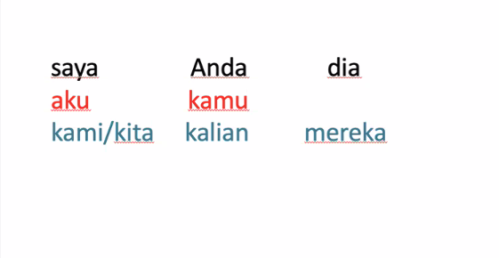

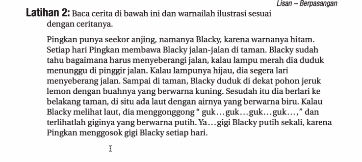

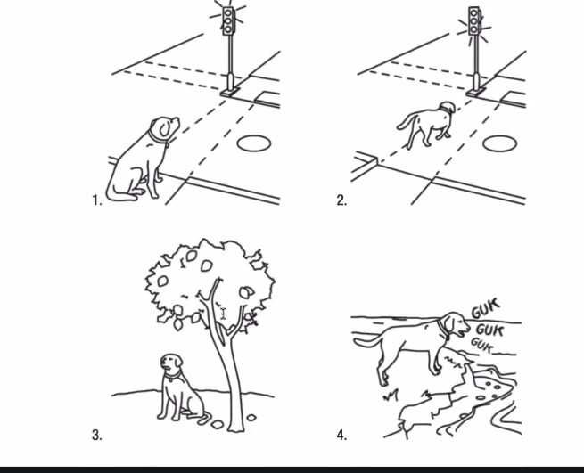

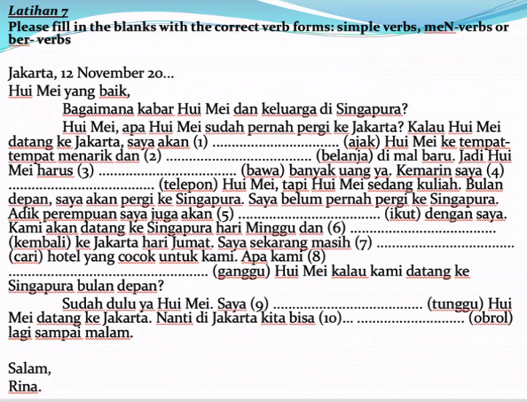

**Please fill in the blanks with the correct verb form (simple verb, ber-verb or meN-verb).**

Nenek saya adalah orang Sumatra. Dia tinggal dengan tante saya di sana. Setiap pagi tante saya _____bangun_____ (1. bangun) jam 05.00, lalu dia _________menggoreng__________ (2. goreng) telur untuk makan pagi dan ________berolahraga____________ (3.olahraga) di taman. Sesudah itu dia akan pergi ke pasar untuk ________berbelanja___________(4.belanja) di sana.

Hari ini tante saya tidak pergi ke pasar. Dia akan pergi ke kantor pos karena nenek minta dia untuk ______mengirim__________ (5. kirim) surat nenek. Tadi malam nenek _______menulis___________ (6. tulis) surat panjang sekali untuk Om Randi. Om Randi adalah anak pertama nenek. Dia tinggal di Bali. Nenek ingin sekali _______bertemu__________ (7. temu) dengan dia dan cucu-cucunya. Jadi nenek minta Om Randi untuk datang ke Sumatra dengan _______membawa___________ (8. bawa) istri dan anak-anaknya.

Dari kantor pos, tante saya mau pergi ke bioskop untuk _______memonton____________(9.tonton) film dengan temannya. Sesudah itu mereka akan pergi ke kafe untuk minum kopi dan_______mengobrol______ (10.obrol) di sana.

**Please fill in the blanks with the correct verb form (simple verb, ber-verb or meN-verb).**

Minggu ini saya sibuk sekali . Hari Senin pagi, saya harus bangun pagi-pagi sekali karena ibu saya  _______mengajak_________ (1.ajak) saya pergi ke pasar. Ibu saya pandai_______menawar_________(2.tawar) , jadi saya mau _______belajar___________ (3. ajar)  dari dia. Sesudah  itu kami makan pagi di warung kopi. Kami  _________memesan_________ (4.pesan) 2 porsi lontong sayur.

Hari Rabu siang, saya pergi ke kantor pos yang ada di dekat rumah saya,  karena saya harus _________mengirim__________ (5.kirim) barang untuk tante saya yang tinggal di Malaysia. Malamnya, saya  __________mampir__________________(6. mampir) ke rumah pacar saya karena orang tuanya  _________mengundang______________ (7.undang) saya untuk makan malam di sana. 

Besoknya, pacar saya dan saya pergi ke Hotel Shangrila. Kami mau _________menyewa_____________  (8.sewa) _Grand Ballroom_ di sana untuk pesta pernikahan kami tahun depan. Wah, mahal sekali ya. Kami__________membayar_______________ (9. bayar) deposit $ 5.000.  Kami juga _________mencoba____________ (10.coba) makanan di sana. Makanannya enak sekali!

---

Memorise the simple verb.

jadi ibu saya mengajar => my mother teach me.

---

Exception of me- to not have object after:
mengobrol => no object after
menikah => no object after

Try to find other exceptions.

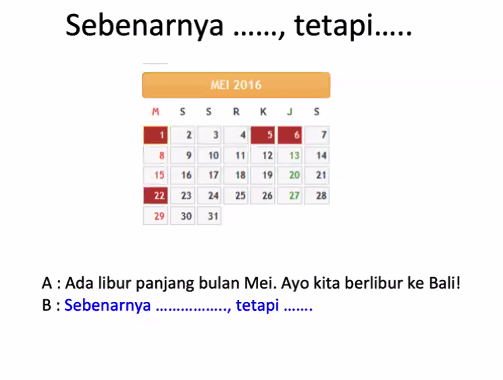

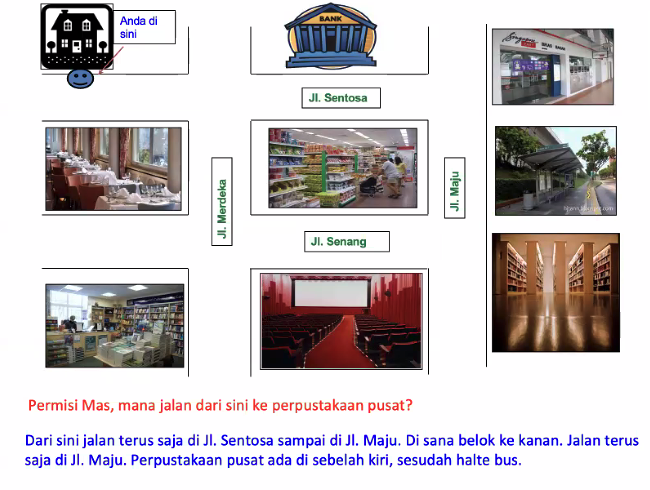

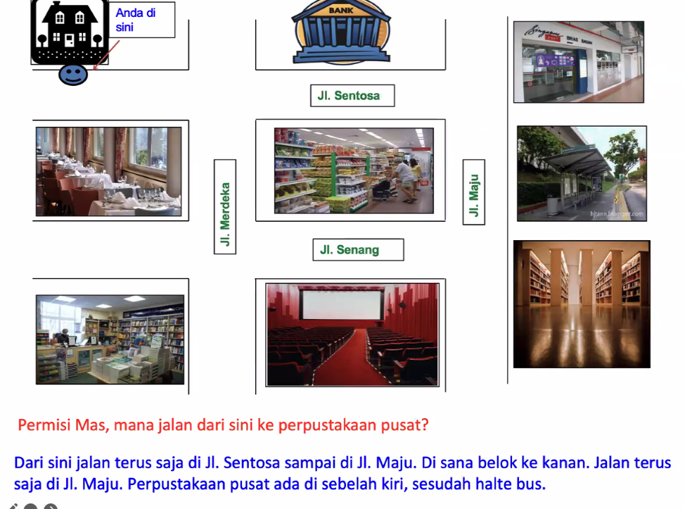

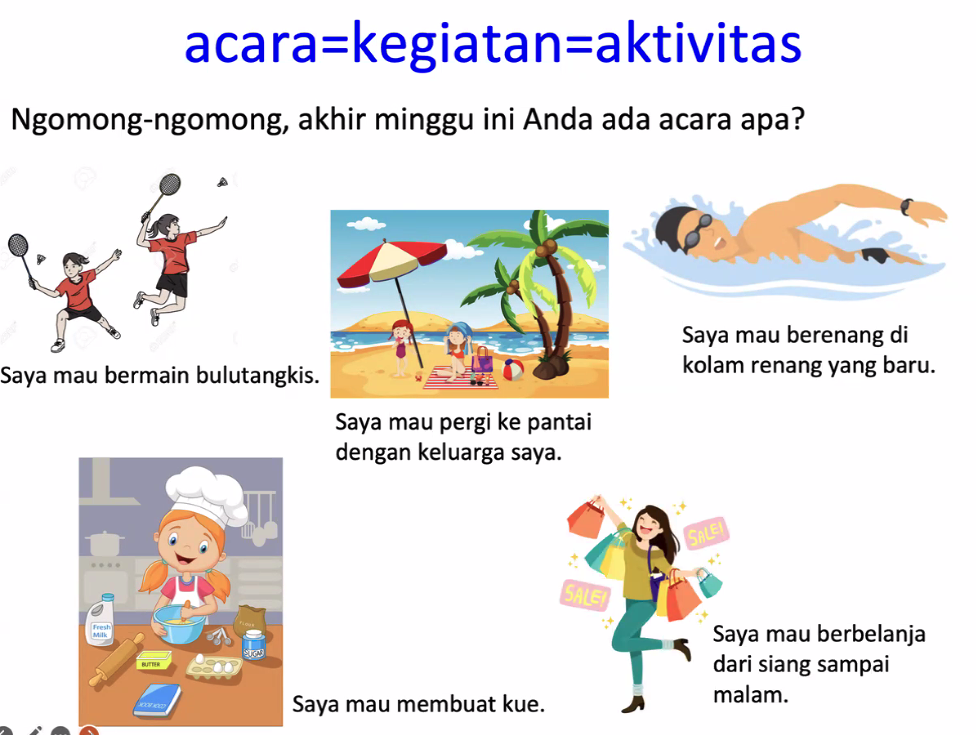

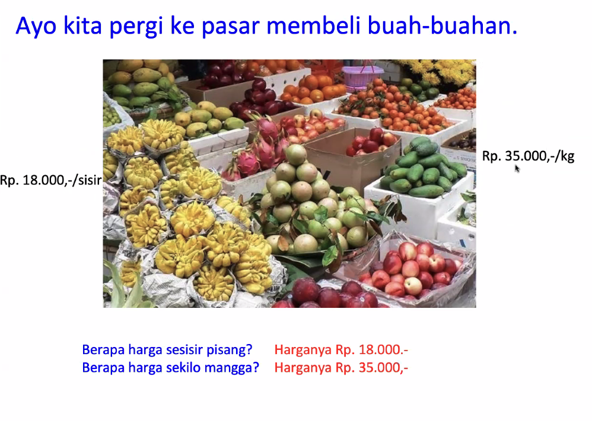

Yuk kita ngobrol!

Ayo = Yuk 

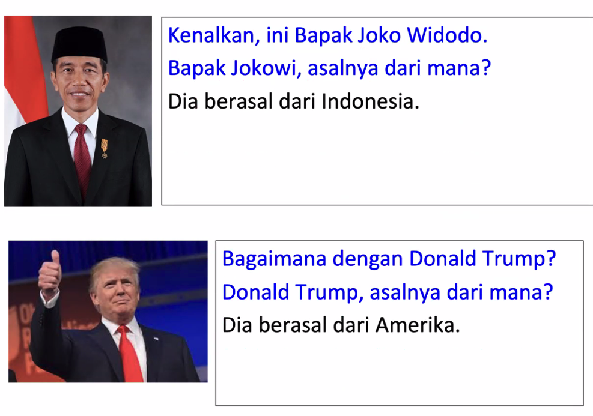

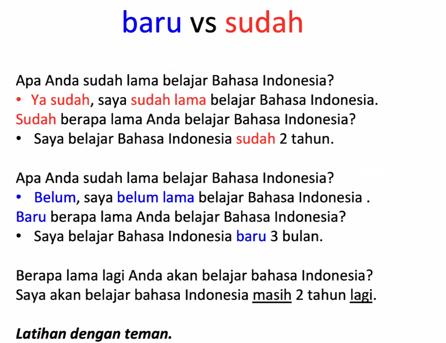

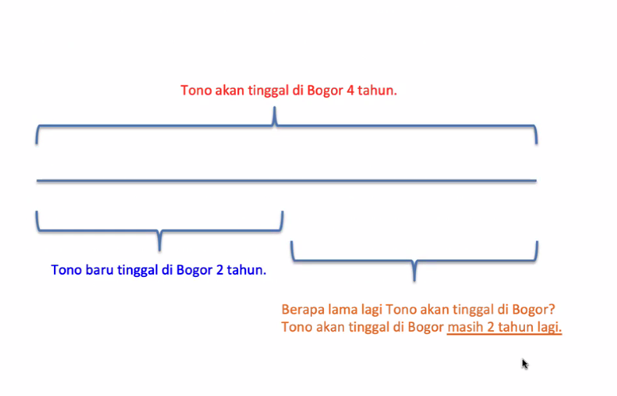

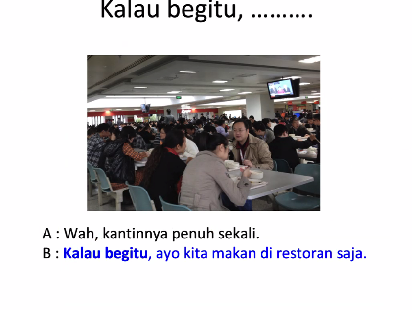

Ayo = lets 

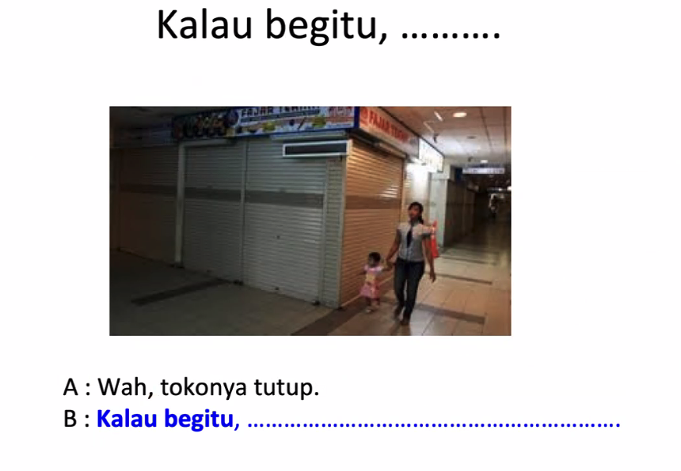

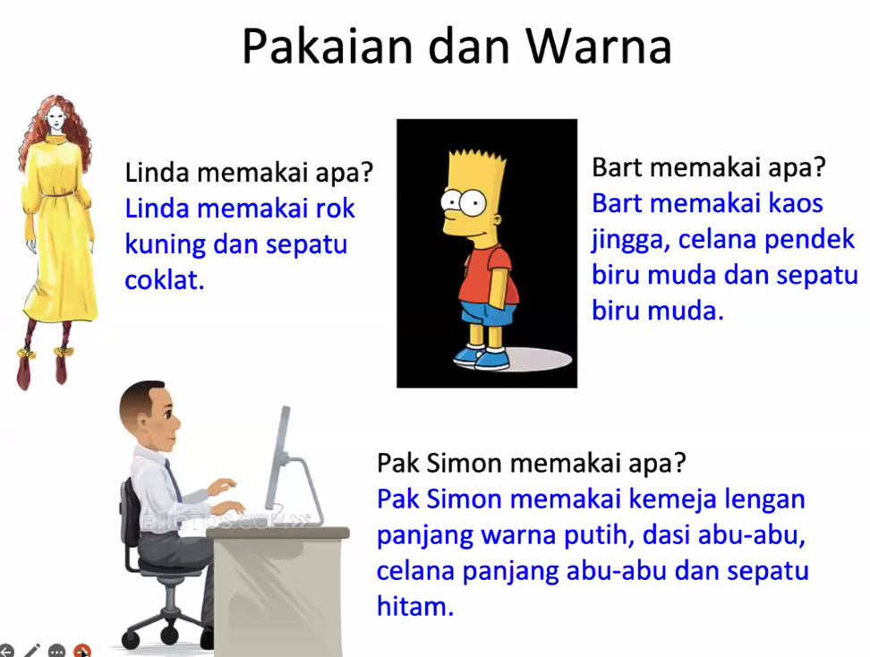

