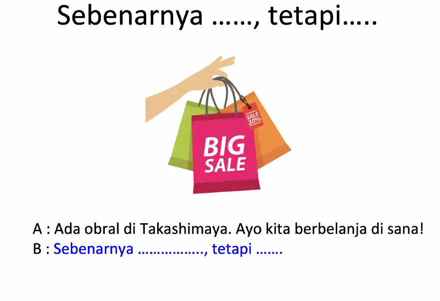

Revision for the mock test:

- **Ongkos** → root word: _ongkos_ (no prefix/suffix). Old Javanese origin meaning “expense.”
    
- **Taksi** → borrowed word from Dutch/English _taxi_, itself from _taximeter cab._

1. Linda: Sebenarnya saya sudah pergi ke mal di Malioboro kemarin tetapi saya lupa membeli kaos untuk suami. 
2. Sari: Sebenarnya saya tidak senang belanja karena saya hemat uang untuk membeli rumah tahun depan tetapi saya belum pernah pergi ke mal di Malioboro jadi saya mau pergi ke sana untuk jalan-jalan/melihat mal.
3. Linda: Sebenarnya kita bisa pergi ke mal naik taksi bersama, ongkos taksi kita bayar bersama tetapi sekarang saya bayar dulu.

Sari: Sebenarnya saya ke mal karena pacar saya dulu mengajak bertemu (atau mengobrol) tetapi pacar saya yang sekarang tidak mau saya pergi.

- **Kami** = _we/us_ **(excluding the person spoken to)**.
    
- **Kita** = _we/us_ **(including the person spoken to)**.

- **Kamu** = _you_ (singular, one person).
    
- **Kalian** = _you all / you guys_ (plural, more than one person).
    

---

### 2. Cultural context in Indonesian

- **Kamu** is commonly used between close friends, family, or to someone younger. Not used in very formal situations.
    
- **Kalian** is used when talking to a group (friends, students, children).
    
- In formal contexts, people usually avoid both and use **Anda** (formal singular/plural) or **Bapak/Ibu sekalian** (very respectful when addressing an audience).

- **Se-** = “one” (prefix used for numbers).
    
- **ekor** = classifier for animals (literally “tail”).
    
- **anjing** = “dog.”  
    Used in daily conversation when talking about dogs:
    
- _Seekor anjing berlari di jalan._ → “A dog ran on the street.”

**Bagaimana** = _how_ (asking about manner, condition, opinion).

- **menyeberangi** → verb = to cross (something).
    
- Usage: It is **transitive** (needs an object).
    
    - _Menyeberangi jalan_ → “to cross the road.”
        
    - _Menyeberangi sungai_ → “to cross the river.”
        

Compare with:

- **menyeberang** (no “-i”) → intransitive, just “to cross” without saying what.
    
    - _Dia menyeberang._ → “He/She crossed.”
        

---

### Word breakdown

- **meN-** (prefix for active verb, here becomes _menye-_ because the root begins with “s”).
    
- **seberang** (root word = “the opposite side, across”).
    
- **-i** (suffix indicating the verb takes an object).
    

So:  
**menyeberangi** = “to cross (something).”

- **Pinggir** = edge, side, margin of something (road, river, table).
    
- **Jalan** = road, street, or also “to walk/go.”  
    Together → “edge/side of the road.”
    

---

### Word breakdown

- **Pinggir** → root = pinggir (noun = side/edge).
    
- **Jalan** → root = jalan (noun = road, or verb = to walk/go).

Examples:

- _Bagaimana kabarmu?_ → “How are you?”
    
- _Bagaimana cara membuatnya?_ → “How do you make it?”
    
- _Bagaimana menurutmu?_ → “What do you think?”

- **Segera** → root: _gera_ (from Javanese = move). Prefix **se-** = makes it into “at once, immediately.”
    
- **Lari** → root verb meaning “run.”

Indonesian has three common ways to say “there”:

- **di sini** = here (near the speaker).
    
- **di situ** = there (near the listener, or place already known).
    
- **di sana** = over there (farther away from both).
    

Indonesians use **di situ** when both people know the location being referred to, or when the place is closer to the listener.

**Please fill in the blanks with the correct verb form (simple verb, ber-verb or meN-verb).**

Nenek saya adalah orang Sumatra. Dia tinggal dengan tante saya di sana. Setiap pagi tante saya _____bangun_____ (1. bangun) jam 05.00, lalu dia _________menggoreng__________ (2. goreng) telur untuk makan pagi dan ________berolahraga____________ (3.olahraga) di taman. Sesudah itu dia akan pergi ke pasar untuk ________berbelanja___________(4.belanja) di sana.

Hari ini tante saya tidak pergi ke pasar. Dia akan pergi ke kantor pos karena nenek minta dia untuk ______mengirim__________ (5. kirim) surat nenek. Tadi malam nenek _______menulis___________ (6. tulis) surat panjang sekali untuk Om Randi. Om Randi adalah anak pertama nenek. Dia tinggal di Bali. Nenek ingin sekali _______bertemu__________ (7. temu) dengan dia dan cucu-cucunya. Jadi nenek minta Om Randi untuk datang ke Sumatra dengan _______membawa___________ (8. bawa) istri dan anak-anaknya.

Dari kantor pos, tante saya mau pergi ke bioskop untuk _______memonton____________(9.tonton) film dengan temannya. Sesudah itu mereka akan pergi ke kafe untuk minum kopi dan_______mengobrol______ (10.obrol) di sana.

---

**Please fill in the blanks with the correct verb form (simple verb, ber-verb or meN-verb).**

Minggu ini saya sibuk sekali . Hari Senin pagi, saya harus bangun pagi-pagi sekali karena ibu saya  _______mengajak_________ (1.ajak) saya pergi ke pasar. Ibu saya pandai_______menawar_________(2.tawar) , jadi saya mau _______belajar___________ (3. ajar)  dari dia. Sesudah  itu kami makan pagi di warung kopi. Kami  _________memesan_________ (4.pesan) 2 porsi lontong sayur.

Hari Rabu siang, saya pergi ke kantor pos yang ada di dekat rumah saya,  karena saya harus _________mengirim__________ (5.kirim) barang untuk tante saya yang tinggal di Malaysia. Malamnya, saya  __________mampir__________________(6. mampir) ke rumah pacar saya karena orang tuanya  _________mengundang______________ (7.undang) saya untuk makan malam di sana. 

Besoknya, pacar saya dan saya pergi ke Hotel Shangrila. Kami mau _________menyewa_____________  (8.sewa) _Grand Ballroom_ di sana untuk pesta pernikahan kami tahun depan. Wah, mahal sekali ya. Kami__________membayar_______________ (9. bayar) deposit $ 5.000.  Kami juga _________mencoba____________ (10.coba) makanan di sana. Makanannya enak sekali!

---
- **cucu** → root word, meaning _grandchild_.
    
- **cucu-cucu** → reduplication to indicate plural (_grandchildren_).
    
- **-nya** → possessive suffix (_his/her/their_).

- **Mampir** = to stop by / drop by (usually at someone’s house, shop, or place while on the way to somewhere else).

- **Sewa** = rent / to rent / hire (depending on context).

- As a **noun** → _“sewa rumah”_ = house rent.
    
- As a **verb** → _“saya sewa mobil”_ = I rent a car.

- - **nikah** = to marry (verb) or marriage (noun).
    
- **pernikahan** = marriage/wedding (noun, more formal and abstract).
---

Memorise the simple verb.

jadi ibu saya mengajar => my mother teach me.

---

Exception of me- to not have object after:
mengobrol => no object after
menikah => no object after

Try to find other exceptions.

**Pusat** = center / central / main point / core.

- Root: **omong** = to talk (a bit old-fashioned but still understood).
    
- Prefix: **ng-** (colloquial form for speaking, Javanese-influenced).
    
- Reduplication: **ngomong-ngomong** makes it into an idiomatic phrase, no longer just “talk-talk” but “by the way.”

- - **akhir** = end.
    
- **minggu** = week. (_minggu_ can also mean “Sunday,” but in this phrase it means “week.”)
    
- Together: **akhir minggu** = end of the week → weekend.

Yuk kita ngobrol!

Ayo = Yuk 

Ayo = let's 

### Word-by-word meaning and daily usage

- **obral** = clearance sale (noun/verb).
    
    - As a verb: _“Toko itu mengobral baju lama.”_ = That shop is clearing out old clothes.
        
    - As a noun: _“Ada obral di pasar.”_ = There’s a clearance sale at the market.
        

---

### 4. Morphology breakdown

- **obral** = root word (loanword from Dutch _opruimen_, meaning “to clear out”).
    
- Derived forms:
    
    - **mengobral** = to put on clearance / to sell cheaply.
        
    - **diobral** = being sold on clearance.