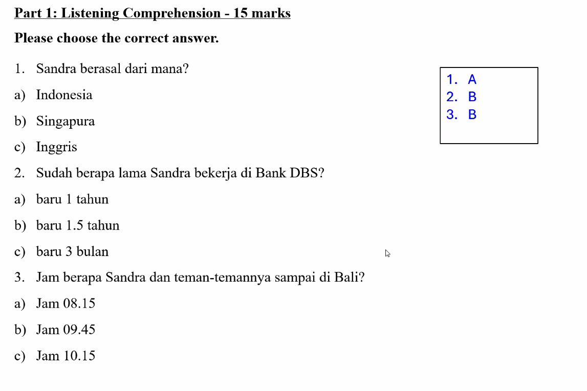

| Word        | Meaning                 | Usage in Daily Life                                                                                          |
| ----------- | ----------------------- | ------------------------------------------------------------------------------------------------------------ |
| **pemandu** | guide (noun)            | Can refer to anyone who guides or leads — e.g., _pemandu acara_ (host/emcee), _pemandu wisata_ (tour guide). |
| **wisata**  | tourism / travel / tour | Used in many contexts: _tempat wisata_ (tourist place), _objek wisata_ (tourist attraction).                 |

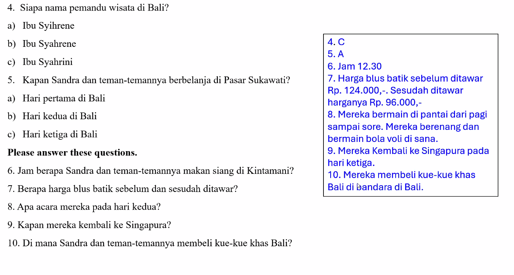

Jam setengah satu
seratus dua puluh empat ribu.
sembilan puluh enam ribu

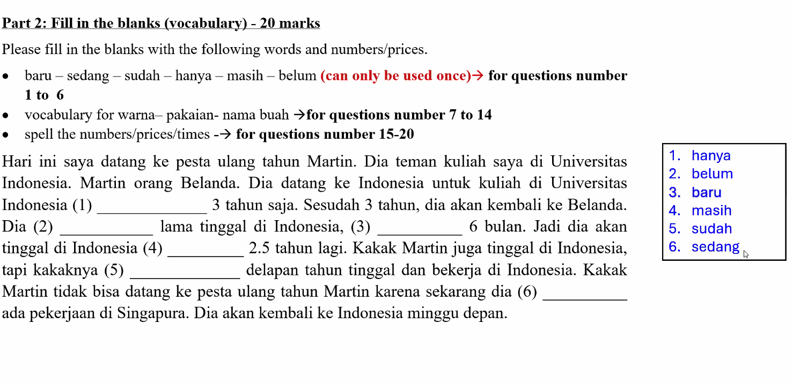

**“Martin orang Belanda”** means  **“Martin is Dutch”** or **“Martin is a person from the Netherlands.”** 

**“Hanya”** means **“only”** or **“just.”**

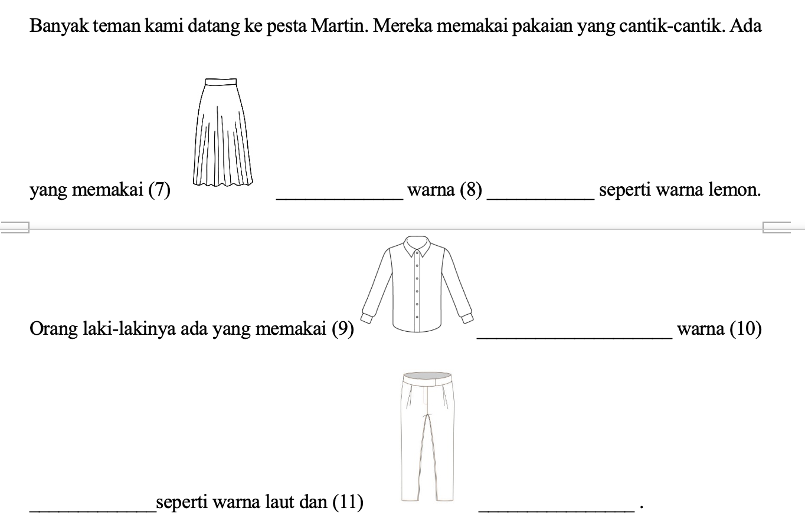

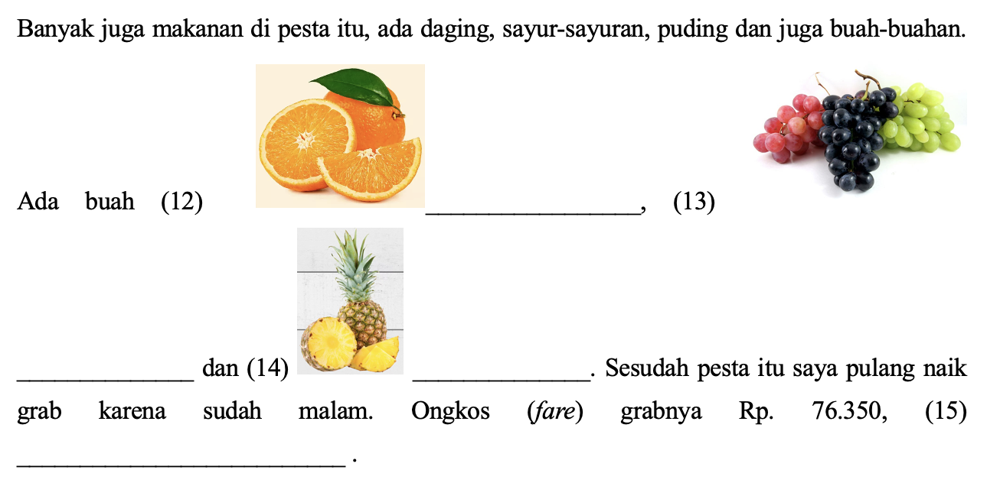

tujuh puluh enam ribu tiga ratus lima puluh 

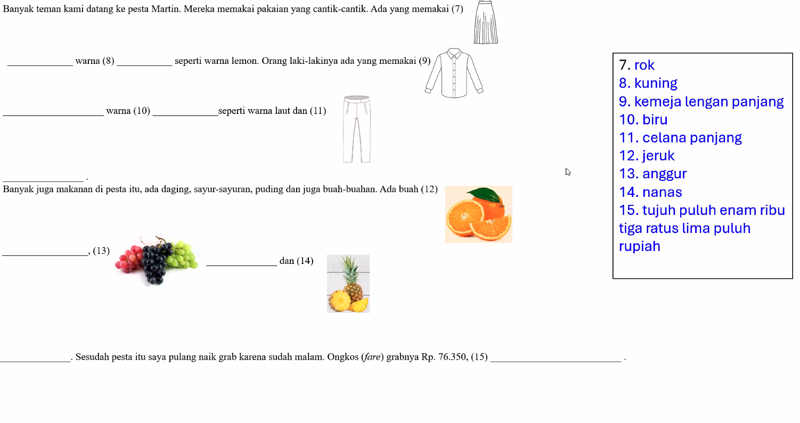

dua ratus sembilan puluh lima ribu
satu juta seratus delapan belas ribu

**“Selama”** means **“for (a duration of time)”** or **“during.”**

tujuh ratus empat belas ribu empat ratus

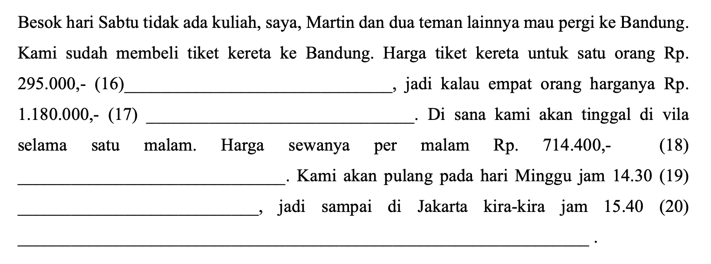

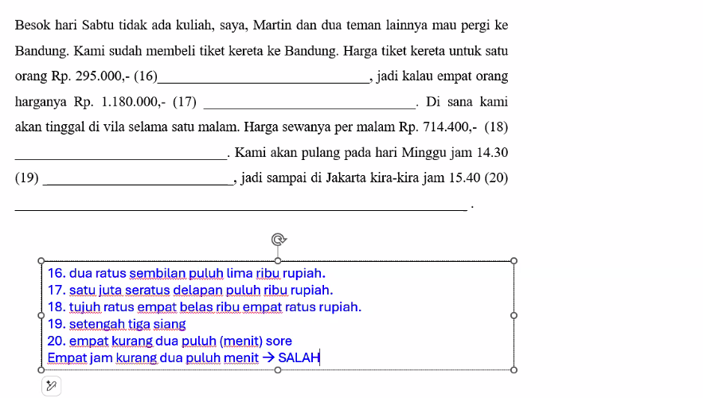

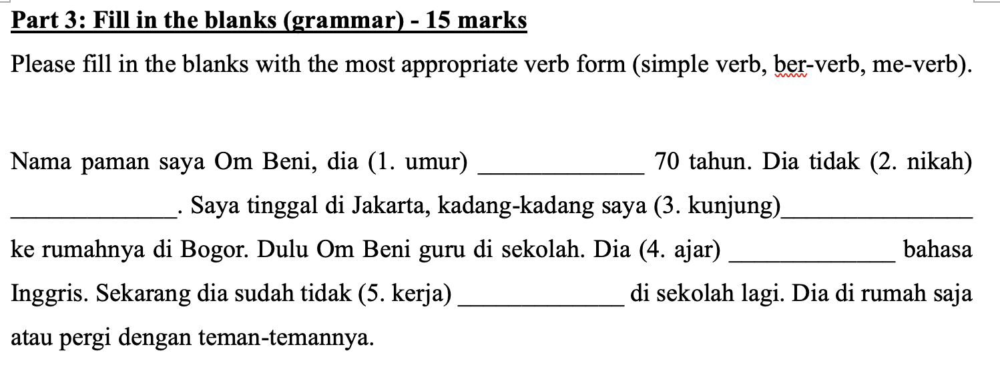

**“Paman”** means **“uncle”**, specifically your **father’s or mother’s brother**, or sometimes a **close older male relative or family friend**.

**“Kadang-kadang”** means **“sometimes”** or **“occasionally.”**

### 1. Literal Meanings

|Phrase|Literal English|Natural English|
|---|---|---|
|**Om Beni guru**|“Uncle Beni teacher”|“Uncle Beni _is_ a teacher.”|
|**Guru Om Beni**|“Teacher Uncle Beni”|“Uncle Beni’s teacher.” or “The teacher of Uncle Beni.”|

---

### 🟦 2. Explanation of Usage and Grammar

#### 🔹 **Om Beni guru**

- This follows the **normal Indonesian word order** for a simple statement:  
    **Subject + Predicate (noun)**  
    → _Om Beni_ (subject) + _guru_ (predicate).
    
- Meaning: _Om Beni adalah seorang guru._ (“Uncle Beni is a teacher.”)
    
- The verb _adalah_ (“is”) is often omitted in spoken Indonesian.
    

✅ **Correct, natural sentence:**

> _Om Beni guru di sekolah dasar._  
> → “Uncle Beni is a teacher at an elementary school.”

---

#### 🔹 **Guru Om Beni**

- This is a **noun phrase**: _guru_ (teacher) + _Om Beni_ (Uncle Beni).
    
- Meaning: _the teacher of Uncle Beni_ — someone **who teaches Uncle Beni**, not Uncle Beni himself.
    
- Similar to English “Uncle Beni’s teacher.”
    

✅ **Example sentence:**

> _Guru Om Beni sangat baik._  
> → “Uncle Beni’s teacher is very kind.”

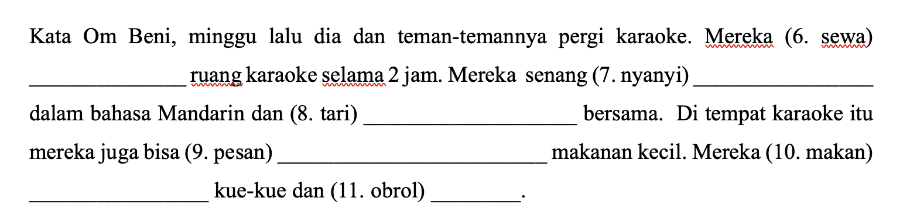

- **tari** → root word meaning “dance.”  
    🔹 So **menari** = “to dance” (literally “doing the action of dancing”).
    
- **bersama** = from _ber-_ (prefix for “having / with”) + _sama_ (“same / together”).  
    🔹 Literally “to be with the same,” → meaning “together / with.”

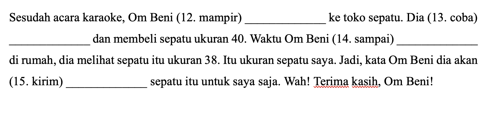

**“Waktu”** means **“time”**.  
It can refer to:

- The _concept_ of time (as in “the passing of time”), or
    
- A _specific moment or period_ (as in “when something happens”).
    

So depending on the context, _waktu_ can mean:

- “time”
    
- “when”
    
- “moment”
    
- “period” or “duration”

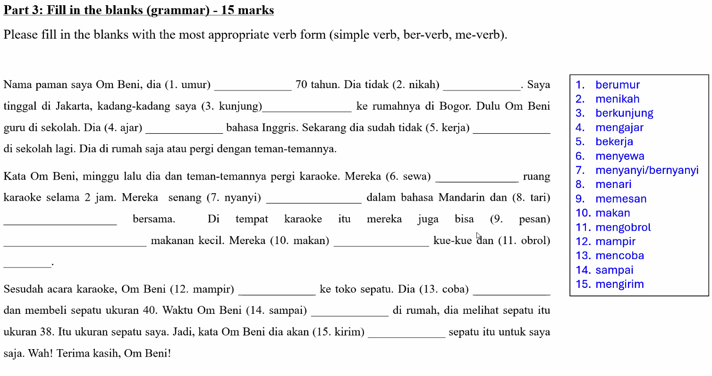

Why kunjung is a ber-verb (berkunjung) instead of simple verb? It's something that needs to be memorised. Both simple very and ber-very have no object following that. So it needs to be memorised.

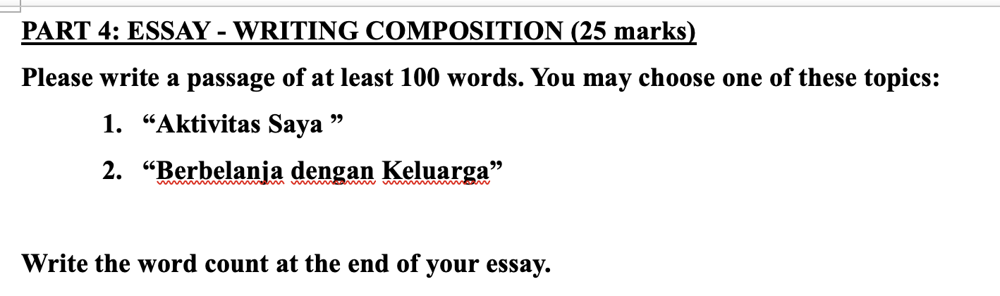

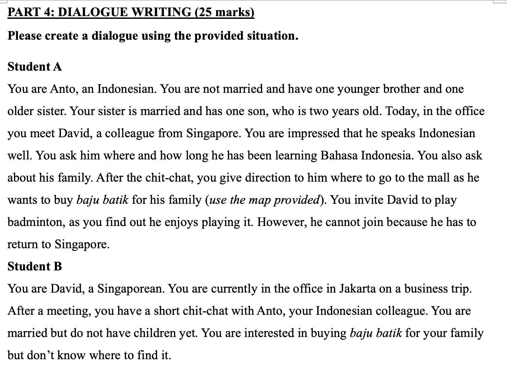

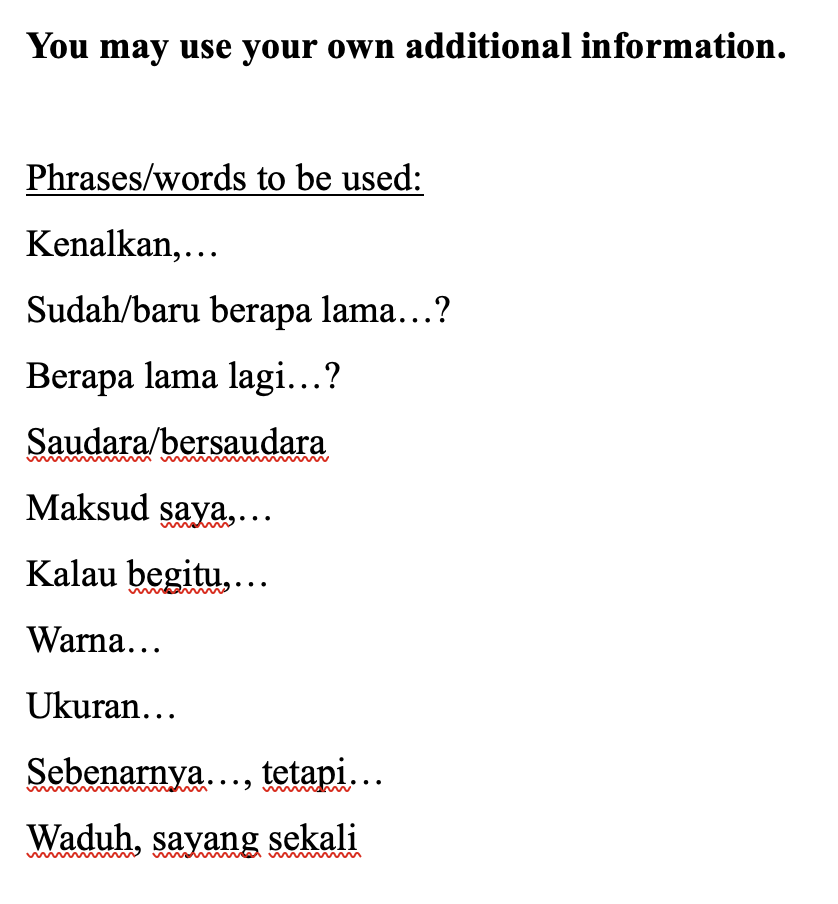

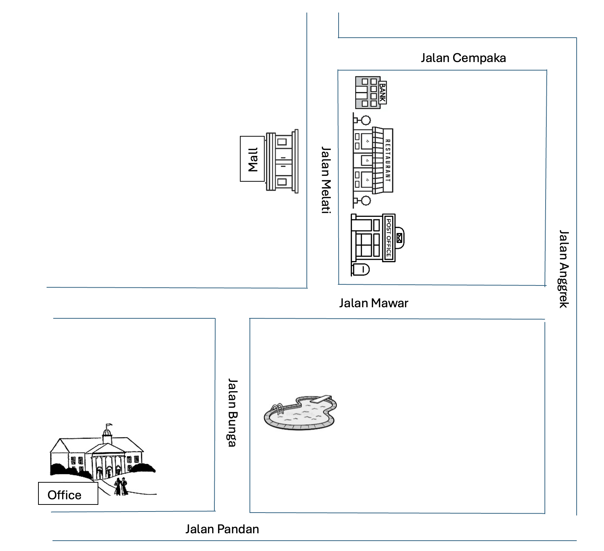

Mahasiswa A: Salam kenal, Pak David. Saya dengar Anda bisa mengobrol dalam bahasa Indo, ya? Yuk kita ngobrol. Anda sudah berapa lama belajar bahasa Indo? 

Mahasiswa B: Salam kenal, Pak. Nama Anda siapa? 

Mahasiswa A: Nama saya Anto. 

Mahasiswa B: Pak David, senang bertemu dengan Anda. Saya belajar belum lama, saya baru belajar bahasa Indo kira-kira lima bulan saja. 

Mahasiswa A: Wah, lima bulan saja, Anda sudah bisa mengobrol dalam bahasa Indo. Anda pandai. Berapa lama lagi Anda mau belajar Bahasa Indo? Dan ini pertama kali Anda di Jakarta?

Mahasiswa B: Saya tidak tahu berapa lama lagi saya harus belajar Bahasa Indo, karena saya ada ChatGPT. Ngomong-ngomong, hari ini bukan pertama kali saya di Jakarta. Saya sudah pernah datang ke Jakarta banyak sekali, tetapi untuk bekerja di perusahaan ini, saya pertama kali datang ke Jakarta dengan perusahaan ini. 

Mahasiswa A: Anda berasal dari mana?

Mahasiswa B: Saya asalnya dari Singapura. 

Mahasiswa A: Dan keluarganya?

Mahasiswa B: Keluarga saya masih di Singapura. 

Mahasiswa A: Anda keluarga punya siapa?

Mahasiswa B: Erm... Saya keluarga punya istri saya saja. Saya sudah menikah tetapi belum punya anak. Kenapa bertanya keluarga saya punya siapa?

Mahasiswa A: Waduh, sayang sekali, sudah menikah tetapi belum punya anak-anak. Kalau begitu, mau cepatlah. Anda berumur berapa? 

Mahasiswa B: Haha.... saya... umurnya tujuh puluh tahun. Kenapa Anda tanya itu?

Mahasiswa A: Maaf ya. Sebenarnya, Anda terlihat seperti dua puluh tujuh tahun, saya tidak tahu Anda sudah tujuh puluh tahun. Tetapi istri Anda berumur berapa?

Mahasiswa B: Huh? Kenapa bertanya banyak sekali itu. Ngomong-ngomong, saya mau pergi ke toko membeli batik, Pak Anto ada rekomendasi? 

Mahasiswa A: Maksud saya, kalau istri Anda seumuran dengan pacar saya, semua orang bisa bertemu. Pacar saya dan istri kamu kenal mengobrol. Ngomong-ngomong,  saya ada rekomendasi. Mal di Jalan Melati ada banyak toko batik. Anda mencari Toko Batik Salim Salim di lantai lima. Di sana, kalau Anda mau menawar harganya, Anda bilang "temu Pak Anto Salim", ya?

Mahasiswa B: Oh terima kasih. Anda keluarga ada banyak uang ya? Anda punya bersaudara? 

Mahasiswa A: Saya punya dua saudara. Satu kakak perempuan dan satu adik laki-laki. Tetapi kakak perempuan sudah menikah. 

Mahasiswa B: Waduh, sayang sekali. Anda adik laki-laki sudah menikah? 

Mahasiswa A: Belum.

Mahasiswa B: Baiklah, saya adik perempuan masih belum menikah. 

Mahasiswa A: Haha.

Mahasiswa B: Ngomong-ngomong, bagaimana cara pergi ke mal?

Mahasiswa A: Jalan terus di Jalan Pandan sampai Jalan Bunga, lalu belok kiri, jalan terus di Jalan Bunga, Anda akan melihat kolam renang di sebelah kanan. Jalan terus sampai Jalan Mawar, lalu belok kanan. Jalan sedikit saja di Jalan Mawar sedikit saja, lalu belok kiri di Jalan Melati. Di sebelah kanan ada kantor pos dan restoran. di sebelah kiri ada mal. Di mal itu ada toko Batik Salim Salim. 

Mahasiswa B: Baiklah. Saya langsung  pergi. Di Toko Batik Salim Salim ada batik ukuran kecil dan warna kuning? 

Mahasiswa A: Saya tidak tahu, kira-kira ada, tetapi saya sudah lama tidak pergi ke Toko Batik Salim Salim. Senang berbelanja, ya! Sorenya, Anda mau pergi bermain badminton? Karena saya dengar Anda masih suka bermain badminton. 

Mahasiswa B: Saya tidak bisa karena saya mau kembali ke Singapura sore ini. Terima kasih Mas Anto

Mahasiswa A: Iya, senang berbelanja, bye bye Mas David!
