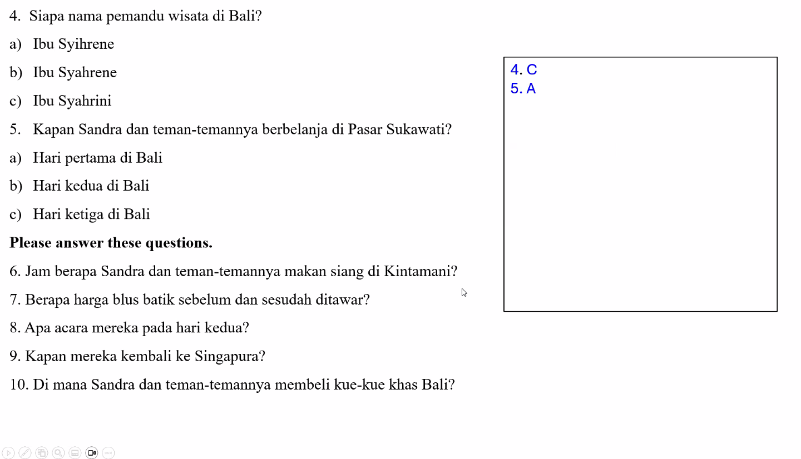
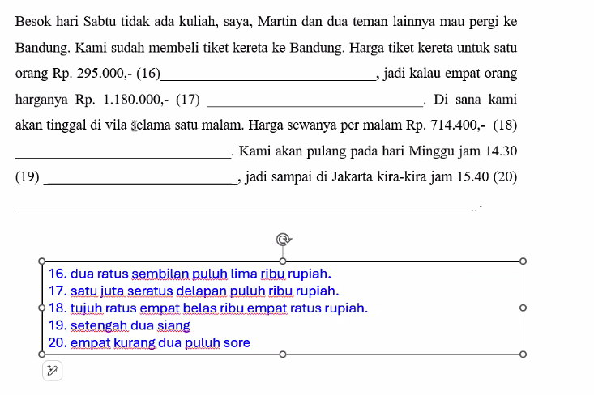

Why kunjung is a ber-verb (berkunjung) instead of simple verb? It's something that needs to be memorised. Both simple very and ber-very have no object following that. So it needs to be memorised.

